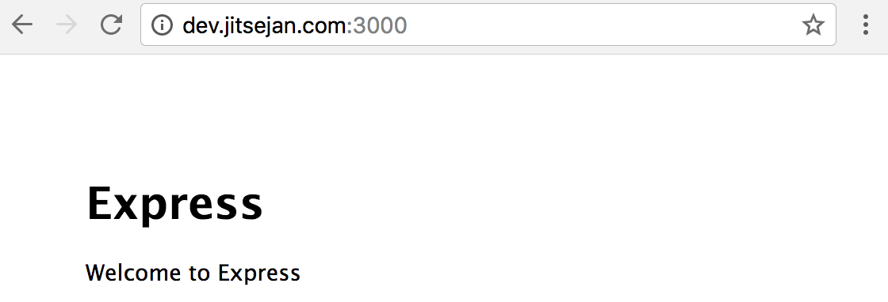
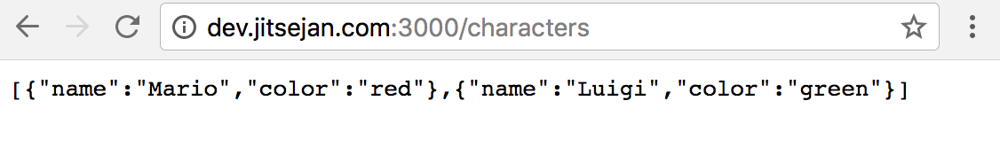
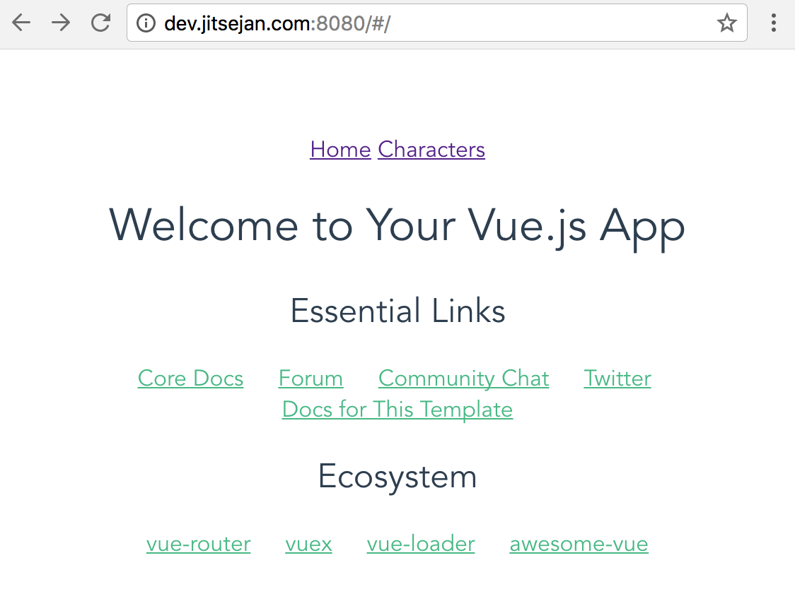
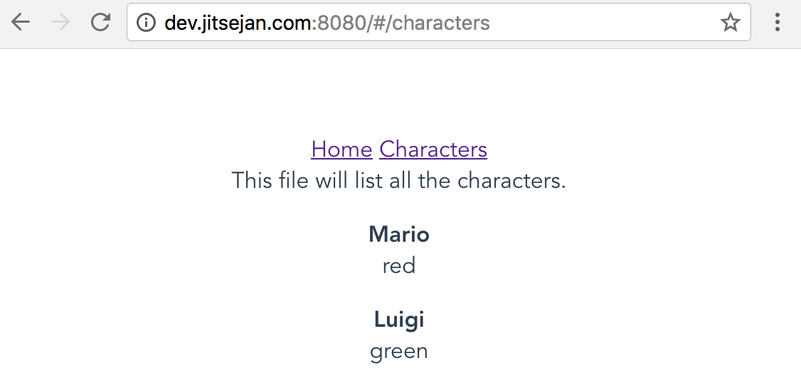

Title: MEVN Stack - Setting up MongoDB, Express and VueJS
Date: 2017-12-05 00:36:28
Modified: 2017-12-05 00:36:28
Category: posts
Tags: VueJS, ExpressJS, Javascript, MongoDB, full-stack, front-end, back-end
Slug: mevn-stack-tutorial
Authors: Jitse-Jan
Summary: This tutorial will go through creating an application using the MEVN stack. 

# MEVN Stack
This stack consists of the following elements:

* MongoDB
* ExpressJS
* VueJS
* NodeJS

## Objectives

* Setup front-end with VueJS
* Setup back-end with ExpressJS
* Setup the connection between the front-end and back-end using Axios
* Setup the connection between ExpressJS and MongoDB

## Prerequisites
Install the last version of [node](https://nodejs.org/en/) and [npm](https://www.npmjs.com).

```bash
jitsejan@dev:~/code$ curl -sL https://deb.nodesource.com/setup_9.x | sudo -E bash -
jitsejan@dev:~/code$ sudo apt-get install -y nodejs
jitsejan@dev:~/code$ node --version
v9.2.0
jitsejan@dev:~/code$ npm --version
5.5.1
```

## Setup
Create the folder for the application and move inside it.

```bash
jitsejan@dev:~/code$ mkdir mongo-express-vue-node && cd $_
```

## Client
<center></center>

Install the [Vue CLI](https://github.com/vuejs/vue-cli) to easily create the scaffold for a Vue application.

```bash
jitsejan@dev:~/code$ sudo npm install -g vue-cli
jitsejan@dev:~/code$ vue --version
2.9.1
```

Use the [webpack template](https://github.com/vuejs-templates/webpack) to create a Vue app with a webpack boilerplate. 

```bash 
jitsejan@dev:~/code/mongo-express-vue-node$ vue init webpack client

? Project name client
? Project description MEVN - Vue.js client
? Author Jitse-Jan <jitsejan@gmail.com>
? Vue build standalone
? Install vue-router? Yes
? Use ESLint to lint your code? Yes
? Pick an ESLint preset Standard
? Setup unit tests Yes
? Pick a test runner karma
? Setup e2e tests with Nightwatch? Yes

   vue-cli · Generated "client".

   To get started:

     cd client
     npm install
     npm run dev

   Documentation can be found at https://vuejs-templates.github.io/webpack

jitsejan@dev:~/code/mongo-express-vue-node$ cd client
jitsejan@dev:~/code/mongo-express-vue-node/client$ npm install
```

To make the app accessible from the VPS, first change the host for the webpack-dev-server in `client/package.json`from

```bash
...
"scripts": {
    "dev": "webpack-dev-server --inline --progress --config build/webpack.dev.conf.js",
    ...
  },
...
```

to

```bash
...
"scripts": {
    "dev": "webpack-dev-server --inline --progress --config build/webpack.dev.conf.js --host 0.0.0.0",
    ...
  },
...
```

and make sure the `disableHostCheck` is set to `true` in `client/build/webpack.dev.conf.js`:

```bash
...
devServer: {
    ...
    disableHostCheck: true
    ...
}    
...
```

We can now start the application by running the following command:

```bash
jitsejan@dev:~/code/mongo-express-vue-node/client$ npm run dev
```
and use curl to check the page:

```bash
jitsejan@dev:~/code/mongo-express-vue-node/client$ curl dev.jitsejan.com:8080
  % Total    % Received % Xferd  Average Speed   Time    Time     Time  Current
                                 Dload  Upload   Total   Spent    Left  Speed
100   322  100   322    0     0   1477      0 --:--:-- --:--:-- --:--:--  1586<!DOCTYPE html>
<html>
  <head>
    <meta charset="utf-8">
    <meta name="viewport" content="width=device-width,initial-scale=1.0">
    <title>client</title>
  </head>
  <body>
    <div id="app"></div>
    <!-- built files will be auto injected -->
  <script type="text/javascript" src="/app.js"></script></body>
</html>
```

which is indeed the content of the `index.html` of the client application.

## Server
<center></center>

As a back-end we will use [ExpressJS](https://expressjs.com/) to connect the front-end to the data and deal with all server related functionality. To (again) not setup all the files by ourselves, but use a generator to create the scaffold, I will use the 
[Express generator](https://expressjs.com/en/starter/generator.html). 

### Create boilerplate

```bash
jitsejan@dev:~/code/mongo-express-vue-node$ sudo npm install express-generator -g
jitsejan@dev:~/code/mongo-express-vue-node$ express --version
4.15.5
```

Using the generator, we can create the boilerplate for the server, with a `.gitignore` by using `--git` and with `ejs` support by setting the view argument. 

```bash
jitsejan@dev:~/code/mongo-express-vue-node$ express --git --view ejs server

   create : server
   create : server/package.json
   create : server/app.js
   create : server/.gitignore
   create : server/public
   create : server/routes
   create : server/routes/index.js
   create : server/routes/users.js
   create : server/views
   create : server/views/index.ejs
   create : server/views/error.ejs
   create : server/bin
   create : server/bin/www
   create : server/public/javascripts
   create : server/public/images
   create : server/public/stylesheets
   create : server/public/stylesheets/style.css

   install dependencies:
     $ cd server && npm install

   run the app:
     $ DEBUG=server:* npm start
```

Lets navigate inside the server folder, install the packages and start the server.

```bash
jitsejan@dev:~/code/mongo-express-vue-node$ cd server/
jitsejan@dev:~/code/mongo-express-vue-node/server$ npm install
jitsejan@dev:~/code/mongo-express-vue-node/server$ DEBUG=server:* npm start

> server@0.0.0 start /home/jitsejan/code/mongo-express-vue-node/server
> node ./bin/www

  server:server Listening on port 3000 +0ms
```

Using curl we can retrieve the content of the application by requesting the server on port 3000.

```bash
jitsejan@dev:~/code/mongo-express-vue-node$ curl dev.jitsejan.com:3000
  % Total    % Received % Xferd  Average Speed   Time    Time     Time  Current
                                 Dload  Upload   Total   Spent    Left  Speed
100   207  100   207    0     0    880      0 --:--:-- --:--:-- --:--:--   945<!DOCTYPE html>
<html>
  <head>
    <title>Express</title>
    <link rel='stylesheet' href='/stylesheets/style.css' />
  </head>
  <body>
    <h1>Express</h1>
    <p>Welcome to Express</p>
  </body>
</html>
```
<center></center>

### Setup API route
Add a new route to `server/app.js` and add some fake data to be returned:

```javascript
 ...
 app.get('/characters', (req, res) => {
  res.send(
    {
      'characters': [
        {
          name: "Mario",
          color: "red"
        },
        {
          name: "Luigi",
          color: "green"
        }
      ]
    }
  )
})
...
```

Start the server to test the new route by running the following command:

```bash
jitsejan@dev:~/code/mongo-express-vue-node/server$ DEBUG=server:* npm start
```

which will result in the curl response as shown below using `jq` for a nicer layout.

```bash
jitsejan@dev:~$ curl dev.jitsejan.com:3000/characters | jq '.'
  % Total    % Received % Xferd  Average Speed   Time    Time     Time  Current
                                 Dload  Upload   Total   Spent    Left  Speed
100    65  100    65    0     0   1029      0 --:--:-- --:--:-- --:--:--  1031
"characters": [
   {
    "name": "Mario",
    "color": "red"
  },
  {
    "name": "Luigi",
    "color": "green"
  }
]
```
<center></center>


## Connect client and server
Finally, we need to connect the VueJS front with the ExpressJS back-end. To do this, we will use `axios` at the client-side to talk to the API from the server-side. First install `axios` for the client:

```bash
jitsejan@dev:~/code/mongo-express-vue-node/client$ npm install --save axios
```

### Setup characters component
Create a new Vue component to show the characters from the API. Add the content to `client/src/components/Characters.vue`:

```html
<<template>
  <div class="characters">
    This file will list all the characters.
    <div v-for="character in characters" :key="character.name">
        <p>
            <span><b>{{ character.name }}</b></span><br />
            <span>{{ character.color }}</span><br/>
        </p>
        </div>
    </div>
</template>

<script>
import CharactersService from '@/services/CharactersService'
export default {
  name: 'Characters',
  data () {
    return {
      characters: []
    }
  },
  mounted () {
    this.getCharacters()
  },
  methods: {
    async getCharacters () {
      const response = await CharactersService.fetchCharacters()
      this.characters = response.data.characters
      console.log(response.data)
    }
  }
}
</script>
```

with `client/src/services/CharactersService.js` contains

```
import api from '@/services/api'

export default {
  fetchCharacters () {
    return api().get('characters')
  }
}

```

and `client/src/services/api.js` contains

```
import axios from 'axios'

export default() => {
  return axios.create({
    baseURL: `http://localhost:3000`
  })
}
```

Add a route to `client/src/router/index.js` for the characters view by adding the import of the component and defining the route parameters.

```javascript
...
import Characters from '@/components/Characters'
...

    {
      path: '/characters',
      name: 'Characters',
      component: Characters
    }
...
```

### Extend main application
To visit the available routes, add the router-links to the main application. Change the template in `client/src/App.vue`:

```html
<template>
  <div id="app">
    <router-link :to="{ name: 'Home' }">Home</router-link>
    <router-link :to="{ name: 'Characters'}">Characters</router-link>
    <router-view/>
  </div>
</template>
...
```

Main page:
<center></center>
Character page:
<center></center>

For the most code, check the [Github repo](https://github.com/jitsejan/mevn-stack-tutorial).