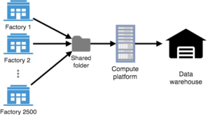
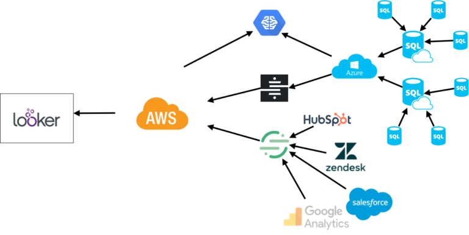
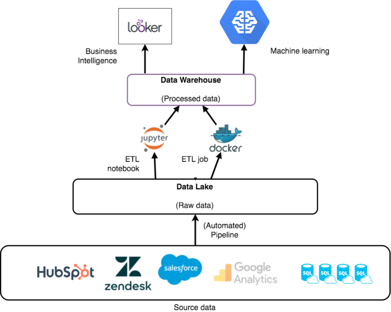
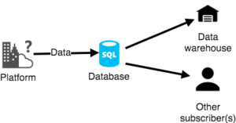
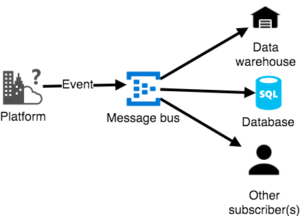

Title: None shall PAAS
Date: 2018-10-17 14:00
Modified: 2018-10-17 14:00
Category: posts
Tags: DevOps, data architecture, serverless, AWS, Azure, data engineer
Slug: none-shall-paas
Authors: Jitse-Jan
Summary: This article was originally posted on the [MarketInvoice blog](https://blog.marketinvoice.com/2018/10/02/none-shall-paas-unlocking-the-data-warehouse/).

## Unlocking the data warehouse

>

It is often the case with start-ups that the transitioning framework is built first around an enhanced functionality of the product to engage with the customers and, at a later stage, around a more consistent structure of the system as a whole. The story was no different in the early days of MarketInvoice. Features had to be added rapidly to accommodate the great customer adoption and there were no manuals illustrating a viable architecture or even predictable working timelines for the platform of a fast-growing company.

Over time, with the increasing participation of new customers, it was evident that the existing structure needed to be more scalable so that reaching the prospected growth was sustainable. Our recent [partnership with Barclays](https://blog.marketinvoice.com/2018/08/02/partnering-with-barclays/), for example, means that the expectations and demands on the platform are set to **grow at full speed**. According to our internal projections, by the end of 2019 the traffic on the platform could easily be incremented by 10X. While this is a remarkable opportunity, it would not have been possible if we hadn’t been prepared to create new paradigms to promptly categorise the data by cleaning it and organising it for our business intelligence (BI) and machine learning models.

The goal was to increase the automation process so that we can give our customers faster responses, reducing the waiting time that occurs while making an application and receiving the funds. Decreasing the number of manual steps in the application process also facilitates the work for our risk underwriters. Tracking additional data appears to be an astute evaluation since it will ensure the creation of new consistent decision-making models intended at automating some of the tasks that the underwriters are currently spending the majority of their time on.

    
     
    Figure 1. Diagram showing the structured environment of the data platform for the hardware manufacturer. 2500 machines write their data into a shared folder which will be transformed into business value using the compute platform.

In my previous job, I was working as a data engineer in the tech field for a hardware manufacturer. They were building out their data platform and asked me to help design their data-flows via different pipelines. Their data source was relatively simple as they had five different types of machines, only generating logging data containing details from testing and producing. The main difficulty I faced, while working on this specific project, was the **amount** of data and the **speed** to calculate the business KPIs. During my assignment, I received data from 2500 machines every 2 hours containing roughly 50 MB per file, thus in total 1.5 TB per day. Calculating the statistics for this data took over 24 hours. This was reduced to 10 minutes through platform optimisations (and scaling up the computing power). The data arrived from various locations around the world in a shared folder where it was fed into an aggregation script. A parsing job reads this data and aggregates it into a data warehouse to be subsequently used by the BI teams. While I was dealing with large volumes of information, the complexity of the task was simple because the data was homogeneous.

### Legacy solution – time driven

#### The old situation

When I joined MarketInvoice, it was far from a clean and structured platform. Two cloud providers were being used for different segments of the company. The platform for our customers was built on [Microsoft Azure](https://azure.microsoft.com/en-gb/) Platform as a Service (PAAS) and contained different database servers with a large number of tables. Part of the data was pushed to [Amazon AWS](https://aws.amazon.com/) to make it accessible in the BI tool [Looker](https://looker.com/). Additionally, data from third-party sources such as Google Analytics and Salesforce were pushed into AWS with the support of third-party synchronisation tools. Machine learning was performed by combining the data from AWS and Azure and was hosted on Azure. The data in AWS resided in one colossal database with tables from diverse sources plus aggregated tables based on the raw data.

    
     
    Figure 2. Diagram showing the old unstructured architecture of the data platform with data synchronised and stored using different tools.

While that approach seemed effective and the important data was effortlessly available in the necessary locations, it didn’t show an actual prospect of being **scalable**. There were challenges while performing tasks requiring heavy computing or while adding new datasets from external sources. Virtual machines were constantly running to extract data but were idle the majority of the time. Data was synced at fixed intervals, making it impossible for the platform to do **live predictions** based on the most recent data.

My challenge when I started at MarketInvoice was to find an optimal solution for the scalability of the data platform. Fundamentally, to scale the system we needed a novel data architecture.

The data platform can be characterised by the following requirements:

* Gather additional data in a **centralised** place to analyse leads, traffic, etc. and monitor the company’s KPIs
* Create a platform where third-party sources can be effortlessly integrated
* Develop a scalable compute platform for number crunching and machine learning to create fast and efficient risk models
* Provide an environment where different sections of the company can easily add their own scripts to create more insights from other sources
* Design an architecture which is low in cost and leverages the power of **serverless computing**

### New solution — data driven

#### Reshaping the data platform

After the requirements of the new data platform were well-defined, it was necessary to investigate the effectiveness of as many approaches as possible, to really make sure that only the most suitable solution was taken into consideration.

We had several conversations with various third-parties like Microsoft and AWS to discuss their tools and data warehouse common practises, more specifically the ones dealing with financial data. In the meanwhile, as a data team, we aimed at building different proof of concepts on Azure and AWS (and the potential mixture of the two) to test data ingestion, data migration and implementation of machine learning models.

In reality, what we were truly trying to achieve was the creation of a so-called *platform agnostic* solution, which could run on any cloud provider with minimal changes, i.e. running a Python extraction script on AWS is easy using AWS Lambda, but we can simply copy that same script and run it on Azure. In the future prospect of possibly moving to another cloud provider, the entire migration process should be uncomplicated and just a matter of placing the correct scripts in the right place to get the same data pipelines working.

    
     
    Figure 3. Diagram showing the new architecture of the data platform. The platform consists of a data lake and data warehouse layer. The data lake contains raw data coming from the user platform and third-party source. The data warehouse contains processed data with aggregations and statistics to serve the business intelligence and data science teams.

In the new data platform, we use both [AWS S3](https://aws.amazon.com/s3/) and [Azure Blob](https://azure.microsoft.com/en-au/services/storage/blobs/) file storage as a data lake to save all the **raw data** from the diverse sources. By using this redundancy, we can smoothly switch between the platforms and an additional backup is readily available in case one of the two providers develops issues. We store the history of the tables on both platforms and we can gather historical statistics. Data is kept in sync between the platform using a data-driven approach; when there is new data in the database it will trigger a function to push that data into file storage on Azure, which will, in turn, be copied to AWS using [Azure Functions](https://azure.microsoft.com/en-us/services/functions/). By using triggers based on the data, we do not need to have machines running 24/7, but only pay for the execution time of the triggered functions. Data from the external sources is retrieved using [AWS Lambda](https://aws.amazon.com/lambda/), consisting of minor running jobs that will pull data from the APIs and push the data into the data lake. These jobs do not necessitate running machines as they are simply scheduled to retrieve data at a set interval.

Finally, the platform is set up to listen to events in the data lake, so when new data is added to a certain folder, it can trigger an **ETL** (Extract, Transform, Load) job to put the new data in the right **projections** for the data warehouse. Similarly, the data warehouse is using AWS S3, which means the projections are saved in a readable format, users of the platform can inspect the data easily and querying it in a BI tool is straightforward. We deemed it unnecessary to push the data into a database since that will limit the usability of the data and significantly increases the cost of the platform. We’re using the data analytics tool Looker, which in fact integrates well with S3 using the [AWS Glue Data Catalog](https://aws.amazon.com/glue/) to index the data in the data warehouse. Furthermore, the machine learning tools and parallel computing platform of AWS work even better when using data saved on S3 instead of a database.

As the platform scales up, this approach will give us the ability to easily handle large volumes of data, without affecting the platform performance or generating huge bills at the end of the month.

### Future solution — event-driven

#### Redesigning the user platform

While the new data platform has contributed towards making us less dependent on any PAAS provider, our user platform is still the Goliath of the story.  At the time of writing this, the Tech team is busy modularising the platform and changing the entire underlying structure.

    
     
    Figure 4. Simplification of the non-event-driven method. A script will check periodically if new data was written to the database and push the new data to the data warehouse.   

Ideally, the data that was originally written to a database from the platform will follow a different route. Instead of writing data directly to the database, it will send the data event to a message bus, making it possible to have different clients listening to that bus and triggering a job to respond to that event. In the data-driven approach, we respond to a row added in the table (Figure 4). Whereas for our event-driven approach, we do not want to check the table but write the event data straight to the data lake and thereby avoiding the necessity of checking databases (Figure 5). While it does not influence the architecture of the data platform, it will help to respond faster to events on the user platform, and therefore increase the reliability of the data platform ensuring that the last data is always present, instead of waiting for the daily extraction job to get data from the databases in the data lakes.

    
     
    Figure 5. Simplification of the event-driven method. All events will be written to a message bus. The data warehouse will listen for new events in the bus and copy the data.

### Conclusion

We made a cost-effective solution by using the best of both platforms without depending on any specific vendor. Following the new approach, we created modular jobs to get data from the raw sources into the data warehouse using both Azure Functions and AWS Lambda. Data is stored in files on Azure Blob Storage and AWS S3 making it the perfect source for machine learning and business intelligence. All the tools that comprise the solution are scalable, consenting to follow the growth trends and projections for the company, as we embrace our new customers with originality in our solutions!