Title: Developing AWS Glue scripts on Mac OSX
Date: 2018-11-21 17:40
Modified: 2018-11-21 17:40
Category: posts
Tags: DevOps, data architecture, Glue, AWS, data engineer, Spark, Zeppelin, notebook
Slug: developing-glue-scripts-on-mac-osx
Authors: Jitse-Jan
Summary: In this short tutorial I show how I developed my first Glue scripts for the AWS platform.

## Prerequisites

* Java
* Python 3.5
* Spark 2.2.0
* Zeppelin 0.7.3

## Java installation

Make sure a recent Java version is installed.

```bash
$ java -version
java version "1.8.0_172"
Java(TM) SE Runtime Environment (build 1.8.0_172-b11)
Java HotSpot(TM) 64-Bit Server VM (build 25.172-b11, mixed mode)
```

## Spark installation
Assuming `brew` is installed, navigate to the _Formula_ folder.

```bash
$ cd /usr/local/Homebrew/Library/Taps/homebrew/homebrew-core/Formula
```
We need to create the formula to install the correct version of Spark. If there is already a `apache-spark.rb` rename it to `apache-spark.rb.old`. Create the `apache-spark.rb` formula with the following content. Note that we explicitly use **Spark 2.2.0**.

```ruby
class ApacheSpark < Formula
  desc "Engine for large-scale data processing"
  homepage "https://spark.apache.org/"
  url "http://archive.apache.org/dist/spark/spark-2.2.0/spark-2.2.0-bin-hadoop2.7.tgz"
  version "2.2.0"
  sha256 "97fd2cc58e08975d9c4e4ffa8d7f8012c0ac2792bcd9945ce2a561cf937aebcc"
  head "https://github.com/apache/spark.git"

  bottle :unneeded

  def install
    # Rename beeline to distinguish it from hive's beeline
    mv "bin/beeline", "bin/spark-beeline"

    rm_f Dir["bin/*.cmd"]
    libexec.install Dir["*"]
    bin.write_exec_script Dir["#{libexec}/bin/*"]
  end

  test do
    assert_match "Long = 1000", pipe_output(bin/"spark-shell", "sc.parallelize(1 to 1000).count()")
  end
end
```

Now install `apache-spark` and verify the correct version gets installed.

```sh
$ brew install apache-spark
$ brew list apache-spark --versions
apache-spark 2.2.0 
```

Verify that we can use Spark now by starting `pyspark` in a terminal. Before we run `pyspark` make sure `JAVA_HOME` is set to the correct path and `PYSPARK_PYTHON` is **not** using Python 2. Use `sudo find / -name javac` to find the Java path.

```bash
export JAVA_HOME="/Library/Java/JavaVirtualMachines/jdk1.8.0_172.jdk/Contents/Home/"
export PYSPARK_PYTHON=python3
```

```bash
$ pyspark                                                                           Python 3.5.0 (v3.5.0:374f501f4567, Sep 12 2015, 11:00:19)
[GCC 4.2.1 (Apple Inc. build 5666) (dot 3)] on darwin
Type "help", "copyright", "credits" or "license" for more information.
Using Spark's default log4j profile: org/apache/spark/log4j-defaults.properties
Setting default log level to "WARN".
To adjust logging level use sc.setLogLevel(newLevel). For SparkR, use setLogLevel(newLevel).
18/11/21 16:45:16 WARN NativeCodeLoader: Unable to load native-hadoop library for your platform... using builtin-java classes where applicable
18/11/21 16:45:16 WARN Utils: Service 'SparkUI' could not bind on port 4040. Attempting port 4041.
18/11/21 16:45:16 WARN Utils: Service 'SparkUI' could not bind on port 4041. Attempting port 4042.
18/11/21 16:45:21 WARN ObjectStore: Failed to get database global_temp, returning NoSuchObjectException
Welcome to
      ____              __
     / __/__  ___ _____/ /__
    _\ \/ _ \/ _ `/ __/  '_/
   /__ / .__/\_,_/_/ /_/\_\   version 2.2.0
      /_/

Using Python version 3.5.0 (v3.5.0:374f501f4567, Sep 12 2015 11:00:19)
SparkSession available as 'spark'.
>>> spark.version
'2.2.0'
>>> sc
<SparkContext master=local[*] appName=PySparkShell>
>>>
```

Apart from some warnings, we can see `pyspark` is working, connects to the local Spark, refers to the right Spark version and Python 3 (`3.5.0`) is used in the shell.

## Zeppelin installation

We need to install **Zeppelin 0.7.3** (and not 0.8.0!) to setup the connection with AWS in a later stage. Navigate to Zeppelin's [Download page](http://zeppelin.apache.org/download.html) and scroll down for [Zeppelin-0.7.3-bin-all](http://www.apache.org/dyn/closer.cgi/zeppelin/zeppelin-0.7.3/zeppelin-0.7.3-bin-all.tgz). Unpack the TGZ-file and start Zeppelin with the command:

```shell
$ bin/zeppelin-daemon.sh start
```

By navigating to http://localhost:8080 the Zeppelin interface should show.

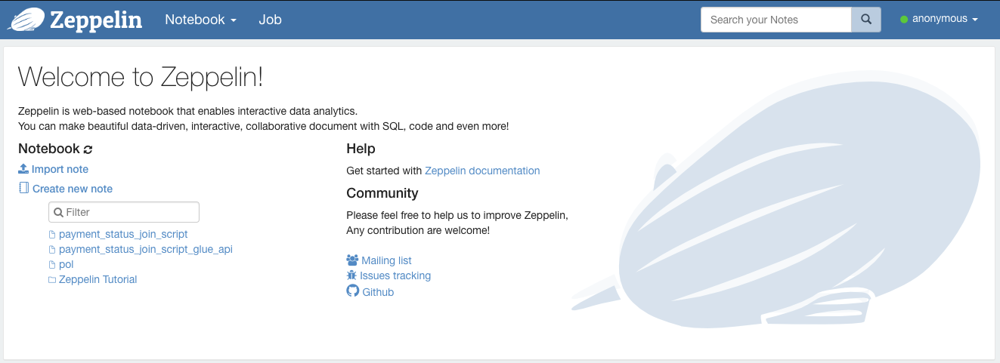

## Development with local Spark

Create a new note and verify the master of the Spark context. Since we did not configure it yet, it will default to connect to the local Spark cluster. We simply test the notebook by creating a simple RDD and converting it to a dataframe.

```python
rdd = sc.parallelize([('Mario', 'Red'), ('Luigi', 'Green'), ('Princess', 'Pink')])
rdd.toDF(['name', 'color']).show()
```
```
+--------+-----+
|    name|color|
+--------+-----+
|   Mario| Red |
|   Luigi|Green|
|Princess| Pink|
+--------+-----+
```

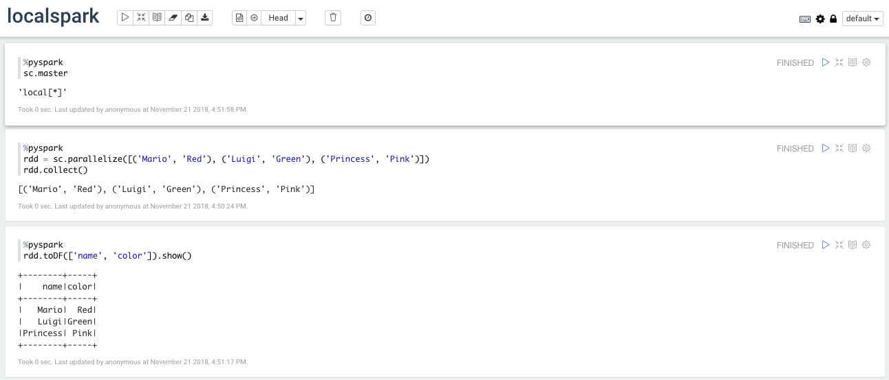

## Development with AWS Spark
### Create a Glue development endpoint

We need to connect the Spark interpreter to the AWS Glue endpoint. Navigate to the [Glue page](https://eu-west-1.console.aws.amazon.com/glue/home?region=eu-west-1#etl:tab=devEndpoints) via the AWS console and click on _Add endpoint_. 

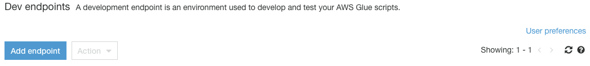

In the _Properties_ pane set the name and assign the role for the development endpoint.

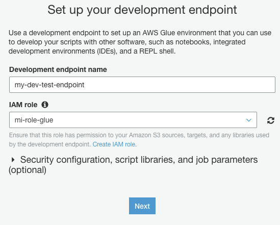

Skip through the _Networking_ pane. In the _SSH public key_ pane, create a new key pair using `ssh-keygen` in the terminal. Save the two files to a safe place and upload the public key (i.e. `id_rsa.pub`) to the development endpoint. Finally, review the endpoint and click on _Finish_. It will take a couple of minutes for the endpoint to go from _Provisioning_ to the _Ready_ state. 

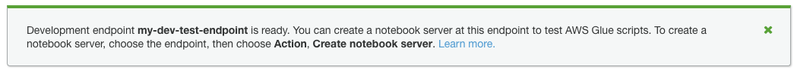

Go the the details page for the endpoint and copy the _SSH tunnel to remote interpeter_ line. Replace the <private-key.pem> with the private key that was just generated in the previous step. Run the command in a terminal and keep it running. Choose _yes_ when it prompts to accept the connection. We now have an active SSH tunnel that will route all traffic to localhost port 9007 to the development endpoint on AWS.

```bash
$ ssh -i id_rsa -vnNT -L :9007:123.456.789.255:9007 glue@ec2-52-16-115-181.eu-west-1.compute.amazonaws.com
```

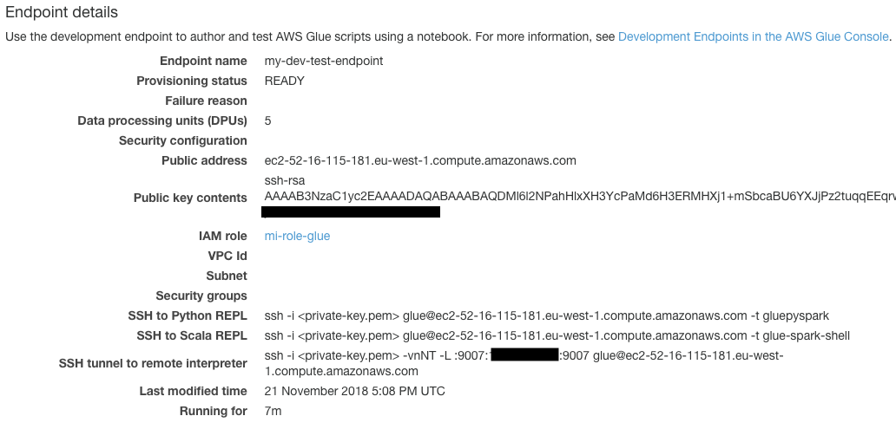

### Connect Zeppelin to Glue endpoint
Enable the Spark interpreter by clicking on _anonymous_ -> _Interpreter_ and scroll down to the Spark section.

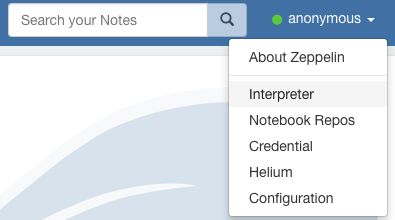

Click on _edit_ to change the settings.


Select _Connect to existing process_ to connect to localhost on port 9007. In the _Properties_ section select `yarn-client` in order to be able to use the Spark running on AWS. Scroll down and select _Save_. Restart the Spark interpreter when prompted.

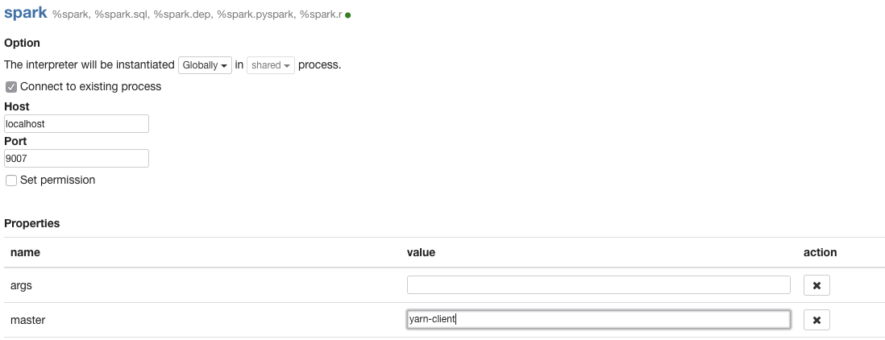

### Run the script
Create a new note to verify the master of the Spark context. If all things went well it should show `yarn-client`. This means the Spark context on AWS will be used instead of the local Spark (and the user is billed for running Spark jobs!).

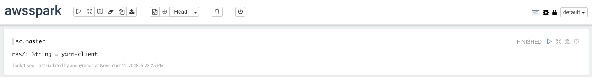

## Deploying on AWS Glue
The final step of running a Glue job is submitting and scheduling the script. After debugging and cleaning up the code in the Zeppelin notebook, the script has to be added via the [Glue console](https://eu-west-1.console.aws.amazon.com/glue/home?region=eu-west-1#etl:tab=jobs). 

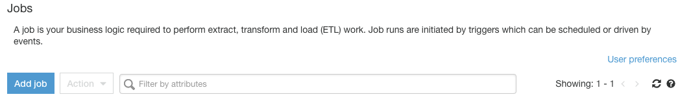

Click on _Add job_ and fill in the name and role for the script. Select the folder to save the script and make sure the option to _A new script to be authored by you_ is selected. Accept the defaults and continue to the next two pages to get to _Save job and edit script_. 

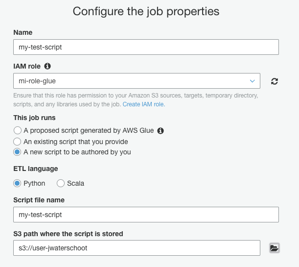

For this tutorial we keep things simple and only add the simple cost that we have used before. The script will have some default content and by adding the two lines for the RDD and dataframe it should look like the code below. Note that I did not clean up the imports since in a normal ETL jobs these imports are needed to manipulate the data properly.

```python
import sys
from awsglue.transforms import *
from awsglue.utils import getResolvedOptions
from pyspark.context import SparkContext
from awsglue.context import GlueContext
from awsglue.job import Job
 
## @params: [JOB_NAME]
args = getResolvedOptions(sys.argv, ['JOB_NAME'])
 
sc = SparkContext()
glueContext = GlueContext(sc)
spark = glueContext.spark_session
job = Job(glueContext)
job.init(args['JOB_NAME'], args)

rdd = sc.parallelize([('Mario', 'Red'), ('Luigi', 'Green'), ('Princess', 'Pink')])
rdd.toDF(['name', 'color']).show()
 
job.commit()
```

After modifying the code, save the job and run it to verify the script is working. 

## Conclusion
To develop Glue scripts the proposed way of working would be:

1. Develop locally with both (a subset of the) data and Spark on the local machine.
2. Develop locally with AWS data and local Spark
3. Develop using data from AWS and the Spark running on AWS
4. Clean up the Zeppelin notebook to create the final script
5. Submit the final script as a Glue job

## Resources

[Tutorial: Set Up a Local Apache Zeppelin Notebook to Test and Debug ETL Scripts - AWS Glue](https://docs.aws.amazon.com/glue/latest/dg/dev-endpoint-tutorial-local-notebook.html)

[Programming ETL Scripts - AWS Glue](https://docs.aws.amazon.com/glue/latest/dg/aws-glue-programming.html)

