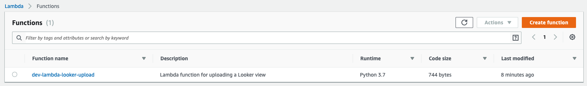

Title: Creating a Lambda function with Terraform to upload a Looker view
Date: 2019-05-13 12:40
Modified: 2019-05-13 12:40
Category: posts
Tags: DevOps, AWS, data engineer, Terraform, Lambda, IaC
Slug: creating-terraform-deployment-aws-lambda-looker
Authors: Jitse-Jan
Summary: A simple Terraform deployment of a Lambda function that exports a Looker view to S3. 

## Objective
Using the [Terraform](https://www.terraform.io/) tool, I will create a simple example where I upload the output from a look from our BI tool [Looker](https://looker.com/) to [AWS S3](https://aws.amazon.com/s3/) in CSV format. By automating the export of a Looker query to S3, we could make certain data publicly available with a regular update to make sure the data contains the latest changes.

## Introduction
Last week I've introduced [Terraform](terraform.io) to the company. I have worked with [Azure Resource Manager](https://docs.microsoft.com/en-us/azure/azure-resource-manager/) before, both in my previous job and one of the first tasks I had here at MI and I have some exposure to AWS [CloudFormation](https://aws.amazon.com/cloudformation/). Since the data platform I have created is cross-platform (a hybrid solution with both Azure and AWS), I thought it would be wise to not use ARM nor CloudFormation, but go a level higher by using Terraform. Terraform supports many cloud providers and can help to define the infrastructure of both Azure and AWS in a few configuration files (#InfrastructureAsCode). By using Terraform we make sure all services are added to the configuration and checked in to version control. In case something breaks, or in the worst case we have a disaster, we can easily recreate the platform with Terraform.

## Structure
The structure of this project will look like this: 

```bash
├── deploy.sh
├── initial_run.py
├── main.tf
├── sources
│   └── lambda-functions
│       └── looker-upload
│           ├── lambda.py
│           └── requirements.txt
├── terraform.tfvars
└── variables.tf
```

## Requirements
### Terraform
Currently I have [installed Terraform](https://learn.hashicorp.com/terraform/getting-started/install.html) on my MacBooks and my VPS. For Mac the installation is straightforward using [brew](https://brew.sh/):

```bash
brew install terraform
```

For Ubuntu we need to download the ZIP-file, extract it and add it manually:

```bash
sudo apt-get install unzip
wget https://releases.hashicorp.com/terraform/0.11.13/terraform_0.11.13_linux_amd64.zip
unzip terraform_0.11.13_linux_amd64.zip
sudo mv terraform /usr/local/bin
```

```bash
╭─ ~/code/data-engineer-solutions
╰─ terraform version
Terraform v0.11.13
```

### Other
- You should have an AWS account and have the credentials available in the default  `~/.aws/credentials`. 
- You should have [Download Python | Python.org](https://www.python.org/downloads/. I am using version 3.7.3 at the moment of writing.
- You should have [Docker Desktop for Mac and Windows | Docker](https://www.docker.com/products/docker-desktop) installed.

## Implementation
The core of the infrastructure is defined in `main.tf`. The first element is the provider that is being used.

```
# The AWS provider
provider "aws" {
  region = "${var.region}"
}
```

Secondly, we need to create the policy and the role for executing the Looker Lambda function. The role should be able to start a Lambda function, creating CloudWatch logs, get parameters from SSM and interact with S3. The resources are not limited in this example, but of course it is good practice to keep the permissions of a role limited and reduce the blast radius.

```
# Define the policy for the role
resource "aws_iam_role_policy" "policy-lambda" {
  name = "dev-jwat-policy-lambda"
  role = "${aws_iam_role.role-lambda.id}"

  policy = <<EOF
{
  "Version": "2012-10-17",
  "Statement": [
    {
      "Effect": "Allow",
      "Action": [
        "lambda:InvokeFunction",
        "logs:CreateLogGroup",
        "logs:CreateLogStream",
        "logs:PutLogEvents",
        "ssm:GetParameter",
        "s3:PutObject",
        "s3:ListBucket",
        "s3:GetObject"
      ],
      "Resource": [
        "*"
      ]
    }
  ]
}
EOF
}

# Define the role
resource "aws_iam_role" "role-lambda" {
  name        = "dev-jwat-role-lambda"
  description = "Role to execute all Lambda related tasks."

  assume_role_policy = <<EOF
{
  "Version": "2012-10-17",
  "Statement": [
    {
      "Action": "sts:AssumeRole",
      "Principal": {
        "Service": "lambda.amazonaws.com"
      },
      "Effect": "Allow",
      "Sid": ""
    }
  ]
}
EOF
}
```

The Lambda function needs the files for executing the function in a ZIP archive. This should contain both the function itself and it's dependencies. The `filename` links to the ZIP file that is created by my deployment script. The deployment script makes sure that the Python dependencies are being build for the Amazon image the Lambda function is running on instead of complying it for my Mac. When a Python library (such as `pandas`) is compiled for Mac it is likely not to work for the Amazon image because `pandas` depends on many C libraries which are OS specific.

```
# Define the Lambda function
resource "aws_lambda_function" "lambda-function" {
  function_name = "dev-lambda-looker-upload"
  description   = "Lambda function for uploading a Looker view"
  handler       = "${var.handler}"
  runtime       = "${var.runtime}"

  filename = "sources/lambda-functions/looker-upload/lambda.zip"
  role     = "${aws_iam_role.role-lambda.arn}"

  tags = {
    Environment = "Development"
    Owner       = "Jitse-Jan"
  }
}
```

The deployment script `deploy.sh` contains the following steps:

1. Create packages for the Lambda functions
2. Deploy the infrastructure
3. Run the initial script

It will first iterate through the Lambda function directory to find the different functions. For each function it will pick up the `requirements.txt` to determine the libraries to be installed. They will be installed inside the Docker container for the Lambda image and added to `lambda.zip`.  The `__pycache__`files are removed to reduce the size of the Lambda package, since its size is limited to 350 MB uncompressed. After adding the library artifacts to the ZIP file, the main function `lambda.py` is added to the ZIP file. We run the `terraform apply` to apply the changes to the infrastructure and finally run a Python script. The Python script is limited to running the Lambda functions.

```bash
#!/usr/bin/env bash
# deploy.sh
export PKG_DIR="python"
export PY_VERSION="python3.7"

SCRIPT_DIR="$( cd "$( dirname "${BASH_SOURCE[0]}" )" && pwd )"
LAMBDA_DIR="sources/lambda-functions"
FULL_DIR=${SCRIPT_DIR}/${LAMBDA_DIR}
for fldr in ${FULL_DIR}/*
do
    printf "\033[1;35m>> Zipping ${fldr} \033[0m\n"
    cd ${fldr} && rm -rf ${PKG_DIR} && mkdir -p ${PKG_DIR}
    docker run --rm -v $(pwd):/foo -w /foo lambci/lambda:build-${PY_VERSION} \
    pip install -r requirements.txt -t ${PKG_DIR} --no-deps
    cd ${fldr}/${PKG_DIR}
    find . -type d -name '__pycache__' -print0 | xargs -0 rm -rf
    rm ${fldr}/lambda.zip && zip --quiet -r ${fldr}/lambda.zip .
    cd ${fldr} && zip --quiet -r ${fldr}/lambda.zip lambda.py
    rm -rf ${fldr}/${PKG_DIR}
done
cd ${SCRIPT_DIR}

terraform apply

${PY_VERSION} initial_run.py
```

Note that for running the Python script `boto3` should be installed.

```python
""" initial_run.py """
import boto3

PREFIX = 'dev-'

lambda_client = boto3.client("lambda", "eu-west-2")

# Trigger the Lambda functions
for function in [
    fun["FunctionName"]
    for fun in lambda_client.list_functions()["Functions"]
    if fun["FunctionName"].startswith(PREFIX)
]:
    print("> Running function `%s`." % function)
    response = lambda_client.invoke(FunctionName=function)
    print("< Response: %s" % response)

```

In order to run the Lambda function at a given interval, we use a cron expression in a CloudWatch event rule. We will run the schedule at midnight every day.

```
# Define the CloudWatch schedule
resource "aws_cloudwatch_event_rule" "cloudwatch-event-rule-midnight-run" {
  name                = "dev-cloudwatch-event-rule-midnight-run-looker-upload"
  description         = "Cloudwatch event rule to run every day at midnight for the Looker upload."
  schedule_expression = "${var.schedule_midnight}"
}
```

The Lambda function and CloudWatch event rule should be attached to get things working.

```
# Define the CloudWatch target
resource "aws_cloudwatch_event_target" "cloudwatch-event-target" {
  rule = "dev-cloudwatch-event-rule-midnight-run-looker-upload"
  arn  = "arn:aws:lambda:${var.region}:848373817713:function:dev-lambda-looker-upload"
}
```

Finally we need to make sure that CloudWatch is allowed to run the Lambda function. 

```
# Define the Lambda permission to run Lambda from CloudWatch
resource "aws_lambda_permission" "lambda-permission-cloudwatch" {
  statement_id  = "AllowExecutionFromCloudWatch"
  action        = "lambda:InvokeFunction"
  function_name = "dev-lambda-looker-upload"
  principal     = "events.amazonaws.com"
  source_arn    = "arn:aws:events:${var.region}:848373817713:rule/dev-cloudwatch-event-rule-midnight-run-looker-upload"
}
```

The result of the Lambda function will be written to a S3 bucket. In the definition we make sure the bucket is public and we enable versioning. 

```
# Define the public bucket
resource "aws_s3_bucket" "bucket-lambda-deployments" {
  bucket = "dev-jwat"
  region = "${var.region}"
  acl    = "public-read"

  versioning = {
    enabled = true
  }

  tags = {
    Environment = "Development"
    Owner       = "Jitse-Jan"
  }
}
```

Variables for a Terraform deployment can be stored in different ways. Terraform will automatically pick up all `*.tf` and `.tfvars` and add it to the deployment. Most commonly the two files `terraform.tfvars`and `variables.tf` are used. The first one defines the specific values of the parameters, while the latter often contains the type and the default. In this example it I have defined the following.  The value of  `region` is inside the first file, while the type `{}` (string) is defined in the second file.  

`terraform.tfvars`
```
region = "eu-west-2"
```

`variables.tf`
```
variable "handler" {
  default = "lambda.handler"
}

variable "region" {}

variable "runtime" {
  default = "python3.7"
}

variable "schedule_midnight" {
  default = "cron(0 0 * * ? *)"
}
```

## Execution
### Terraform initialization

```bash
╭─ ~/code/terraform-aws-lambda-looker $
╰─ terraform init

Initializing provider plugins...
- Checking for available provider plugins on https://releases.hashicorp.com...
- Downloading plugin for provider "aws" (2.10.0)...

The following providers do not have any version constraints in configuration,
so the latest version was installed.

To prevent automatic upgrades to new major versions that may contain breaking
changes, it is recommended to add version = "..." constraints to the
corresponding provider blocks in configuration, with the constraint strings
suggested below.

* provider.aws: version = "~> 2.10"

Terraform has been successfully initialized!

You may now begin working with Terraform. Try running "terraform plan" to see
any changes that are required for your infrastructure. All Terraform commands
should now work.

If you ever set or change modules or backend configuration for Terraform,
rerun this command to reinitialize your working directory. If you forget, other
commands will detect it and remind you to do so if necessary.
```

### Terraform plan

```bash
╭─ ~/code/terraform-aws-lambda-looker $
╰─ terraform plan
Refreshing Terraform state in-memory prior to plan...
The refreshed state will be used to calculate this plan, but will not be
persisted to local or remote state storage.


------------------------------------------------------------------------

An execution plan has been generated and is shown below.
Resource actions are indicated with the following symbols:
  + create

Terraform will perform the following actions:

  + aws_cloudwatch_event_rule.cloudwatch-event-rule-midnight-run
      id:                             <computed>
      arn:                            <computed>
      description:                    "Cloudwatch event rule to run every day at midnight for the Looker upload."
      is_enabled:                     "true"
      name:                           "dev-cloudwatch-event-rule-midnight-run-looker-upload"
      schedule_expression:            "cron(0 0 * * ? *)"

  + aws_cloudwatch_event_target.cloudwatch-event-target
      id:                             <computed>
      arn:                            "arn:aws:lambda:eu-west-1:848373817713:function:dev-lambda-looker-upload"
      rule:                           "dev-cloudwatch-event-rule-midnight-run"
      target_id:                      <computed>

  + aws_iam_role.role-lambda
      id:                             <computed>
      arn:                            <computed>
      assume_role_policy:             "{\n  \"Version\": \"2012-10-17\",\n  \"Statement\": [\n    {\n      \"Action\": \"sts:AssumeRole\",\n      \"Principal\": {\n        \"Service\": \"lambda.amazonaws.com\"\n      },\n      \"Effect\": \"Allow\",\n      \"Sid\": \"\"\n    }\n  ]\n}\n"
      create_date:                    <computed>
      description:                    "Role to execute all Lambda related tasks."
      force_detach_policies:          "false"
      max_session_duration:           "3600"
      name:                           "dev-jwat-role-lambda"
      path:                           "/"
      unique_id:                      <computed>

  + aws_iam_role_policy.policy-lambda
      id:                             <computed>
      name:                           "dev-jwat-policy-lambda"
      policy:                         "{\n  \"Version\": \"2012-10-17\",\n  \"Statement\": [\n    {\n      \"Effect\": \"Allow\",\n      \"Action\": [\n        \"lambda:InvokeFunction\",\n        \"logs:CreateLogGroup\",\n        \"logs:CreateLogStream\",\n        \"logs:PutLogEvents\",\n        \"ssm:GetParameter\",\n        \"s3:PutObject\",\n        \"s3:ListBucket\",\n        \"s3:GetObject\"\n      ],\n      \"Resource\": [\n        \"*\"\n      ]\n    }\n  ]\n}\n"
      role:                           "${aws_iam_role.role-lambda.id}"

  + aws_lambda_function.lambda-function
      id:                             <computed>
      arn:                            <computed>
      description:                    "Lambda function for uploading a Looker view"
      filename:                       "sources/lambda-functions/looker-upload/lambda.zip"
      function_name:                  "dev-lambda-looker-upload"
      handler:                        "lambda.handler"
      invoke_arn:                     <computed>
      last_modified:                  <computed>
      memory_size:                    "128"
      publish:                        "false"
      qualified_arn:                  <computed>
      reserved_concurrent_executions: "-1"
      role:                           "${aws_iam_role.role-lambda.arn}"
      runtime:                        "python3.7"
      source_code_hash:               <computed>
      source_code_size:               <computed>
      tags.%:                         "2"
      tags.Environment:               "Development"
      tags.Owner:                     "Jitse-Jan"
      timeout:                        "3"
      tracing_config.#:               <computed>
      version:                        <computed>

  + aws_lambda_permission.lambda-permission-cloudwatch
      id:                             <computed>
      action:                         "lambda:InvokeFunction"
      function_name:                  "dev-lambda-looker-upload"
      principal:                      "events.amazonaws.com"
      source_arn:                     "arn:aws:events:eu-west-1:848373817713:rule/dev-cloudwatch-event-rule-midnight-run-looker-upload"
      statement_id:                   "AllowExecutionFromCloudWatch"

  + aws_s3_bucket.bucket-lambda-deployments
      id:                             <computed>
      acceleration_status:            <computed>
      acl:                            "public-read"
      arn:                            <computed>
      bucket:                         "dev-jwat"
      bucket_domain_name:             <computed>
      bucket_regional_domain_name:    <computed>
      force_destroy:                  "false"
      hosted_zone_id:                 <computed>
      region:                         "eu-west-2"
      request_payer:                  <computed>
      tags.%:                         "2"
      tags.Environment:               "Development"
      tags.Owner:                     "Jitse-Jan"
      versioning.#:                   "1"
      versioning.0.enabled:           "true"
      versioning.0.mfa_delete:        "false"
      website_domain:                 <computed>
      website_endpoint:               <computed>


Plan: 7 to add, 0 to change, 0 to destroy.

------------------------------------------------------------------------

Note: You didn't specify an "-out" parameter to save this plan, so Terraform
can't guarantee that exactly these actions will be performed if
"terraform apply" is subsequently run.
```

### Terraform deploy

```bash
╭─ ~/code/terraform-aws-lambda-looker $ 
╰─ ./deploy.sh
[1/3] Creating packages for Lambda
> Checking for Lambda functions in /Users/j.waterschoot/code/terraform-aws-lambda-looker/sources/lambda-functions
>> Zipping /Users/j.waterschoot/code/terraform-aws-lambda-looker/sources/lambda-functions/looker-upload
Collecting certifi==2019.3.9 (from -r requirements.txt (line 1))
  Downloading https://files.pythonhosted.org/packages/60/75/f692a584e85b7eaba0e03827b3d51f45f571c2e793dd731e598828d380aa/certifi-2019.3.9-py2.py3-none-any.whl (158kB)
Collecting lookerapi==3.0.0 (from -r requirements.txt (line 2))
  Downloading https://files.pythonhosted.org/packages/5e/b5/49ecd3c4c86803e62e24ee206681e64820e24ab289b3d8496db98a073c60/lookerapi-3.0.0-py3-none-any.whl (687kB)
Collecting python-dateutil==2.8.0 (from -r requirements.txt (line 3))
  Downloading https://files.pythonhosted.org/packages/41/17/c62faccbfbd163c7f57f3844689e3a78bae1f403648a6afb1d0866d87fbb/python_dateutil-2.8.0-py2.py3-none-any.whl (226kB)
Collecting six==1.12.0 (from -r requirements.txt (line 4))
  Downloading https://files.pythonhosted.org/packages/73/fb/00a976f728d0d1fecfe898238ce23f502a721c0ac0ecfedb80e0d88c64e9/six-1.12.0-py2.py3-none-any.whl
Collecting urllib3==1.24.2 (from -r requirements.txt (line 5))
  Downloading https://files.pythonhosted.org/packages/df/1c/59cca3abf96f991f2ec3131a4ffe72ae3d9ea1f5894abe8a9c5e3c77cfee/urllib3-1.24.2-py2.py3-none-any.whl (131kB)
Installing collected packages: certifi, lookerapi, python-dateutil, six, urllib3
Successfully installed certifi-2019.3.9 lookerapi-3.0.0 python-dateutil-2.8.0 six-1.12.0 urllib3-1.24.2
You are using pip version 19.0.3, however version 19.1.1 is available.
You should consider upgrading via the 'pip install --upgrade pip' command.
[2/3] Deploying on AWS
aws_s3_bucket.bucket-lambda-deployments: Refreshing state... (ID: dev-jwat)
aws_cloudwatch_event_target.cloudwatch-event-target: Refreshing state... (ID: dev-cloudwatch-event-rule-midnight-run-...d-terraform-20190513083217509800000001)
aws_iam_role.role-lambda: Refreshing state... (ID: dev-jwat-role-lambda)
aws_lambda_permission.lambda-permission-cloudwatch: Refreshing state... (ID: AllowExecutionFromCloudWatch)
aws_cloudwatch_event_rule.cloudwatch-event-rule-midnight-run: Refreshing state... (ID: dev-cloudwatch-event-rule-midnight-run-looker-upload)
aws_lambda_function.lambda-function: Refreshing state... (ID: dev-lambda-looker-upload)
aws_iam_role_policy.policy-lambda: Refreshing state... (ID: dev-jwat-role-lambda:dev-jwat-policy-lambda)

Apply complete! Resources: 0 added, 0 changed, 0 destroyed.
[3/3] Executing the initial run script
> Running function `dev-lambda-looker-upload`.
< Response: {'ResponseMetadata': {'RequestId': '1d492f55-78c4-47c2-921a-a27cf784d4b0', 'HTTPStatusCode': 200, 'HTTPHeaders': {'date': 'Mon, 13 May 2019 08:40:36 GMT', 'content-type': 'application/json', 'content-length': '123', 'connection': 'keep-alive', 'x-amzn-requestid': '1d492f55-78c4-47c2-921a-a27cf784d4b0', 'x-amz-function-error': 'Unhandled', 'x-amzn-remapped-content-length': '0', 'x-amz-executed-version': '$LATEST', 'x-amzn-trace-id': 'root=1-5cd92d84-d306a2215d6228179c96cb04;sampled=0'}, 'RetryAttempts': 0}, 'StatusCode': 200, 'FunctionError': 'Unhandled', 'ExecutedVersion': '$LATEST', 'Payload': <botocore.response.StreamingBody object at 0x10ea5ceb8>}
```

## Validation
### Lambda functions


### Lambda function detail


### Cloudwatch event


### Cloudwatch rule


## Conclusion
It is straightforward to deploy a Lambda function using Terraform and keep the infrastructure in version control. See [GitHub](https://github.com/jitsejan/terraform-aws-lambda-looker) for the final result.

