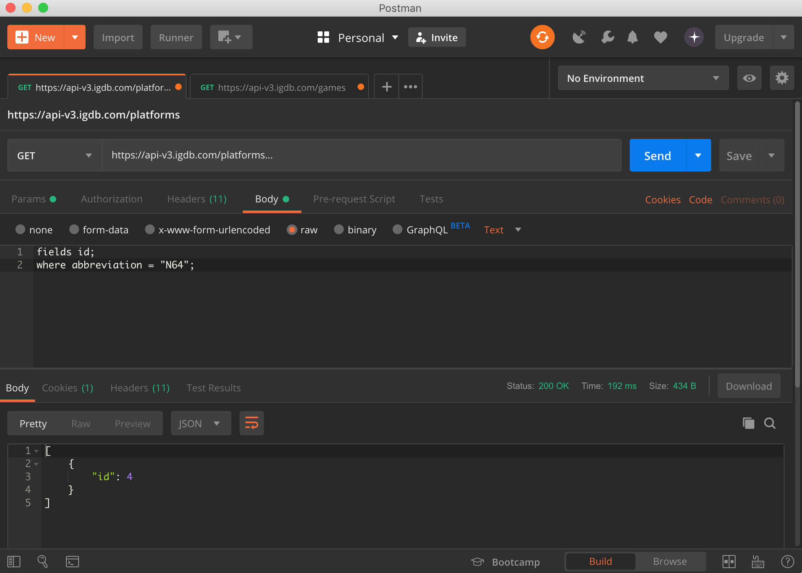
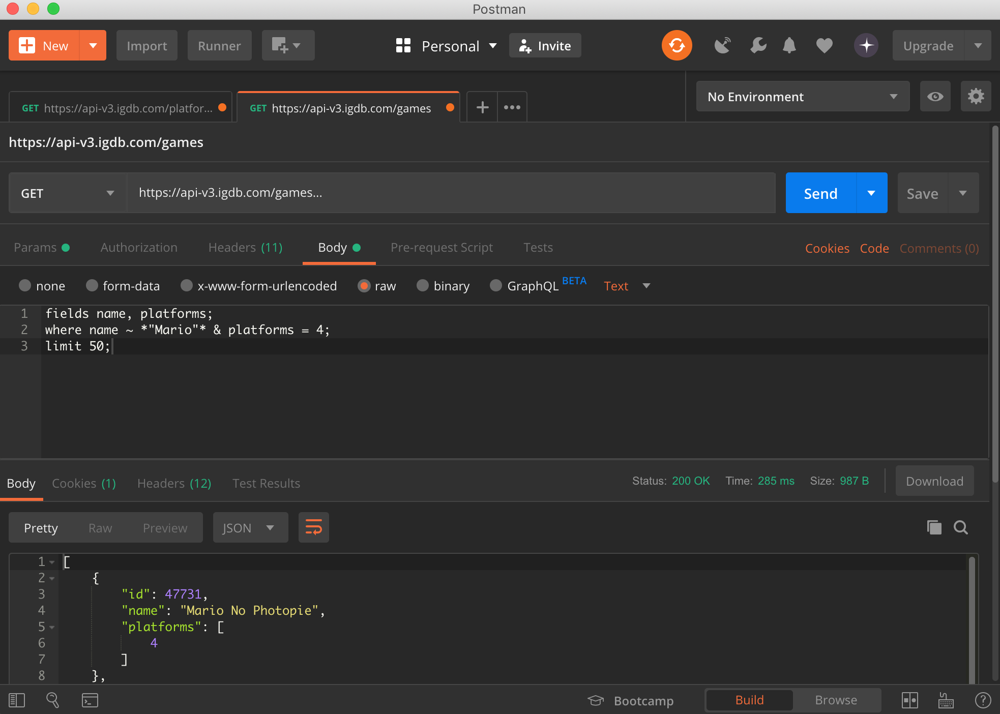
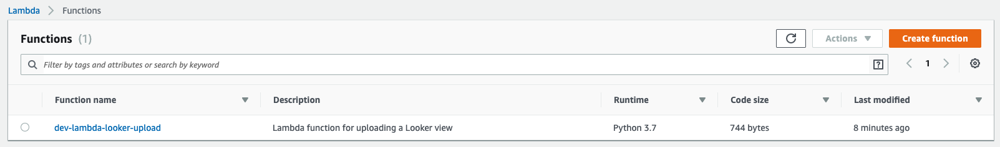
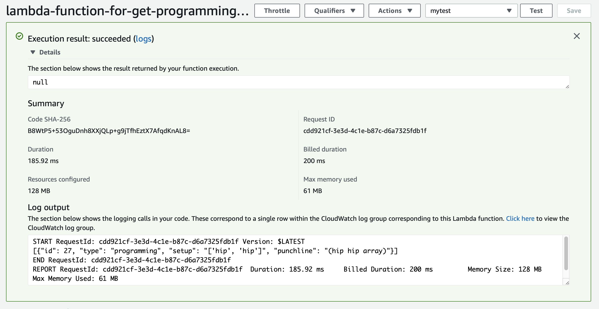

Title: Creating abstract classes with Lambda and Terraform
Date: 2019-07-26 11:30
Modified: 2019-07-26 11:30
Category: posts
Tags: DevOps, AWS, data engineer, Terraform, Lambda, IaC, OOP
Slug: create-abstract-classes-with-lambda-and-terraform
Authors: Jitse-Jan
Summary: In this article I will create an abstract class and different concrete classes to be used within AWS Lambda deployed with Terraform.

## Objective
- Understand Python's *abstract classes*
- Implement a few *concrete classes*
- Understand basic software principles
- Create foundation for scalable serverless deployment with Lambda functions

## Introduction
In this article I want to touch on different things. I have been working with [AWS Lambda](https://aws.amazon.com/lambda/) and [Terraform](https://www.terraform.io) for a while now and I am constantly trying to improve my knowledge. By making a small project I hope to give a good idea of a minimal Terraform deployment for people that are new to Terraform. 

In previous years I have been working as a Software Engineer where code was written in a more consistent way and software practices were followed according to the different *Software Design Patterns* ([Gang of Four Patterns](https://www.gofpatterns.com)). I have noticed that in my current team everybody understands Python and PySpark, but often code is simply written as a sequential script rather than a proper structure with appropriate classes. This was not a problem when my team was still small, but since we are scaling here at MarketInvoice, more people are working on the code base. For example, we have a variety of AWS Lambda functions that crawl data from third parties (i.e. Jira, PagerDuty) which are all written as standalone functions with (a lot) of overlapping code. The idea is to create a common class with shared functionality which can then be used by the different crawlers and avoid repeating writing the same code over and over again ([Don't repeat yourself - Wikipedia](https://en.wikipedia.org/wiki/Don%27t_repeat_yourself)). By utilizing these software principles, I am sure my team will become more productive and can spend more time on adding more interesting data to our data platform and reduce fixing bugs.

## Initialization
First I create the Git repository for this tutorial on Github. After creating the repo, I clone it to my code directory.

```bash
~/code $ git clone https://github.com/jitsejan/abstract-lambdas-terraform.git
```

I have the alias that will open [PyCharm](https://www.jetbrains.com/pycharm/) from my command line so I can simply do the following:

```bash
~/code $ which charm
/usr/local/bin/charm
~/code $ cd abstract-lambdas-terraform
~/code/abstract-lambdas-terraform $ charm .
No IDE instance has been found. New one will be started.
```

After opening PyCharm, make sure to add the `.idea` folder to the `.gitignore`.

```bash
~/code/abstract-lambdas-terraform $ echo .idea >> .gitignore
```

Additionally, add the API key from IGDB (see below) to your shell, either add the `export IGDB_KEY="<KEY>"` to `~/.bashrc` or `~/.zshrc` and run `source` on the file you've just changed to make variable available in your terminal and Python.

```bash
~/code/abstract-lambdas-terraform $ echo $IGDB_KEY
<KEY>
```


## Testing
I will use the public gaming database from [IGDB: Free Video Game Database API](https://api.igdb.com) as a source for this project. Check [GitHub - public-apis/public-apis](https://github.com/public-apis/public-apis) for other APIs. Make sure to sign-up and get your personal API key to interact with the IGDB API. Test the API with [Postman](https://www.getpostman.com) to ensure the credentials are working and you understand the endpoints. Add your API key as `user-key` to the *Headers* field. At the query to the (raw) *Body* field. 

First I hit the `platform` endpoint to retrieve the ID for the *N64* platform.



Second I hit the games endpoint to filter for N64 games that contain Mario in the name.




## Implementation
### Single file 
Let's first start by recreating the Postman test in Python with the following code to get the platform ID for the N64.

```python
""" __main__.py """
import os
import requests

BASE_URL = 'https://api-v3.igdb.com/{endpoint}'
HEADERS = {
    'user-key': os.environ.get('IGDB_KEY', '')
}


def main():
    """ Main function """
    response = requests.get(BASE_URL.format(endpoint='platforms'),
                            data='fields id; where abbreviation = "N64";',
                            headers=HEADERS)
    print(response.json())


if __name__ == "__main__":
    main()

```

Running this in the terminal will print the response with a list containing ID 4.

```bash
~/code/abstract-lambdas-terraform $ python .
[{u'id': 4}]
```

After cleaning up the code by introducing a private function the code looks like this:

```python
""" __main__.py """
import os
import requests

BASE_URL = 'https://api-v3.igdb.com/{endpoint}'
HEADERS = {
    'user-key': os.environ.get('IGDB_KEY', '')
}


def _get_platform_id(platform_abbreviation):
    """ Get the platform ID for a given platform abbreviation """
    endpoint = 'platforms'
    query = 'fields id; where abbreviation = "{abbr}";'
    response = requests.get(BASE_URL.format(endpoint=endpoint),
                            data=query.format(abbr=platform_abbreviation),
                            headers=HEADERS)
    return response.json()[0]["id"]


def main():
    """ Main function """
    print(_get_platform_id("N64"))


if __name__ == "__main__":
    main()
```

Let's add the second endpoint function to retrieve the games for the platform like we did in the second Postman call.

```python
""" __main__.py """
import json
import os
import requests

BASE_URL = 'https://api-v3.igdb.com/{endpoint}'
HEADERS = {
    'user-key': os.environ.get('IGDB_KEY', '')
}


def _get_games(platform_id, name=None):
    """ Get the games for a given platform and an optional name filter """
    endpoint = 'games'
    if name:
        query = 'fields name; where name ~ *"{name}"* & platforms = {platform_id}; limit 50;'
    else:
        query = 'fields name; where platforms = {platform_id}; limit 50;'
    response = requests.get(BASE_URL.format(endpoint=endpoint),
                            data=query.format(name=name, platform_id=platform_id),
                            headers=HEADERS)
    return response.json()


def _get_platform_id(platform_abbreviation):
    """ Get the platform ID for a given platform abbreviation """
    endpoint = 'platforms'
    query = 'fields id; where abbreviation = "{abbr}";'
    response = requests.get(BASE_URL.format(endpoint=endpoint),
                            data=query.format(abbr=platform_abbreviation),
                            headers=HEADERS)
    return response.json()[0]["id"]


def main():
    """ Main function """
    platform_id = _get_platform_id("N64")
    games = _get_games(platform_id, "Mario")
    print(json.dumps(games))


if __name__ == "__main__":
    main()
```

Running this will result in the list with games. Note that I use the `jq` tool to pretty print the JSON response from the API.

```bash
~/code/abstract-lambdas-terraform $ python . | jq
[
  {
    "id": 47731,
    "name": "Mario No Photopie"
  },
  {
    "id": 3541,
    "name": "Mario no Photopi"
  },
  {
    "id": 2327,
    "name": "Mario Party"
  },
  {
    "id": 3475,
    "name": "Dr. Mario 64"
  },
  {
    "id": 44059,
    "name": "Mario Artist: Talent Studio"
  },
  {
    "id": 2329,
    "name": "Mario Party 3"
  }
]
```

### Introduce classes
We now introduce the IGDBApiResolver class that contains the code for the two endpoints. The initial version looks like this:

```python
""" __main__.py """
import json
import os
import requests


class IGDBApiResolver:
    """ Class definition for the IGDBApiResolver """
    BASE_URL = 'https://api-v3.igdb.com/{endpoint}'
    HEADERS = {
        'user-key': os.environ.get('IGDB_KEY', '')
    }

    def _get_games(self, platform_id, name=None):
        """ Get the games for a given platform and an optional name filter """
        endpoint = 'games'
        if name:
            query = 'fields name; where name ~ *"{name}"* & platforms = {platform_id}; limit 50;'
        else:
            query = 'fields name; where platforms = {platform_id}; limit 50;'
        response = requests.get(self.BASE_URL.format(endpoint=endpoint),
                                data=query.format(name=name, platform_id=platform_id),
                                headers=self.HEADERS)
        return response.json()


    def _get_platform_id(self, platform_abbreviation):
        """ Get the platform ID for a given platform abbreviation """
        endpoint = 'platforms'
        query = 'fields id; where abbreviation = "{abbr}";'
        response = requests.get(self.BASE_URL.format(endpoint=endpoint),
                                data=query.format(abbr=platform_abbreviation),
                                headers=self.HEADERS)
        return response.json()[0]["id"]


def main():
    """ Main function """
    game_api = IGDBApiResolver()
    platform_id = game_api._get_platform_id("N64")
    games = game_api._get_games(platform_id, "Mario")
    print(json.dumps(games))


if __name__ == "__main__":
    main()
```

Because we use the `requests` call several times, it's good practice to create a function for the call. Additionally, a function that can be called from a class externally should not have the leading underscore. Let's separate private and public functions properly.

```python
""" __main__.py """
import json
import os
import requests


class IGDBApiResolver:
    """ Class definition for the IGDBApiResolver """
    BASE_URL = 'https://api-v3.igdb.com/{endpoint}'
    HEADERS = {
        'user-key': os.environ.get('IGDB_KEY', '')
    }

    def _get_api_json_response(self, endpoint, data):
        """ Return the API JSON response """
        response = requests.get(url=self.BASE_URL.format(endpoint=endpoint),
                                data=data,
                                headers=self.HEADERS)
        return response.json()

    def get_games(self, platform_id, name=None):
        """ Get the games for a given platform and an optional name filter """
        endpoint = 'games'
        if name:
            query = 'fields name; where name ~ *"{name}"* & platforms = {platform_id}; limit 50;'
        else:
            query = 'fields name; where platforms = {platform_id}; limit 50;'

        return self._get_api_json_response(endpoint=endpoint,
                                           data=query.format(name=name,
                                                             platform_id=platform_id))

    def get_platform_id(self, platform_abbreviation):
        """ Get the platform ID for a given platform abbreviation """
        endpoint = 'platforms'
        query = 'fields id; where abbreviation = "{abbr}";'

        return self._get_api_json_response(endpoint=endpoint,
                                           data=query.format(abbr=platform_abbreviation))[0]['id']


def main():
    """ Main function """
    game_api = IGDBApiResolver()
    platform_id = game_api.get_platform_id("N64")
    games = game_api.get_games(platform_id, "Mario")
    print(json.dumps(games))


if __name__ == "__main__":
    main()

```

We split the class and the main function into two files. `__main__.py` contains

```python
""" __main__.py """
import json
from igdbapiresolver import IGDBApiResolver


def main():
    """ Main function """
    game_api = IGDBApiResolver()
    platform_id = game_api.get_platform_id("N64")
    games = game_api.get_games(platform_id, "Mario")
    print(json.dumps(games))


if __name__ == "__main__":
    main()

```

and `igdbapiresolver.py` contains the class:

```python
""" igdbapiresolver.py """
import os
import requests


class IGDBApiResolver:
    """ Class definition for the IGDBApiResolver """
    BASE_URL = 'https://api-v3.igdb.com/{endpoint}'
    HEADERS = {
        'user-key': os.environ.get('IGDB_KEY', '')
    }

    def _get_api_json_response(self, endpoint, data):
        """ Return the API JSON response """
        response = requests.get(url=self.BASE_URL.format(endpoint=endpoint),
                                data=data,
                                headers=self.HEADERS)
        return response.json()

    def get_games(self, platform_id, name=None):
        """ Get the games for a given platform and an optional name filter """
        endpoint = 'games'
        if name:
            query = 'fields name; where name ~ *"{name}"* & platforms = {platform_id}; limit 50;'
        else:
            query = 'fields name; where platforms = {platform_id}; limit 50;'

        return self._get_api_json_response(endpoint=endpoint,
                                           data=query.format(name=name,
                                                             platform_id=platform_id))

    def get_platform_id(self, platform_abbreviation):
        """ Get the platform ID for a given platform abbreviation """
        endpoint = 'platforms'
        query = 'fields id; where abbreviation = "{abbr}";'

        return self._get_api_json_response(endpoint=endpoint,
                                           data=query.format(abbr=platform_abbreviation))[0]['id']

```

Running this will result in the exact same list.

```bash
~/code/abstract-lambdas-terraform $ python . | jq
[
  {
    "id": 47731,
    "name": "Mario No Photopie"
  },
  {
    "id": 3541,
    "name": "Mario no Photopi"
  },
  {
    "id": 2327,
    "name": "Mario Party"
  },
  {
    "id": 3475,
    "name": "Dr. Mario 64"
  },
  {
    "id": 44059,
    "name": "Mario Artist: Talent Studio"
  },
  {
    "id": 2329,
    "name": "Mario Party 3"
  }
]
```

### Another API..
I will use the [GitHub - 15Dkatz/official_joke_api](https://github.com/15Dkatz/official_joke_api) to add another API resolver to this project.

Add the following class to `jokeapiresolver.py`:

```python
""" jokeapiresolver.py """
import os
import requests


class JokeApiResolver:
    """ Class definition for the JokeApiResolver """
    BASE_URL = 'https://official-joke-api.appspot.com/{endpoint}'
    HEADERS = None

    def _get_api_json_response(self, endpoint, data=None):
        """ Return the API JSON response """
        response = requests.get(url=self.BASE_URL.format(endpoint=endpoint),
                                data=data,
                                headers=self.HEADERS)
        return response.json()

    def get_programming_joke(self):
        endpoint = 'jokes/programming/random'
        return self._get_api_json_response(endpoint)

    def get_random_joke(self):
        endpoint = 'random_joke'
        return self._get_api_json_response(endpoint)
```

and extend the `__main__.py` with the new API:

```python
""" __main__.py """
import json
from igdbapiresolver import IGDBApiResolver
from jokeapiresolver import JokeApiResolver

def main():
    """ Main function """
    game_api = IGDBApiResolver()
    platform_id = game_api.get_platform_id("N64")
    games = game_api.get_games(platform_id, "Mario")
    print(json.dumps(games))

    joke_api = JokeApiResolver()
    print(json.dumps(joke_api.get_random_joke()))
    print(json.dumps(joke_api.get_programming_joke()))


if __name__ == "__main__":
    main()
```

Running the main function will give back the games as before, plus two jokes from the new API.

```bash
~/code/abstract-lambdas-terraform $ python . | jq
[
  {
    "id": 47731,
    "name": "Mario No Photopie"
  },
  {
    "id": 3541,
    "name": "Mario no Photopi"
  },
  {
    "id": 2327,
    "name": "Mario Party"
  },
  {
    "id": 3475,
    "name": "Dr. Mario 64"
  },
  {
    "id": 44059,
    "name": "Mario Artist: Talent Studio"
  },
  {
    "id": 2329,
    "name": "Mario Party 3"
  }
]
{
  "setup": "What does a female snake use for support?",
  "type": "general",
  "id": 247,
  "punchline": "A co-Bra!"
}
[
  {
    "setup": "Where do programmers like to hangout?",
    "type": "programming",
    "id": 17,
    "punchline": "The Foo Bar."
  }
]
```

### Introduce an Abstract Base Class (ABC)

It's time to combine some logic in one central class, since we have the `_get_api_json_response` in both the classes we have introduced. It is good practice to combine common methods in a base class and inherit from that base class with subclasses for specific functionality for those classes. In this case we will make an ApiResolver base class and both the Game and Joke subclasses will inherit from that class. We will use the `abc` module in Python to create an Abstract Base Class which will help us defining 

- common functions shared between classes
- common properties shared between classes
- necessary functions to be implemented by the subclass (concrete class)
- necessary properties to be implemented by the subclass (concrete class)
(Note that abstract properties in Python > 3.5 are defined with the two decorators `@property` and `@abstractmethod`. 

Add the following to `abstractapiresolver.py`:

```python
""" abstractapiresolver.py """
from abc import ABCMeta, abstractmethod
import requests


class AbstractApiResolver(metaclass=ABCMeta):
    """ Class definition of the AbstractApiResolver """

    def _get_api_json_response(self, endpoint, data=None):
        """ Return the API JSON response """
        response = requests.get(url=self.BASE_URL.format(endpoint=endpoint),
                                data=data,
                                headers=self.HEADERS)
        return response.json()

    @property
    @abstractmethod
    def headers(self):
        pass

    @property
    @abstractmethod
    def base_url(self):
        pass

```

We can now inherit from this ABC in the Joke API resolver as such:

```python
""" jokeapiresolver.py """
from abstractapiresolver import AbstractApiResolver


class JokeApiResolver(AbstractApiResolver):
    """ Class definition for the JokeApiResolver """
    BASE_URL = 'https://official-joke-api.appspot.com/{endpoint}'
    HEADERS = None

    def get_programming_joke(self):
        endpoint = 'jokes/programming/random'
        return self._get_api_json_response(endpoint)

    def get_random_joke(self):
        endpoint = 'random_joke'
        return self._get_api_json_response(endpoint)
```

and the API resolver for the games as:

```python
""" igdbapiresolver.py """
import os
from abstractapiresolver import AbstractApiResolver


class IGDBApiResolver(AbstractApiResolver):
    """ Class definition for the IGDBApiResolver """
    BASE_URL = 'https://api-v3.igdb.com/{endpoint}'
    HEADERS = {
        'user-key': os.environ.get('IGDB_KEY', '')
    }

    def get_games(self, platform_id, name=None):
        """ Get the games for a given platform and an optional name filter """
        endpoint = 'games'
        if name:
            query = 'fields name; where name ~ *"{name}"* & platforms = {platform_id}; limit 50;'
        else:
            query = 'fields name; where platforms = {platform_id}; limit 50;'

        return self._get_api_json_response(endpoint=endpoint,
                                           data=query.format(name=name,
                                                             platform_id=platform_id))

    def get_platform_id(self, platform_abbreviation):
        """ Get the platform ID for a given platform abbreviation """
        endpoint = 'platforms'
        query = 'fields id; where abbreviation = "{abbr}";'

        return self._get_api_json_response(endpoint=endpoint,
                                           data=query.format(abbr=platform_abbreviation))[0]['id']

```

Note that I did not clean this file up yet and this will not work yet. Instead, when running the code now will result in the following error:

```bash
~/code/abstract-lambdas-terraform $ python3 .
Traceback (most recent call last):
  File "/Library/Frameworks/Python.framework/Versions/3.7/lib/python3.7/runpy.py", line 193, in _run_module_as_main
    "__main__", mod_spec)
  File "/Library/Frameworks/Python.framework/Versions/3.7/lib/python3.7/runpy.py", line 85, in _run_code
    exec(code, run_globals)
  File "./__main__.py", line 19, in <module>
    main()
  File "./__main__.py", line 8, in main
    game_api = IGDBApiResolver()
TypeError: Can't instantiate abstract class IGDBApiResolver with abstract methods base_url, headers

```

Because in `abstractapiresolver.py` we defined `base_url` and `headers` as abstract properties, each inherited class should define these properties, otherwise the class can not be instantiated. I have moved the properties `BASE_URL` and `HEADERS` to be a property of the ABC, so let's rewrite them as below.

```python
""" jokeapiresolver.py """
from abstractapiresolver import AbstractApiResolver


class JokeApiResolver(AbstractApiResolver):
    """ Class definition for the JokeApiResolver """

    def get_programming_joke(self):
        endpoint = 'jokes/programming/random'
        return self._get_api_json_response(endpoint)

    def get_random_joke(self):
        endpoint = 'random_joke'
        return self._get_api_json_response(endpoint)

    @property
    def headers(self):
        return None

    @property
    def base_url(self):
        return 'https://official-joke-api.appspot.com/{endpoint}'
```

and

```python
""" igdbapiresolver.py """
import os
from abstractapiresolver import AbstractApiResolver


class IGDBApiResolver(AbstractApiResolver):
    """ Class definition for the IGDBApiResolver """

    def get_games(self, platform_id, name=None):
        """ Get the games for a given platform and an optional name filter """
        endpoint = 'games'
        if name:
            query = 'fields name; where name ~ *"{name}"* & platforms = {platform_id}; limit 50;'
        else:
            query = 'fields name; where platforms = {platform_id}; limit 50;'

        return self._get_api_json_response(endpoint=endpoint,
                                           data=query.format(name=name,
                                                             platform_id=platform_id))

    def get_platform_id(self, platform_abbreviation):
        """ Get the platform ID for a given platform abbreviation """
        endpoint = 'platforms'
        query = 'fields id; where abbreviation = "{abbr}";'

        return self._get_api_json_response(endpoint=endpoint,
                                           data=query.format(abbr=platform_abbreviation))[0]['id']

    @property
    def headers(self):
        return {
            'user-key': os.environ.get('IGDB_KEY', '')
        }

    @property
    def base_url(self):
        return 'https://api-v3.igdb.com/{endpoint}'
```

In order to use `base_url` and `headers` we rewrite the ABC as:

```python
""" abstractapiresolver.py """
from abc import ABCMeta, abstractmethod
import requests


class AbstractApiResolver(metaclass=ABCMeta):
    """ Class definition of the AbstractApiResolver """

    def _get_api_json_response(self, endpoint, data=None):
        """ Return the API JSON response """
        response = requests.get(url=self.base_url.format(endpoint=endpoint),
                                data=data,
                                headers=self.headers)
        return response.json()

    @property
    @abstractmethod
    def headers(self):
        pass

    @property
    @abstractmethod
    def base_url(self):
        pass
```

Now the code will run fine, since we implemented the correct properties for the concrete classes.

Additionally, we can add a `@abstractmethod`, which is a method that we define in the ABC to enforce it to be implemented by each concrete class.

Add the following to the ABC:

```python
@abstractmethod
def get_data(self):
    pass
```

so it becomes

```python
""" abstractapiresolver.py """
from abc import ABCMeta, abstractmethod
import requests


class AbstractApiResolver(metaclass=ABCMeta):
    """ Class definition of the AbstractApiResolver """

    def _get_api_json_response(self, endpoint, data=None):
        """ Return the API JSON response """
        response = requests.get(url=self.base_url.format(endpoint=endpoint),
                                data=data,
                                headers=self.headers)
        return response.json()

    @abstractmethod
    def get_data(self):
        pass

    @property
    @abstractmethod
    def headers(self):
        pass

    @property
    @abstractmethod
    def base_url(self):
        pass
```

```bash
~/code/abstract-lambdas-terraform $ python3 . | jq
Traceback (most recent call last):
  File "/Library/Frameworks/Python.framework/Versions/3.7/lib/python3.7/runpy.py", line 193, in _run_module_as_main
    "__main__", mod_spec)
  File "/Library/Frameworks/Python.framework/Versions/3.7/lib/python3.7/runpy.py", line 85, in _run_code
    exec(code, run_globals)
  File "./__main__.py", line 19, in <module>
    main()
  File "./__main__.py", line 8, in main
    game_api = IGDBApiResolver()
TypeError: Can't instantiate abstract class IGDBApiResolver with abstract methods get_data
```

### Rewrite the classes
The abstract class contains the shared method to get the API response, the `get_data` method that each class should implement, as well as the `base_url`, `headers` and `endpoints` abstract properties.

```python
""" abstractapiresolver.py """
from abc import ABCMeta, abstractmethod
import requests


class AbstractApiResolver(metaclass=ABCMeta):
    """ Class definition of the AbstractApiResolver """

    def _get_api_json_response(self, endpoint, data=None):
        """ Return the API JSON response """
        response = requests.get(url=self.base_url.format(endpoint=endpoint),
                                data=data,
                                headers=self.headers)
        return response.json()

    @abstractmethod
    def get_data(self):
        pass

    @property
    @abstractmethod
    def headers(self):
        pass

    @property
    @abstractmethod
    def base_url(self):
        pass

    @property
    @abstractmethod
    def endpoints(self):
        pass
```

Note that I wrote the `get_data` function differently in the Joke API resolver compared to the Game API resolver, just for the sake of example. This `get_data` function is generic enough to put in the ABC instead of defining it for each subclass since the endpoints are defined the same way, but that's an easy fix!

```python
""" jokeapiresolver.py """
from abstractapiresolver import AbstractApiResolver


class JokeApiResolver(AbstractApiResolver):
    """ Class definition for the JokeApiResolver """

    def get_data(self, endpoint, **params):
        """ Get data from the API """
        url = self.endpoints[endpoint]['url']
        return self._get_api_json_response(url)

    @property
    def base_url(self):
        return 'https://official-joke-api.appspot.com/{endpoint}'

    @property
    def endpoints(self):
        return {
            'get_programming_joke': {
                'data': None,
                'url': 'jokes/programming/random',
            },
            'get_random_joke': {
                'data': None,
                'url': 'random_joke',
            }
        }

    @property
    def headers(self):
        return None
```

```python
""" igdbapiresolver.py """
import os
from abstractapiresolver import AbstractApiResolver


class IGDBApiResolver(AbstractApiResolver):
    """ Class definition for the IGDBApiResolver """

    def get_data(self, endpoint, **params):
        """ Get data from the API """
        url = self.endpoints[endpoint]['url']
        data = self.endpoints[endpoint]['data'].format(**params)
        return self._get_api_json_response(url, data)

    @property
    def base_url(self):
        return 'https://api-v3.igdb.com/{endpoint}'

    @property
    def endpoints(self):
        return {
            'get_platform_id': {
                'data': 'fields id; where abbreviation = "{abbr}";',
                'url': 'platforms',
            },
            'get_games_for_platform': {
                'data': 'fields name; where platforms = {platform_id}; limit 50;',
                'url': 'games',
            },
            'get_games_for_platform_with_name': {
                'data': 'fields name; where name ~ *"{name}"* & platforms = {platform_id}; limit 50;',
                'url': 'games',
            },
        }

    @property
    def headers(self):
        return {
            'user-key': os.environ.get('IGDB_KEY', '')
        }
```

Finally, we need to update our `__main__.py` to call the two APIs with the right methods.

```python
""" __main__.py """
import json
from igdbapiresolver import IGDBApiResolver
from jokeapiresolver import JokeApiResolver

def main():
    """ Main function """
    game_api = IGDBApiResolver()
    platform_id = game_api.get_data(endpoint="get_platform_id",
                                    abbr="N64")[0]['id']
    games = game_api.get_data(endpoint="get_games_for_platform_with_name",
                              platform_id=platform_id,
                              name="Mario")
    print(json.dumps(games))

    joke_api = JokeApiResolver()
    print(json.dumps(joke_api.get_data(endpoint='get_random_joke')))
    print(json.dumps(joke_api.get_data(endpoint='get_programming_joke')))


if __name__ == "__main__":
    main()
```

### Lambda functions
This article is not about the use or the definition of a Lambda function, but simply an article to show how to simplify Lambda functions and layers with user defined classes.

#### Get a programming joke
Let's define a function that calls the Joke API and get a programming joke. `lambda_handler` is the default handler for a Lambda function, which we will call with an empty `event` and `context`. 

```python
""" get_programming_joke.py """
import json
from jokeapiresolver import JokeApiResolver


def lambda_handler(event, context):
    """ Main function """
    joke_api = JokeApiResolver()
    print(json.dumps(joke_api.get_data(endpoint="get_programming_joke")))


if __name__ == "__main__":
    lambda_handler({}, {})
```

#### Get the Mario games for N64
In this case we add the `platform_abbr` and `name` to the event. This means we can keep the Lambda function the same and simply update these two parameters to get different sets of games. 

```python
""" get_games_for_platform.py """
import json
from igdbapiresolver import IGDBApiResolver


def lambda_handler(event, context):
    """ Main function """
    game_api = IGDBApiResolver()
    platform_id = game_api.get_data(
        endpoint="get_platform_id", abbr=event.get("platform_abbr", "")
    )[0]["id"]
    games = game_api.get_data(
        endpoint="get_games_for_platform_with_name",
        platform_id=platform_id,
        name=event.get("name", ""),
    )
    print(json.dumps(games))


if __name__ == "__main__":
    event = {"platform_abbr": "N64", "name": "Mario"}
    lambda_handler(event, {})


```

### Terraform
See my article on [Creating a Lambda function with Terraform to upload a Looker view | JJ's World](https://www.jitsejan.com/creating-terraform-deployment-aws-lambda-looker.html) for a simple Terraform introduction. In this article I will simply show the steps to deploy the following:

- `get_games_for_platform` Lambda function
- `get_programming_joke` Lambda function
- Lambda layer with
	- Abstract class  `AbstractApiResolver` 
	- Concrete class  `IGDBApiResolver` 
	- Concrete class `JokeApiResolver`

#### Initialization

```bash
~/code/abstract-lambdas-terraform $ terraform init
...
~/code/abstract-lambdas-terraform $ terraform workspace new dev
Created and switched to workspace "dev"!
~/code/abstract-lambdas-terraform $ touch main.tf
~/code/abstract-lambdas-terraform $ touch variables.tf
```

#### Structure  

```bash
~/code/abstract-lambdas-terraform $ tree .
.
├── README.md
├── images
│   ├── postman_get_games.png
│   └── postman_get_platform.png
├── main.tf
├── sources
│   ├── lambda-functions
│   │   ├── get-games-for-platform
│   │   │   └── get_games_for_platform.py
│   │   └── get-programming-joke
│   │       └── get_programming_joke.py
│   └── lambda-layers
│       └── abstract-layer
│           └── python
│               └── abstractlayer
│                   ├── __init__.py
│                   ├── __main__.py
│                   ├── abstractapiresolver.py
│                   ├── igdbapiresolver.py
│                   └── jokeapiresolver.py
├── terraform.tfstate.d
│   └── dev
└── variables.tf
```

#### Build

##### Lambda layer
In order to create the right `lambda.zip` for the Lambda layer, we create a `dist`folder and copy the content of the `python`folder inside. Additionally we need to install all the requirements (in this case only `requests`) for AWS with Docker. We add everything to the ZIP file inside the `dist` folder.

```bash
~/code/abstract-lambdas-terraform/sources/lambda-layers/abstract-layer $ mkdir -p dist/python 
~/code/abstract-lambdas-terraform/sources/lambda-layers/abstract-layer $ docker run --rm -v $(PWD):/foo -w /foo lambci/lambda:build-python3.7 \
	pip install -r requirements.txt -t ./dist/python
~/code/abstract-lambdas-terraform/sources/lambda-layers/abstract-layer $ cp -r ./python/* ./dist
~/code/abstract-lambdas-terraform/sources/lambda-layers/abstract-layer $ cd dist 
~/code/abstract-lambdas-terraform/sources/lambda-layers/abstract-layer/dist $ zip -rD lambda.zip .
  adding: python/abstractlayer/jokeapiresolver.py (deflated 55%)
  adding: python/abstractlayer/abstractapiresolver.py (deflated 61%)
  adding: python/abstractlayer/__init__.py (stored 0%)
  adding: python/abstractlayer/igdbapiresolver.py (deflated 62%)
  adding: python/abstractlayer/__main__.py (deflated 56%)

```

##### Lambda functions
For the Lambda functions we make sure we first rename the files to `lambda.py` since that's the default filename AWS expects as default module name. Then we create again a `dist` folder, add the `lambda.py` and compress the file.

```bash
~/code/abstract-lambdas-terraform/sources/lambda-functions/get-games-for-platform $ mkdir dist                     
~/code/abstract-lambdas-terraform/sources/lambda-functions/get-games-for-platform $ cp lambda.py dist/ 
~/code/abstract-lambdas-terraform/sources/lambda-functions/get-games-for-platform $ cd dist && zip -rD lambda.zip .
  adding: lambda.py (deflated 50%)
```

##### Validate
Run `terraform validate`to ensure all files are there and there is no configuration issue.

```bash
~/code/abstract-lambdas-terraform  $ terraform validate
Success! The configuration is valid.
```

##### Plan & apply
```bash
~/code/abstract-lambdas-terraform  $ terraform plan
...
~/code/abstract-lambdas-terraform  $ terraform apply
...
Apply complete! Resources: 5 added, 0 changed, 0 destroyed.
```

##### Results
Overview of the two Lambda functions:



Running the Lambda function:



## Conclusion
Using abstract classes makes it easier to create complex software, even when running serverless code on AWS. By using these type of classes you can enforce the developer that creates a new concrete class to implement all the necessary methods and properties to ensure code consistency. The approach in my team would be to create all classes as part of one Lambda layer that contains the Python module with the different abstract classes (APIConnector, FTPConnector, etc) and all concrete classes (CompaniesHouseApiConnector, ExperianApiConnector, etc). The Lambda functions to execute the actual data crawl can remain short and simple making it more scalable and flexible to add new endpoints and therefore new datasets to the data lake.


## Reference
[GitHub - jitsejan/abstract-lambdas-terraform](https://github.com/jitsejan/abstract-lambdas-terraform.git)
