Title: Hosting a static website with IPFS
Date: 2020-07-10 01:21
Modified: 2020-07-10 01:21
Category: posts
Tags: IPFS, blockchain, decentralized, eth, website, hosting
Slug: hosting-static-website-with-ipfs
Authors: Jitse-Jan
Summary: In this article I will upload a static website to [IPFS](https://ipfs.io) to get myself familiar with the steps it takes to link an .eth domain to content hosted on the distributed web.

In this article I will upload a static website to [IPFS](https://ipfs.io) to get myself familiar with the steps it takes to link an .eth domain to content hosted on the distributed web.

## Prerequisites

### Mac

Install IPFS Desktop according to the [install instructions](https://docs.ipfs.io/install/). This will add IPFS to the toolbar (the cube icon).

   <center>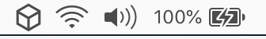</center>

Verify that IPFS is working properly by clicking the icon.

   <center>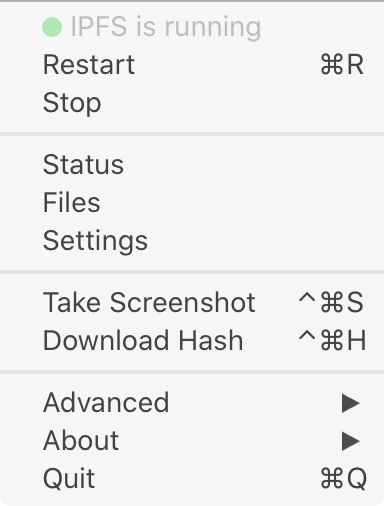</center>
Test `ipfs` in the command line after enabling *Command Line Tools* in the *Preferences*:

```bash
~/code/ipfs-static-website $                                                                           
❯ ipfs --version
ipfs version 0.6.0
```

By installing the Desktop will already start the daemon, so running `ipfs daemon` is not necessary.

### VPS

Install the `go-ipfs` by retrieving the TAR-ball, extracing it and running the installation script.

```bash
~/ $ wget https://github.com/ipfs/go-ipfs/releases/download/v0.5.1/go-ipfs_v0.5.1_linux-amd64.tar.gz
~/ $ tar -xvzf go-ipfs_v0.5.1_linux-amd64.tar.gz
~/ $ cd go-ipfs
~/go-ipfs $ sudo bash install.sh
~/go-ipfs $ ipfs --version
ipfs version 0.5.1
```
   
Initialization will start the node in a local folder. Once you have been added as a node, the daemon can be started. 

```bash
$ ipfs init --profile server
initializing IPFS node at /home/jitsejan/.ipfs
generating 2048-bit RSA keypair...done
peer identity: QmSztWC9dxLzUV7Ph5ZJLwhGW5aLRG2Pwptis3cw6cfK53
to get started, enter:
         ipfs cat /ipfs/QmQPeNsJPyVWPFDVHb77w8G42Fvo15z4bG2X8D2GhfbSXc/readme
$ ipfs daemon
Initializing daemon...
go-ipfs version: 0.5.1
Repo version: 9
System version: amd64/linux
Golang version: go1.13.10
Swarm listening on /ip4/127.0.0.1/tcp/4001
Swarm listening on /ip4/172.17.0.1/tcp/4001
Swarm listening on /ip4/172.21.0.1/tcp/4001
Swarm listening on /ip4/209.182.238.29/tcp/4001
Swarm listening on /ip6/::1/tcp/4001
Swarm listening on /p2p-circuit
Swarm announcing /ip4/127.0.0.1/tcp/4001
Swarm announcing /ip4/209.182.238.29/tcp/4001
Swarm announcing /ip6/::1/tcp/4001
API server listening on /ip4/127.0.0.1/tcp/5001
WebUI: http://127.0.0.1:5001/webui
Gateway (readonly) server listening on /ip4/127.0.0.1/tcp/8080
Daemon is ready
```

Verify the peers that are connected.

```bash
$ ipfs swarm peers
/ip4/104.131.131.82/tcp/4001/p2p/QmaCpDMGvV2BGHeYERUEnRQAwe3N8SzbUtfsmvsqQLuvuJ
/ip4/111.229.117.28/tcp/4001/p2p/QmXUKFSAKB4K9mSVMmtjJw55CkcyXajwTLXdmxvTC4kYy6
/ip4/113.255.3.43/tcp/44244/p2p/QmYC6H9pD26iAMnSiDgn1Rtz8g7Kmiv7mMjoCPRUGkQMLk
/ip4/139.162.58.12/tcp/4001/p2p/QmXYaskeTJHGooCG32wP8tY8yfPYiQbC6yeD9RbrYref67
/ip4/147.75.109.213/tcp/4001/p2p/QmNnooDu7bfjPFoTZYxMNLWUQJyrVwtbZg5gBMjTezGAJN
/ip4/147.75.77.187/tcp/4001/p2p/QmQCU2EcMqAqQPR2i9bChDtGNJchTbq5TbXJJ16u19uLTa
/ip4/147.75.94.115/tcp/4001/p2p/QmcZf59bWwK5XFi76CZX8cbJ4BhTzzA3gU1ZjYZcYW3dwt
/ip4/159.65.73.69/tcp/31564/p2p/12D3KooWQC15gyTUwDUob18c5EQBLCDbHrp8WymrrHoMgdPwLFqW
/ip4/172.104.103.157/tcp/4001/p2p/QmYRk9rftMorXbRPMW26on6kw1ZPkf5hPQVvmd4aumT8JV
/ip4/206.189.69.250/tcp/30315/p2p/12D3KooWJDNVGavZMo5WzgqPZCNBdrKu1DxqoER5wAQ61PHaFnrv
/ip4/207.148.19.196/tcp/20010/p2p/12D3KooWMRXRibgUrCY9FDEXG8DFX3RtqwDKLQT98dgAZP25jvRu
/ip4/49.234.193.176/tcp/4001/p2p/QmakhXhhfcpKpy1LY9FgBqZ6WcMMgeZqPzXjZSDEcFAmQ2
/ip4/73.95.18.162/tcp/51238/p2p/QmWMZpfbMfwRumwrrDjicWsBzHCGzq91AR285dtkrAQB9D
```

Execute the sample test by adding a string to IPFS and querying it using `curl`. 

```bash
$ hash=`echo "I <3 IPFS -$(whoami)" | ipfs add -q`
$ echo $hash
QmR8yeru6tqJis2WR5YV6xmgAQHTBwPKxN8DoJK7uhK4Z3
$ curl "https://ipfs.io/ipfs/$hash"
I <3 IPFS -jitsejan
```

## Create a basic website

The website that we will upload has the following structure. I chose to use subfolders for `css` and `images` to make sure this is also supported by IPFS. In the future I want to upload more complex websites to IPFS, for example my personal blog that is statis website created using [Pelican](https://blog.getpelican.com). From my understanding of IPFS it is not possible to upload dynamic content at this point.

```bash
~/code/ipfs-static-website $
❯ tree
.
├── README.md
├── css
│   └── style.css
├── images
│   └── blockchain.jpg
└── index.html
```

The template for the website has a link to the stylesheet, some content and an image.

`index.html`

```html
<!DOCTYPE html>
<html>
  <head>
    <link rel="stylesheet" type="text/css" href="style.css">
    <title>My first IPFS site!</title>
  </head>
  <body>
    <div class='main-container'>
      
      <div class="content">
        IPFS is the <b>future</b>!
      </div>
    </div>
  </body>
</html>
```

The stylesheet sets the background for the page and makes sure the image is aligned in the center.

`style.css`

```css
body{
    background-color: black;
}
.main-container{
    margin: 50px auto 0px auto;
    width: 500px;
}
.main-container img{
    width: 100%;
}
.main-container .content{
    color: white;
    text-align: center;
}
```

<center>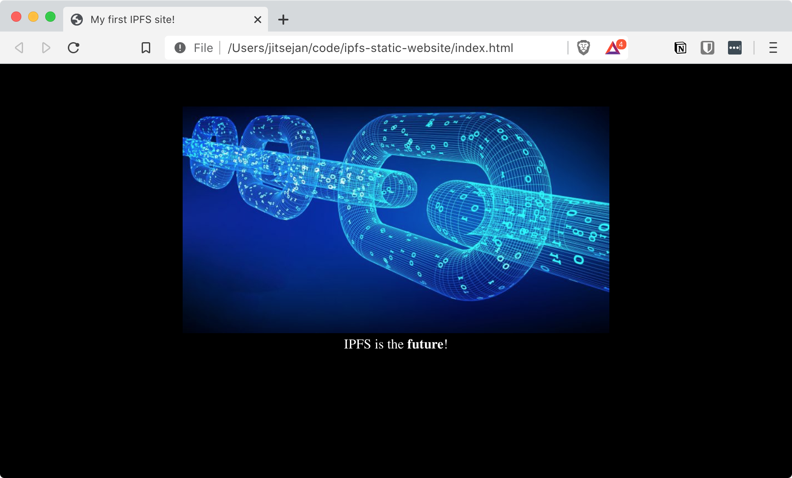</center>

## Add files to IPFS

Now that the files have been created the website should be added to the filesystem. Run `ipfs add -r` in the folder that should be uploaded to recursively add the files to IPFS.

```sh
~/code/ipfs-static-website $
❯ ipfs add -r .
added QmNfVVQsXyekrNiM2dK35oQXg2dGqQ97Gz2PDBxUH6Piqu ipfs-static-website/README.md
added QmZEZJRrb6WxoenKzuXtu9jUgmCxGpg777Y2zqcFwifGNS ipfs-static-website/css/style.css
added QmQaYCUpUzHLiefmonVSHFnBhWw9bHTi1Js3QMddMxStKE ipfs-static-website/images/blockchain.jpg
added QmSFgajgQq1XtjsLxxDupPH1Ys1tAuJ8DQoPScEUEZZX2U ipfs-static-website/index.html
added QmUnsAAQ5vpH4gX1ypR5WaQJb1KDP7KsTEomiijJzetUvM ipfs-static-website/css
added QmYBwq5uLGX6zfEBwjQ7UHgEv3Ton9hX4QjxxkTfg1tdVx ipfs-static-website/images
added Qmeg3LpczHYLWFhQ9htz6qjizkf2aPKm3qZEyW4autpo5u ipfs-static-website
 77.86 KiB / 178.67 KiB [===========================>----------------------------------]  43.58%
```

The `SITE_ID` would be `Qmeg3LpczHYLWFhQ9htz6qjizkf2aPKm3qZEyW4autpo5u` as it is the hash of the main folder (bottom element). Opening up the file browser in **IPFS desktop** and searching for the *QmHash* will show the files from the repository.

<center>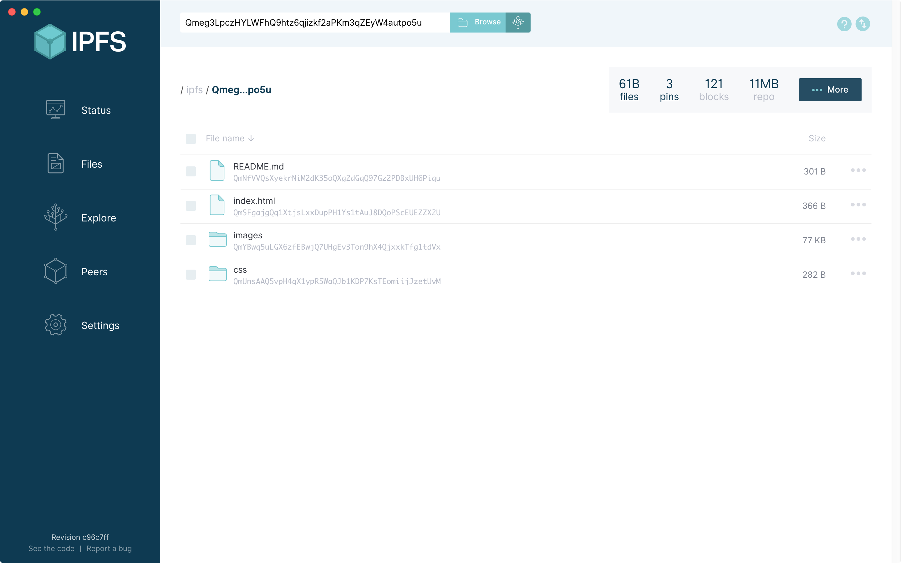</center>

To confirm that the files are correct you can view the files. For example, you can navigate to images and open the `blockchain.jpg` to see the actual content.

<center>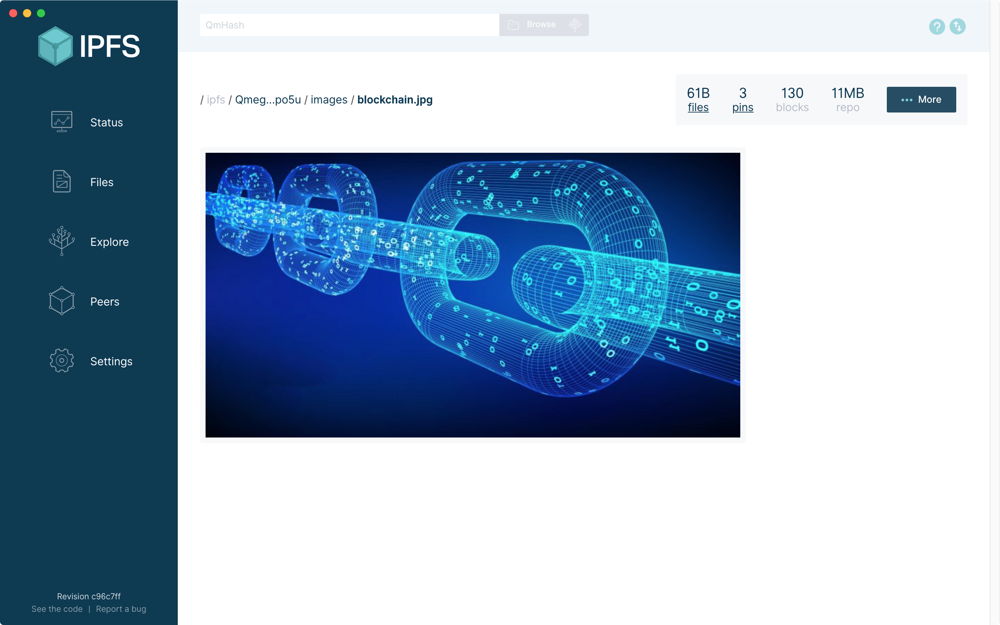</center>

## Verify the content

In the previous step we found the hash of the main folder of the website. Since the ipfs daemon is running, we can view the files locally by navigating to [http://localhost:8080/ipfs/](http://localhost:8080/ipfs/) and adding the hash. Opening the hash in the browser [http://localhost:8080/ipfs/Qmeg3LpczHYLWFhQ9htz6qjizkf2aPKm3qZEyW4autpo5u/](http://localhost:8080/ipfs/Qmeg3LpczHYLWFhQ9htz6qjizkf2aPKm3qZEyW4autpo5u/) will show the page as we expect:

<center>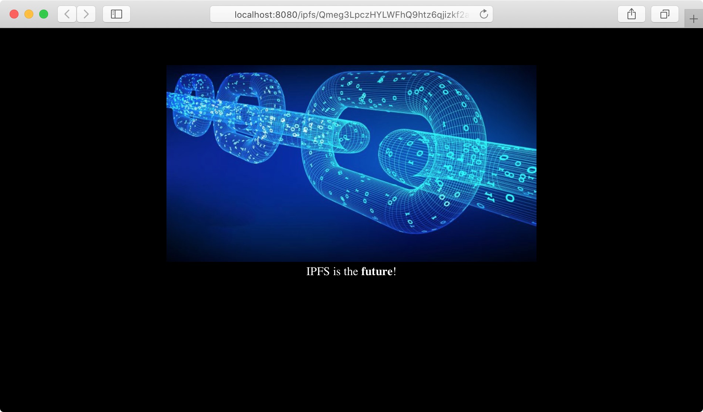</center>

## Use IPNS to host content

A downside of using IPFS is that every time the website changes the corresponding hashes will be updated. If you link directly to the IPFS hash with your DNS this will break the next time you update the website. To avoid manually updating the hash with every update we could use [IPNS](https://docs.ipfs.io/concepts/ipns/) instead. The IPNS hash should remain the same even though the website gets updated. In order to get the IPNS hash we will need to publish using `ipfs name publish <IPFS_HASH>` and wait for the IPFS hash to be returned. In my case it took a minute before the publishing was completed.

```bash
❯ ipfs name publish Qmeg3LpczHYLWFhQ9htz6qjizkf2aPKm3qZEyW4autpo5u
Published to QmSztWC9dxLzUV7Ph5ZJLwhGW5aLRG2Pwptis3cw6cfK53: /ipfs/Qmeg3LpczHYLWFhQ9htz6qjizkf2aPKm3qZEyW4autpo5u
```

The return value contains the hash for IPNS which again we can verify using our localhost. The `$PEER_ID` will be *QmSztWC9dxLzUV7Ph5ZJLwhGW5aLRG2Pwptis3cw6cfK53* and can be appended to [http://localhost:8080/ipns/](http://localhost:8080/ipns/). Indeed opening [http://localhost:8080/ipns/QmXwD1dj6ywm3pNQPY2vuEzjdxz1zvrnVe7DrJp56yBnPU/](http://localhost:8080/ipns/QmXwD1dj6ywm3pNQPY2vuEzjdxz1zvrnVe7DrJp56yBnPU/) shows again the basic website.

<center>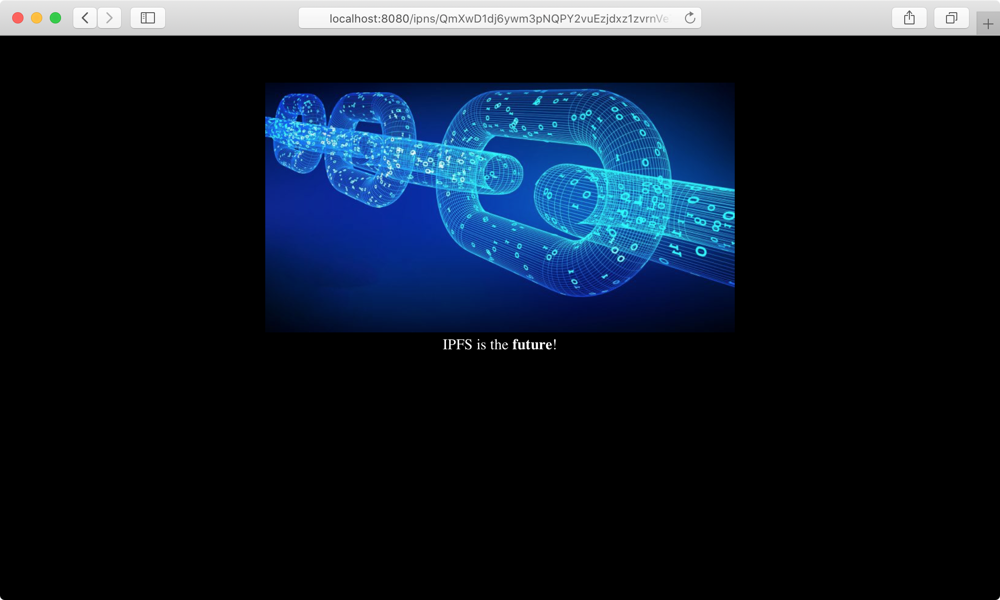</center>

## Setup DNS with Cloudflare

Cloudflare is a service I use for my DNS management and security of my website. Cloudfare also supports an [IPFS gateway](https://www.cloudflare.com/distributed-web-gateway/) which means we can setup the DNS to the IPFS content with this service. In order to link a domain name to the IPFS content we need to add two elements. In my case I want to link the IPFS content to [https://ipfs.jitsejan.com](https://ipfs.jitsejan.com).

1. CNAME containing the subdomain with a target to cloudflare-ipfs.com. 
2. TXT with the name following the pattern `_dnslink.<subdomain>` with the `dnslink=/ipfs/<IPFS_HASH>` as content.

CNAME:

<center>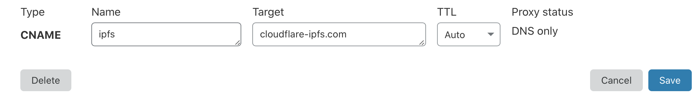</center>

DNS link:

<center>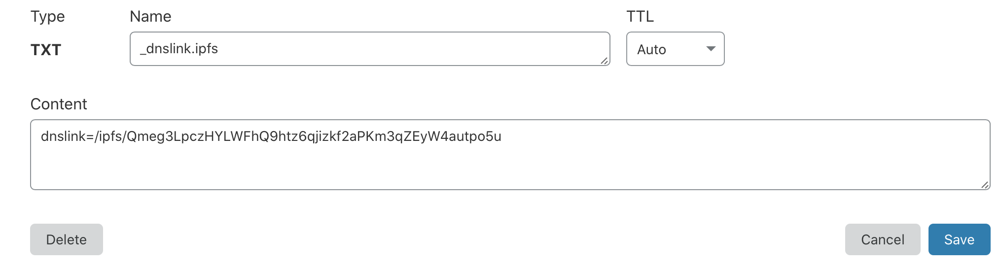</center>

These settings can be verified with `dig`  by checking the answer to a call to `_dnslink.<subdomain>.<domain>`. This should return the `dnslink` with the correct IPFS hash. 

```bash
❯ dig +noall +answer TXT _dnslink.ipfs.jitsejan.com
_dnslink.ipfs.jitsejan.com. 300	IN	TXT	"dnslink=/ipfs/Qmeg3LpczHYLWFhQ9htz6qjizkf2aPKm3qZEyW4autpo5u"
```

As an additional step we can add a certificate to the domain by navigating to [https://www.cloudflare.com/distributed-web-gateway/](https://www.cloudflare.com/distributed-web-gateway/) and scrolling down to the bottom:

<center>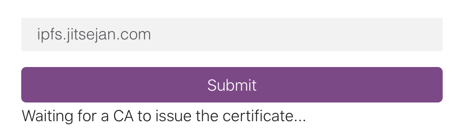</center>

After a few seconds this should complete:

<center>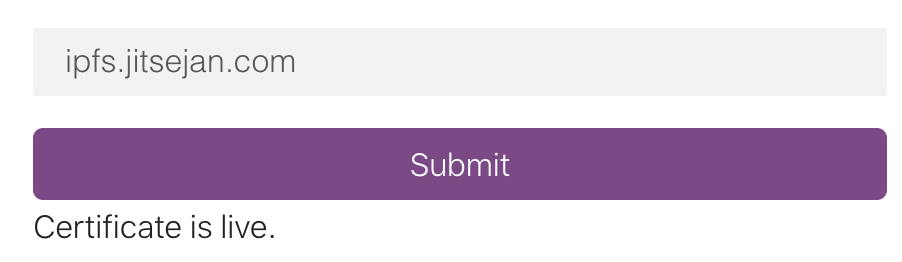</center>

Before checking if my domain is working I will verify the content on the IPFS server of Cloudflare. By navigating to [https://cloudflare-ipfs.com/ipfs/Qmeg3LpczHYLWFhQ9htz6qjizkf2aPKm3qZEyW4autpo5u/](https://cloudflare-ipfs.com/ipfs/Qmeg3LpczHYLWFhQ9htz6qjizkf2aPKm3qZEyW4autpo5u/) I can check if the website is available. Initially it showed me the right page, but without the image.

<center>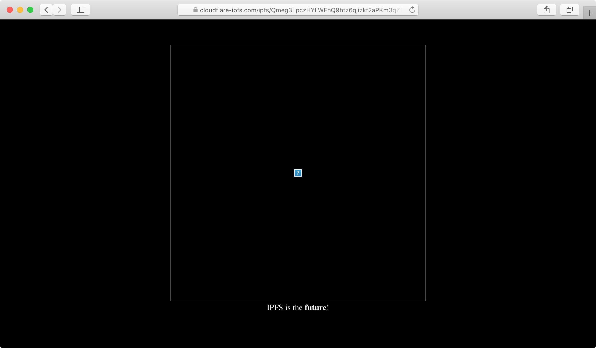</center>

After waiting a couple of minutes the image shows too:

<center>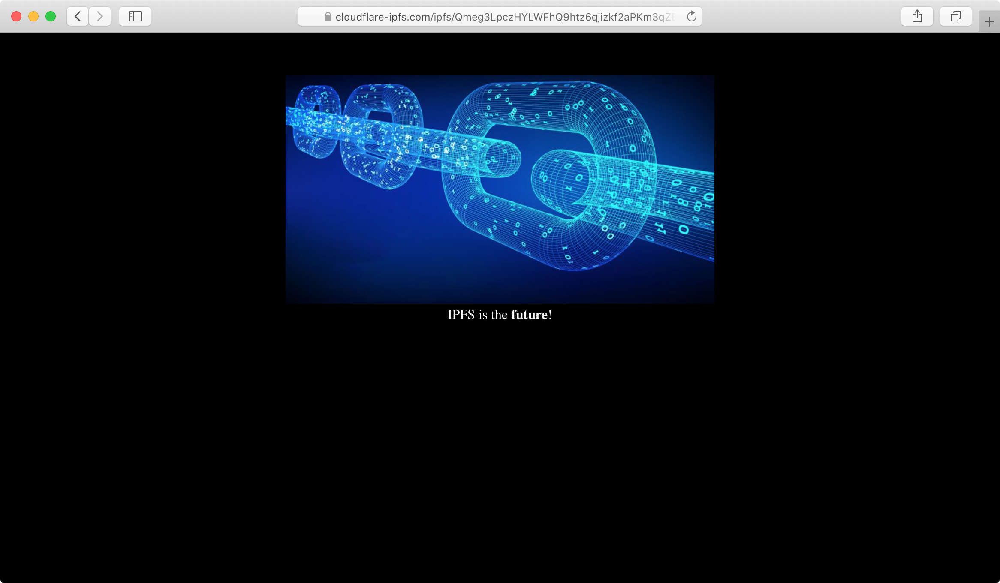</center>

## Setup ENS

I have registered my `eth` domain with [https://app.ens.domains](https://app.ens.domains) to make sure nobody would take `jitsejan.eth`. To see my domains I will need to connect to my wallet which was used to buy the domains. 

Because I bought the domain on my phone using the Cipher Browser some time ago and since then Cipher Browser got acquired by Coinbase the Cipher app was disabled. I did not have access to the Ethereum network and could not access [https://app.ens.domains](https://app.ens.domains). Using the recovery phrase I was able to import my wallet into Firefox with MetaMask on my laptop and manage my domains.

Navigate to your `eth` domain page, for example [https://app.ens.domains/name/jitsejan.eth](https://app.ens.domains/name/jitsejan.eth), and by clicking the `+` under **Records** add the content with your IPFS link:

<center>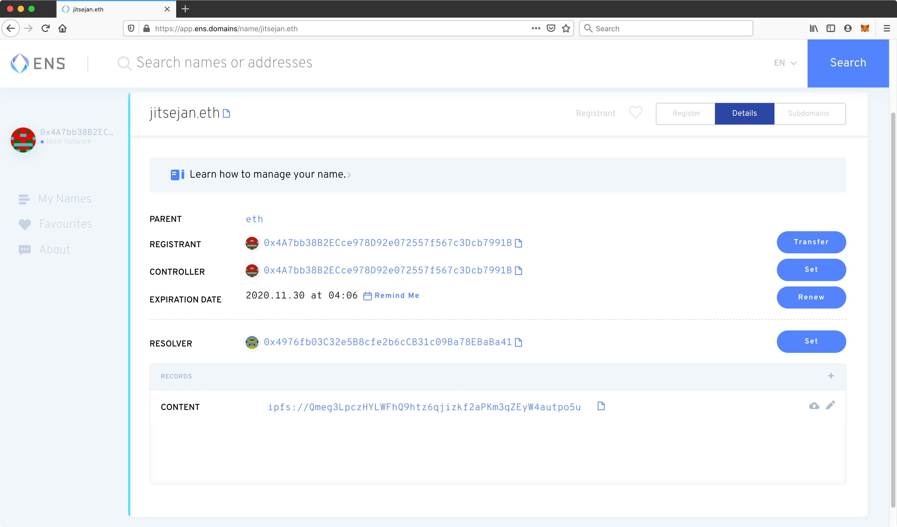</center>

Note: Adding content to the network will cost gas! 

<center>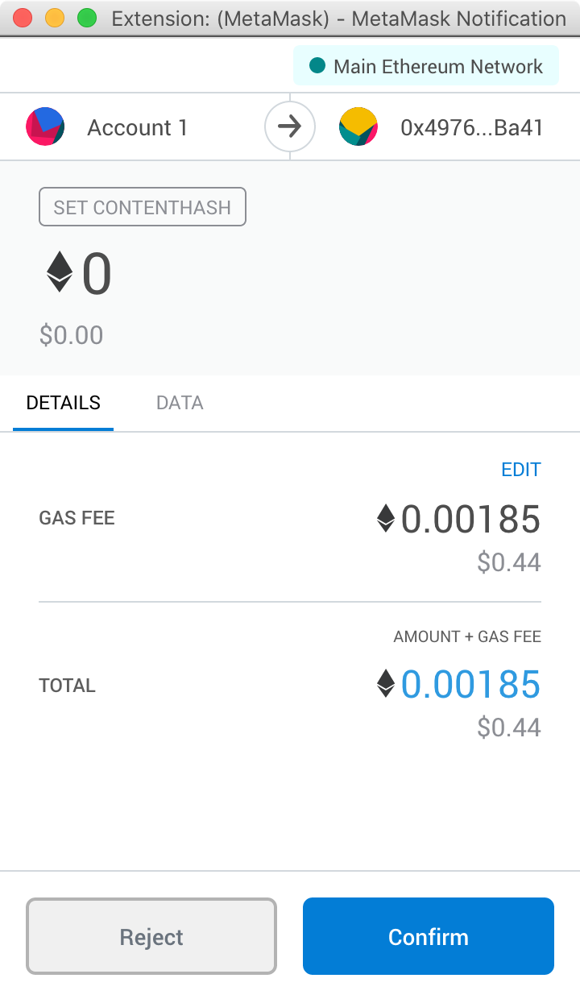</center>

After being very patience the website will be visible on [http://jitsejan.eth.link](http://jitsejan.eth.link). Note the `.link ` in the end to make sure the DNS can handle the content hosted on ENS (info: http://eth.link/). Viewing the page is free, so refreshing every second wouldn't cost you money. 

<center>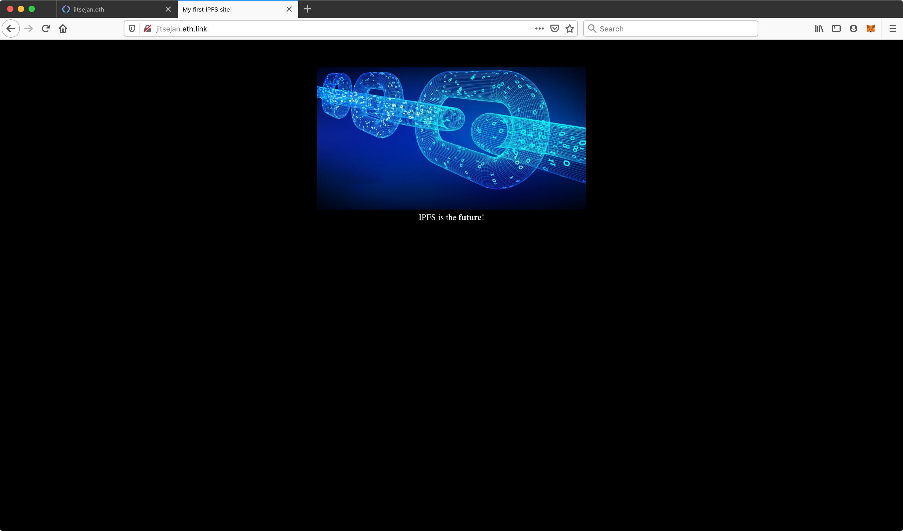</center>

## Future work

- Add a Pelican blog to IPFS
- Use IPNS in combination with the .eth domain

## Sources

- [https://docs.ipfs.io/how-to/host-single-page-site/#create-your-site](https://docs.ipfs.io/how-to/host-single-page-site/#create-your-site)
- [https://www.cloudflare.com/distributed-web-gateway/](https://www.cloudflare.com/distributed-web-gateway/)
