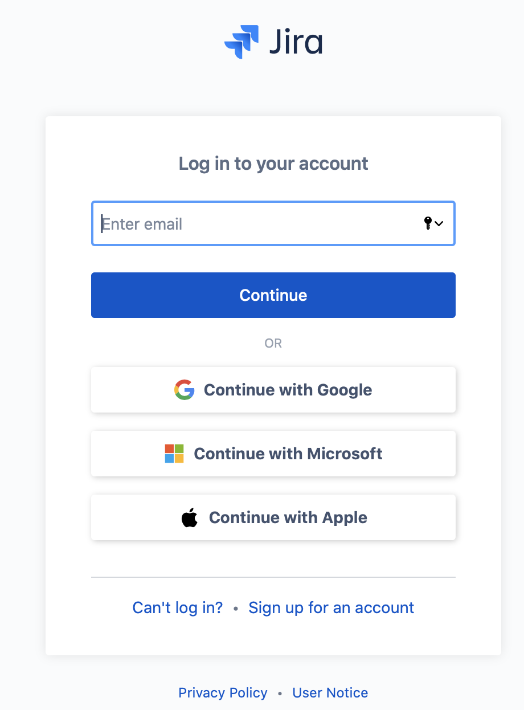
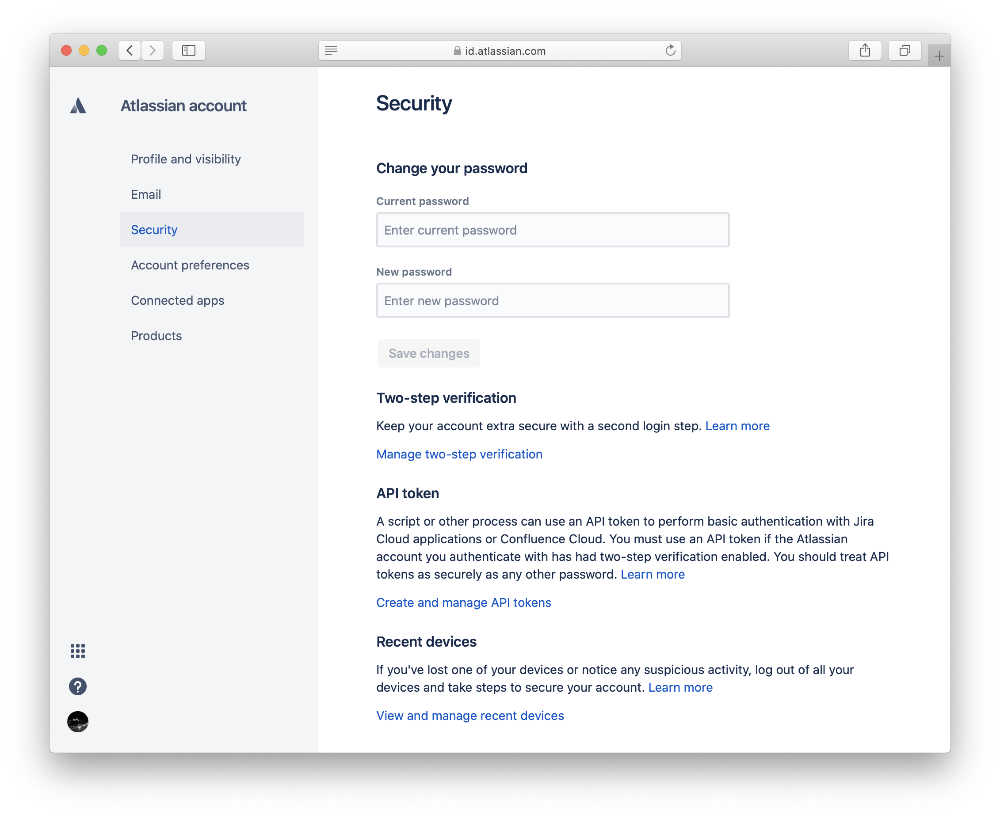
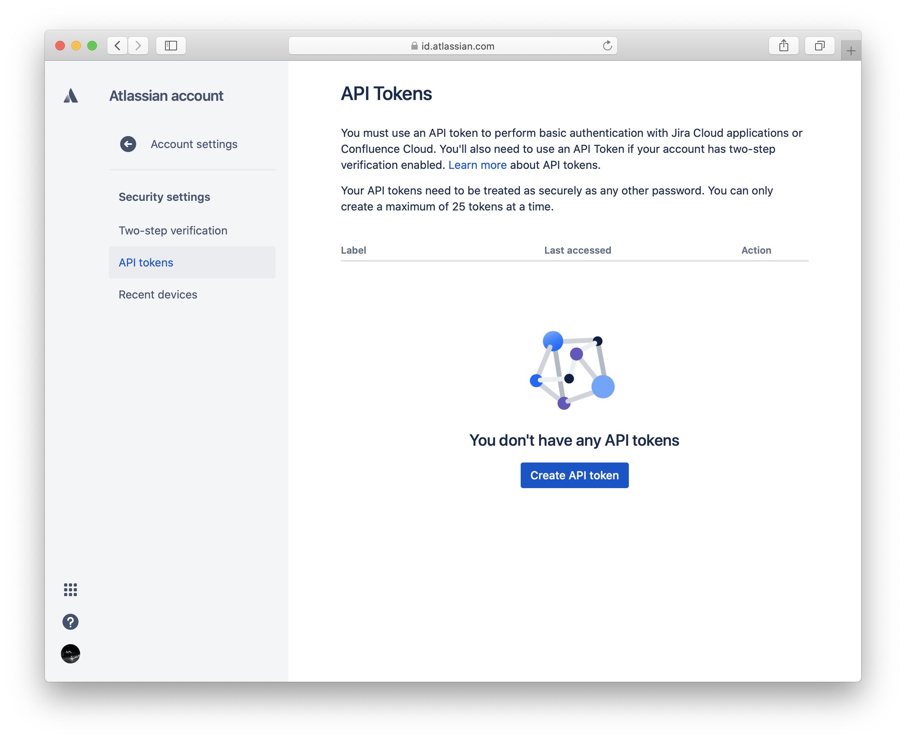
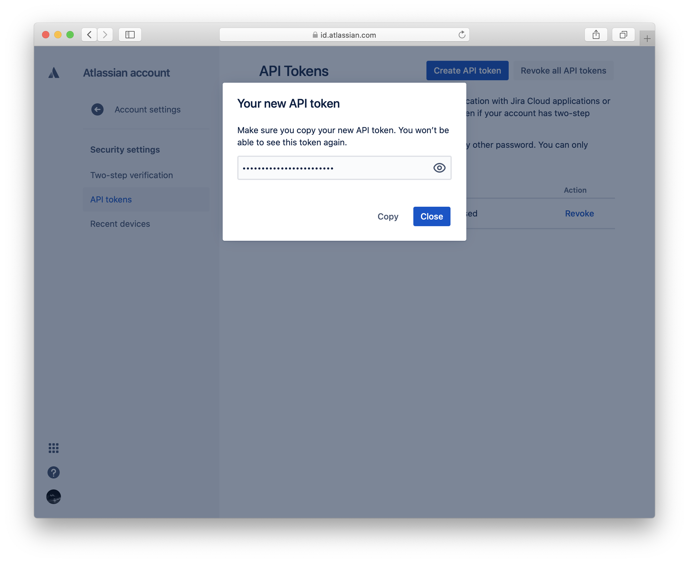
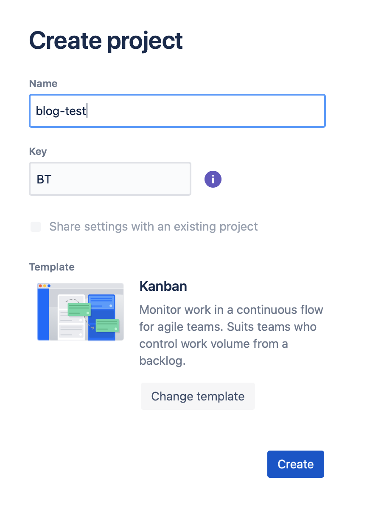
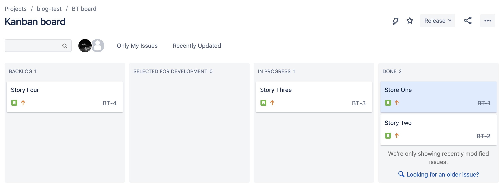
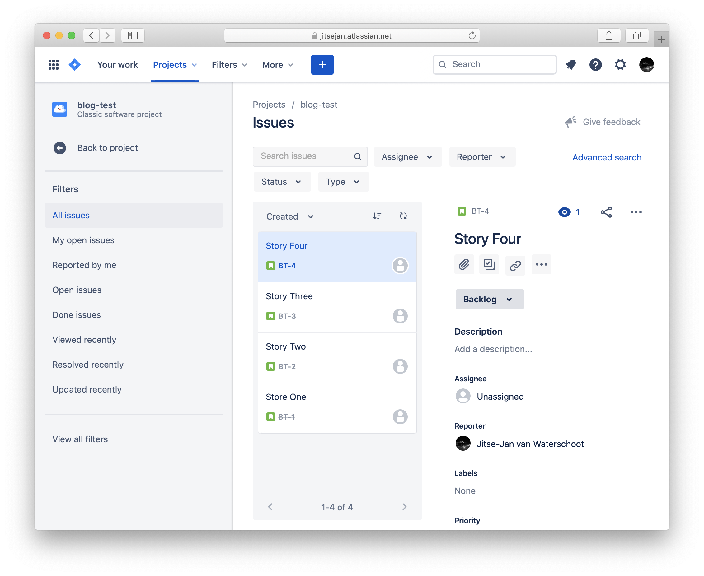

Title: Getting the lead time for Jira tickets
Date: 2020-08-29 23:45
Modified: 2020-09-05 03:12
Category: posts
Tags: ETL, Python, Jira, data extraction, Pandas
Slug: getting-lead-time-for-jira-tickets
Authors: Jitse-Jan
Summary: This is a simple example on how to retrieve the *changelog* of your Jira tickets using Python and `requests` and calculate the lead time. 

## Goal

This is a simple example on how to retrieve the *changelog* of your Jira tickets using Python and `requests` and calculate the lead time. You could also use the Python [Jira module](https://jira.readthedocs.io/en/master/) but by using plain `requests` the following code can easily be copied to other languages.

## Setting up

Either you can use the Jira instance you use at work or simply create a **free** account at [Atlassian.com](https://www.atlassian.com/software/jira/try). 

<center></center>

Note: setting up a new instance using GMail or another other Single Sign On method will not give you a Jira password. You do not need it if you can use the API token for logging in to your Jira instance but in case you do need a password logout of the account and on the login page click on "Can't log in?".

<center></center>

Fill in the email address you used to sign up for Jira and click on "Send recovery link" to set a password.  

## Authenticating

In case of using the free instance that Jira provides authentication is done through the API token. Navigate to your *Atlassian account* > *Security* and click on "Create and manage API tokens" under **API token**. 

<center></center>

In case you have started from scratch there will be no API tokens yet.

<center></center>

Click on "Create API token" to generate a token that you can use in the Python code to connect to the Jira instance. Make sure to save the token somewhere save, i.e. in your terminal environment.

<center></center>

Add the `API_TOKEN`, `API_USER` and `API_URL` to your Python script and add them as `authentication` for your `requests` session. 

Note: for older Jira instances the token might not be supported and you need to authenticate with `(JIRA_USER, JIRA_PASSWORD)`. 

```python
import requests
# Authentication
JIRA_TOKEN = "abcdefg12345"
JIRA_URL = "https://jitsejan.atlassian.net/"
JIRA_USER = "jitsejan@gmail.com"
# Setup request session
rsession = requests.Session()
rsession.auth = (JIRA_USER, JIRA_TOKEN)
```

## Mocking data

<center></center>

To create some data for this small example I have created four stories as part of the `blog-test` (BT) project. I have moved two stories to *Done*, one is still *In progress* and one is in the *Backlog*. Since this is a simple example I haven't added any assignee, description or other metadata to the tickets. 

<center></center>

## Retrieving data

Using the Jira API it is easy to retrieve the tickets as long as you know a little bit of the [Jira Query Language](https://www.atlassian.com/software/jira/guides/expand-jira/jql). To create a query navigate to the *All issues* page and click on Advanced search.

<center></center>

It can be as simple as querying all tickets by their project. For more advanced queries play with the Jira UI and copy the query using the Advanced search option. For simplicity reasons I will pull all the tickets based on the project with the following query:

```sql
project = BT
```

The following Python code will retrieve the tickets for the query and addtionally add the changelog. It is important to enable the `changelog` for the `expand` parameter when the data is retrieved for the tickets. Note that I use version 2 of the API and I retrieve JSON data directly. If this was production code you would obviously verify the response and build in the proper error handling. 

```python
jql = "project = BT"
params = {
    'jql': jql,
    'expand': 'changelog',
}
issues = rsession.get(f"{JIRA_URL}/rest/api/2/search",params=params).json()['issues']
```

As a base table I use only the `key` and the `created` field.

```python
import pandas as pd

base = pd.json_normalize(issues)[['key', 'fields.created']]
base.rename(columns={'fields.created': 'created'}, inplace=True)
```

This will result in the following table with the four tickets that I created before.

| key  | Created                      |
| :--- | :--------------------------- |
| BT-4 | 2020-08-30T21:13:05.191+0000 |
| BT-3 | 2020-08-30T21:13:00.259+0000 |
| BT-2 | 2020-08-30T21:12:52.512+0000 |
| BT-1 | 2020-08-30T21:12:46.238+0000 |

To get the changelog from the `issues` we have to dive a little deeper into the JSON structure. Again I use `json_normalize` but keep the `fields` and `key` fields. To get the history you need to open the JSON path to `changelog` > `histories` and extract the `items` field.

```Python
transitions = pd.json_normalize(data=issues,
                                record_path=['changelog', 'histories'],
                                meta=['fields', 'key'])[['created', 'items', 'key']]
```

Running the above code will result in the following table with the `items` still containing a list of different elements.

| created                      | items                                                        | key  |
| :--------------------------- | :----------------------------------------------------------- | :--- |
| 2020-08-30T21:25:13.454+0000 | [{'field': 'status', 'fieldtype': 'jira', .. ] | BT-3 |
| 2020-08-30T21:17:14.147+0000 | [{'field': 'status', 'fieldtype': 'jira', .. ] | BT-3 |
| 2020-08-30T21:21:39.042+0000 | [{'field': 'resolution', 'fieldtype': 'jira', .. ] | BT-2 |
| 2020-08-30T21:18:59.912+0000 | [{'field': 'status', 'fieldtype': 'jira', .. ] | BT-2 |
| 2020-08-30T21:17:08.462+0000 | [{'field': 'status', 'fieldtype': 'jira', .. ] | BT-2 |
| 2020-08-30T21:21:41.059+0000 | [{'field': 'resolution', 'fieldtype': 'jira', .. ] | BT-1 |
| 2020-08-30T21:18:58.145+0000 | [{'field': 'status', 'fieldtype': 'jira', .. ] | BT-1 |
| 2020-08-30T21:14:17.086+0000 | [{'field': 'status', 'fieldtype': 'jira', .. ] | BT-1 |

The next transformation involves a few steps:

1. Explode the items column to have a row for each item in the list
2. Extract the columns from the items column (i.e. `field` and `fieldtype`) using `pd.Series`
3. Filter out the transitions that involve a `status` change
4. Select only the status change date `created`, the `key` and the `toString` (final state of the transition)

```python
transitions = transitions.join(transitions['items']\
                               .explode()\
                               .apply(pd.Series)
                              )\
                          .query("field == 'status'")\
                          .drop("items", axis=1)[['created', 'key', 'toString']]
```

The table looks cleaner now and shows when a ticket was put in a certain state.

| created                      | key  | toString                 |
| :--------------------------- | :--- | :----------------------- |
| 2020-08-30T21:25:13.454+0000 | BT-3 | In Progress              |
| 2020-08-30T21:17:14.147+0000 | BT-3 | Selected for Development |
| 2020-08-30T21:21:39.042+0000 | BT-2 | Done                     |
| 2020-08-30T21:18:59.912+0000 | BT-2 | In Progress              |
| 2020-08-30T21:17:08.462+0000 | BT-2 | Selected for Development |
| 2020-08-30T21:21:41.059+0000 | BT-1 | Done                     |
| 2020-08-30T21:18:58.145+0000 | BT-1 | In Progress              |
| 2020-08-30T21:14:17.086+0000 | BT-1 | Selected for Development |

In the previous table it should be observed that there are no transitions for the fourth ticket `BT-4`. This makes sense since the ticket was only created but was never put in another column on the Jira board. To calculate ticket metrics it is important to also include the transition to when a ticket was added. In order to do this I will join the `transitions` table with the `created` column from the base table.

First I will create a copy of the base dataframe and add an additional column with the transition to match the schema of the `transitions` table.

```python
created_transitions = base.copy()
# Add column
created_transitions['toString'] = 'Backlog'
```

This will show the four keys with the timestamp and the `toString` information.

| key  | created                      | toString |
| :--- | :--------------------------- | :------- |
| BT-4 | 2020-08-30T21:13:05.191+0000 | Backlog  |
| BT-3 | 2020-08-30T21:13:00.259+0000 | Backlog  |
| BT-2 | 2020-08-30T21:12:52.512+0000 | Backlog  |
| BT-1 | 2020-08-30T21:12:46.238+0000 | Backlog  |

After combining the two tables with

```python
transitions = pd.concat([transitions, create_transitions])
```

the table is complete and contains all the information we need. Now we *do* have a transition for `BT-4`. 

| created                      | key  | toString                 |
| :--------------------------- | :--- | :----------------------- |
| 2020-08-30T21:12:46.238+0000 | BT-1 | Backlog                  |
| 2020-08-30T21:14:17.086+0000 | BT-1 | Selected for Development |
| 2020-08-30T21:18:58.145+0000 | BT-1 | In Progress              |
| 2020-08-30T21:21:41.059+0000 | BT-1 | Done                     |
| 2020-08-30T21:12:52.512+0000 | BT-2 | Backlog                  |
| 2020-08-30T21:17:08.462+0000 | BT-2 | Selected for Development |
| 2020-08-30T21:18:59.912+0000 | BT-2 | In Progress              |
| 2020-08-30T21:21:39.042+0000 | BT-2 | Done                     |
| 2020-08-30T21:13:00.259+0000 | BT-3 | Backlog                  |
| 2020-08-30T21:17:14.147+0000 | BT-3 | Selected for Development |
| 2020-08-30T21:25:13.454+0000 | BT-3 | In Progress              |
| 2020-08-30T21:13:05.191+0000 | BT-4 | Backlog                  |

To calculate the time in each status we will need to `pivot` the table to get the tickets as rows and the statuses as columns.

```python
statuses = transitions.pivot(index='key',
                             values='created',
                             columns='toString')
# Correct the datatype for the dataframe
statuses = statuses.astype('datetime64[ns]')
# Rename the column
```

The table now looks like this which makes it easy to see that `BT-3` is not done yet and `BT-4` never moved.

| key  | Backlog                 | Selected for Development | In Progress             | Done                    |
| :--- | :---------------------- | :----------------------- | :---------------------- | :---------------------- |
| BT-1 | 2020-08-30T21:12:46.238 | 2020-08-30T21:14:17.086  | 2020-08-30T21:18:58.145 | 2020-08-30T21:21:41.059 |
| BT-2 | 2020-08-30T21:12:52.512 | 2020-08-30T21:17:08.462  | 2020-08-30T21:18:59.912 | 2020-08-30T21:21:39.042 |
| BT-3 | 2020-08-30T21:13:00.259 | 2020-08-30T21:17:14.147  | 2020-08-30T21:25:13.454 | NaT                     |
| BT-4 | 2020-08-30T21:13:05.191 | NaT                      | NaT                     | NaT                     |

Now to calculate the *lead time* (time from Backlog to Done) it is straightforward to substract the two columns and get the *timedelta*. Since I moved tickets manually in a short period of time I will calculate the delta in seconds.

```python
statuses['duration [s]'] = (statuses['Done'] - statuses['Backlog']).apply(lambda x: x.seconds)
```

The very impressive result will be this small table:

| key  | duration [s] |
| :--- | -----------: |
| BT-1 |          534 |
| BT-2 |          526 |
| BT-3 |          nan |
| BT-4 |          nan |

Check the final gist [here](https://gist.github.com/jitsejan/0d841dba8f1efeb6bbef10ae7149cc1f). Hope this helps anyone playing with Jira and Python!