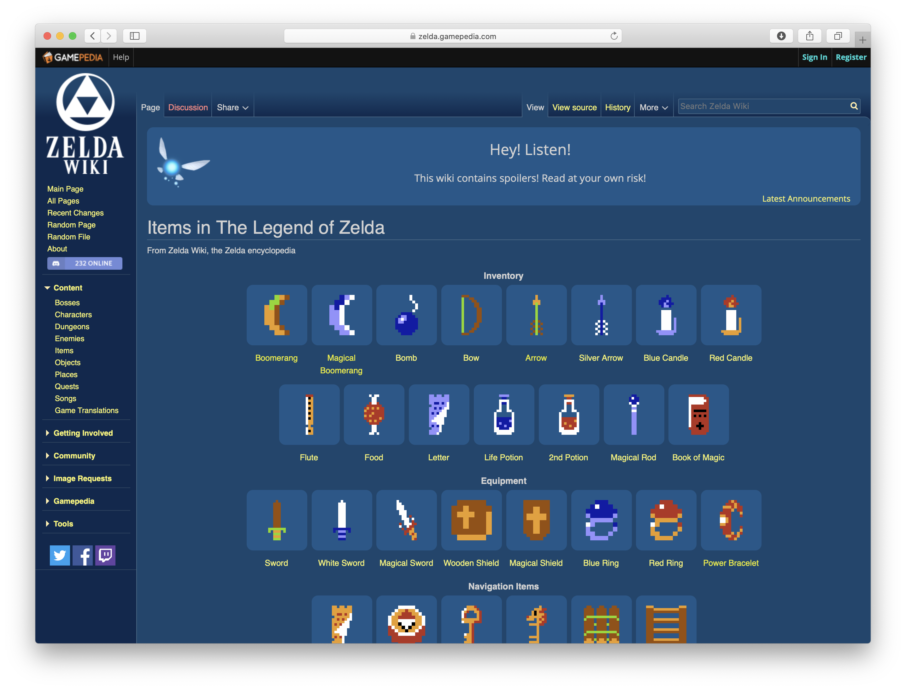
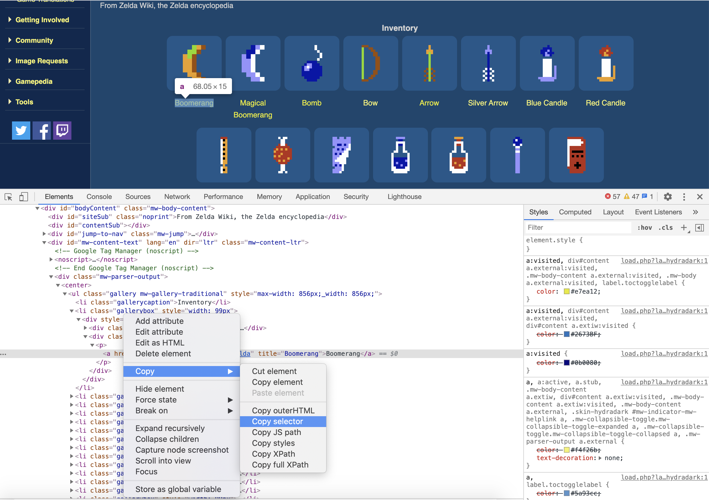

Title: Scraping data with Scrapy and PostgreSQL
Date: 2021-01-05 22:00
Modified: 2021-01-05 22:00
Category: posts
Tags: Python, postgres, PostgreSQL, SQLAlchemy, Scrapy, web crawling
Slug: scraping-with-scrapy-and-postgres
Authors: Jitse-Jan
Summary: To continue the experiment with PostgreSQL I made a simple crawler that retrieves data with Scrapy and stores the data in the PostgreSQL database.

## Introduction

In the following tutorial I will use [Scrapy](https://scrapy.org) to retrieve the items in The Legend of Zelda from [Gamepedia](http://zelda.gamepedia.com/Items_in_The_Legend_of_Zelda). I will focus on those items that have a name and a cost and add them to the database. In [this post](https://www.jitsejan.com/setting-up-postgres-for-python.html) I have installed PostgreSQL on my VPS and configured it to work with Python. These items will help in the next project where I will use them to create a simple REST API with Flask.

## Objective

- Retrieve data from website using Scrapy.
- Store results in a PostgreSQL database.

## Prerequisites

- `pipenv` installed (or any other Python virtual environment tool).
- `Scrapy`,  `sqlalchemy` and `psycopg2` installed in the environment.
- PostgreSQL installed.

```bash
$ pipenv --python 3
$ pipenv shell
data-retrieval $ python --version
Python 3.9.1
data-retrieval $ pipenv install Scrapy
data-retrieval $ pip freeze | grep Scrapy
Scrapy==2.4.1
data-retrieval $ pip freeze | grep SQLAlchemy
SQLAlchemy==1.3.22
data-retrieval $ pip freeze | grep psycopg2
psycopg2==2.8.6
```

## Initialize Scrapy

Start a new Scrapy project inside your new Python project. I picked the creative name `crawl` for the Scrapy project.

```bash
data-retrieval $ scrapy startproject crawl
New Scrapy project 'crawl', using template directory '/Users/jitsejan/.local/share/virtualenvs/testscrapy-jJKHMw2I/lib/python3.9/site-packages/scrapy/templates/project', created in:
    /Users/jitsejan/code/testscrapy/data-retrieval/crawl

You can start your first spider with:
    cd crawl
    scrapy genspider example example.com
```

Running the `startproject` command will create a folder with the structure outlined below. There is a top folder with the project name (`crawl`) that contains the Scrapy configuration and a subfolder with the same name containing the actual crawling code. 

NB: I don't want to go into too much detail about Scrapy because there are many tutorials for the tool online, and because I normally use `requests` with `lxml` to make (very simple) data crawlers. Many people prefer to use [BeautifulSoup](https://www.crummy.com/software/BeautifulSoup/bs4/doc/) or other higher level data crawl libraries so feel free to go for that. I picked Scrapy in this particular case because it creates a nice scaffold when working with crawlers and databases but this can be completely done from scratch as well.

```bash
data-retrieval $ tree crawl
crawl
├── crawl
│   ├── __init__.py
│   ├── items.py
│   ├── middlewares.py
│   ├── pipelines.py
│   ├── settings.py
│   └── spiders
│       └── __init__.py
└── scrapy.cfg

2 directories, 7 files
```

You could choose to not use the generator and write the Scrapy files yourself but for simplicity I use the boilerplate that comes with Scrapy. Now navigate to the top level project folder and create the spider (*crawler*) using `genspider`. In my case I will be crawling data from Gamepedia.com about items that were found in the Zelda games. A completely random choice of website but it fits with the theme I normally use when playing around with code.

<center>

</center>

```bash
data-retrieval $ cd crawl
data-retrieval/crawl $ scrapy genspider zelda_items zelda.gamepedia.com
Created spider 'zelda_items' using template 'basic' in module:
  crawl.spiders.zelda_items
```

If we look again at the tree structure we see that inside the `spiders` folder a new file (`zelda_items.py`) has been created. This file creates the basic structure for a spider.

```bash
data-retrieval/crawl $ tree
.
├── crawl
│   ├── __init__.py
│   ├── items.py
│   ├── middlewares.py
│   ├── pipelines.py
│   ├── settings.py
│   └── spiders
│       ├── __init__.py
│       └── zelda_items.py
└── scrapy.cfg
```

The content of the `zelda_items.py` file is the minimal setup to get started with crawling data.

```python
import scrapy


class ZeldaItemsSpider(scrapy.Spider):
    name = 'zelda_items'
    allowed_domains = ['zelda.gamepedia.com']
    start_urls = ['http://zelda.gamepedia.com/']

    def parse(self, response):
        pass
```

## Setup the scraper

The first element we want to crawl is the link to all the items to get the detailed information for each of them. The code to retrieve these links is added to the `parse` function. Looking at the source code it is easy to copy the selector to get to the right element.

<center>

</center>

The selector returns the following information. 

```html
#mw-content-text > div > center:nth-child(1) > ul > li:nth-child(2) > div > div.gallerytext > p > a
```

As a selector I will use the CSS selector `li.gallerybox .gallerytext p a::attr(href)` to get the hyperlinks to all the items.

```python
def parse(self, response):
    """
    Retrieve the links to the items
    """
    selector = "li.gallerybox .gallerytext p a::attr(href)"
    for href in response.css(selector).extract():
    		yield Request(f"{self.base_url}{href}", callback=self.parse_item)
```

For each link that is retrieved the `parse_item` function is executed. The structure of the information page is a little ugly but we only care about the information table. Since this is a Wiki the data can be very unstructured and not all the tables will have the same fields which should be taken into account when retrieving data. For my particular case I want to retrieve the name and the price of each item (under the condition that the table contains the cost information). The following shows a simplified version of the HTML from which I am extracting the data.

```html
<table class="infobox wikitable">
    <tbody>
        <tr>
            <th class="infobox-name centered" colspan="2"><span class="term">Arrow</span></th>
        </tr>
        <tr>
            <td class="infobox-image centered" colspan="2"> ... </td>
        </tr>
        <tr class="infobox-field">
            <th>Main appearance(s)</th>
            <td> ... </td>
        </tr>
        <tr class="infobox-field">
            <th>Other appearance(s)</th>
            <td> ... </td>
        </tr>
        <tr class="infobox-field">
            <th>Cost(s)</th>
            <td>
                <div class="infobox-field-content">
                    80 <a href="/Rupee" title="Rupee">Rupees</a> <sup>(<b><span title="The Legend of Zelda">TLoZ</span></b>)</sup>
                </div>
            </td>
        </tr>
        <tr class="infobox-field">
            <th>Location(s)</th>
            <td> ... </td>
        </tr>
        <tr class="infobox-field">
            <th>Use(s)</th>
            <td> ... </td>
        </tr>
        <tr class="infobox-field">
            <th>Strength</th>
            <td> ... </td>
        </tr>
        <tr class="infobox-field">
            <th>Comparable item(s)</th>
            <td> ... </td>
        </tr>
    </tbody>
</table>
```

To fetch the data I will again use a CSS selector for the name but the `xpath` selector to find the right element in the table for the cost. I explained in this [earlier article](https://www.jitsejan.com/scraping-with-xpaths.html) how I figured out the right syntax to get the information. Only when the price returns an integer I will return the item. If there is no price I will ignore the item. In the future this code will most probably change to retrieve more items and different fields.

```python
def parse_item(self, response):
    """
    Retrieve the item details
    """
    name_sel = "meta[property='og:title']::attr(content)"
    price_sel = "//tr[th//text()[contains(., 'Cost(s)')]]/td/div/text()"
    name = response.css(name_sel).get()
    price = response.xpath(price_sel).get()
    if price and price.strip().isdigit():
        yield {"name": name, "price": int(price)}
```

## Crawl the data

Now the scraper is ready to be executed and retrieve the items. Run the crawler and verify that it is returning indeed the items that you would expect. There is no output that stores the items yet but the log tells me that there were 10 items that actually had a name and the cost defined (` 'item_scraped_count': 10,`). Note that I set the `loglevel` to **INFO** to prevent an information overload in the console.

```bash
data-retrieval/crawl $ scrapy crawl zelda_items
2021-01-05 21:26:07 [scrapy.utils.log] INFO: Scrapy 2.4.1 started (bot: crawl)
2021-01-05 21:26:07 [scrapy.utils.log] INFO: Versions: lxml 4.6.2.0, libxml2 2.9.10, cssselect 1.1.0, parsel 1.6.0, w3lib 1.22.0, Twisted 20.3.0, Python 3.9.1 (default, Dec 17 2020, 03:41:37) - [Clang 12.0.0 (clang-1200.0.32.27)], pyOpenSSL 20.0.1 (OpenSSL 1.1.1i  8 Dec 2020), cryptography 3.3.1, Platform macOS-10.15.7-x86_64-i386-64bit
2021-01-05 21:26:07 [scrapy.crawler] INFO: Overridden settings:
{'BOT_NAME': 'crawl',
 'LOG_LEVEL': 'INFO',
 'NEWSPIDER_MODULE': 'crawl.spiders',
 'ROBOTSTXT_OBEY': True,
 'SPIDER_MODULES': ['crawl.spiders']}
2021-01-05 21:26:07 [scrapy.extensions.telnet] INFO: Telnet Password: 7313d2472beec312
2021-01-05 21:26:07 [scrapy.middleware] INFO: Enabled extensions:
['scrapy.extensions.corestats.CoreStats',
 'scrapy.extensions.telnet.TelnetConsole',
 'scrapy.extensions.memusage.MemoryUsage',
 'scrapy.extensions.logstats.LogStats']
2021-01-05 21:26:07 [scrapy.middleware] INFO: Enabled downloader middlewares:
['scrapy.downloadermiddlewares.robotstxt.RobotsTxtMiddleware',
 'scrapy.downloadermiddlewares.httpauth.HttpAuthMiddleware',
 'scrapy.downloadermiddlewares.downloadtimeout.DownloadTimeoutMiddleware',
 'scrapy.downloadermiddlewares.defaultheaders.DefaultHeadersMiddleware',
 'scrapy.downloadermiddlewares.useragent.UserAgentMiddleware',
 'scrapy.downloadermiddlewares.retry.RetryMiddleware',
 'scrapy.downloadermiddlewares.redirect.MetaRefreshMiddleware',
 'scrapy.downloadermiddlewares.httpcompression.HttpCompressionMiddleware',
 'scrapy.downloadermiddlewares.redirect.RedirectMiddleware',
 'scrapy.downloadermiddlewares.cookies.CookiesMiddleware',
 'scrapy.downloadermiddlewares.httpproxy.HttpProxyMiddleware',
 'scrapy.downloadermiddlewares.stats.DownloaderStats']
2021-01-05 21:26:07 [scrapy.middleware] INFO: Enabled spider middlewares:
['scrapy.spidermiddlewares.httperror.HttpErrorMiddleware',
 'scrapy.spidermiddlewares.offsite.OffsiteMiddleware',
 'scrapy.spidermiddlewares.referer.RefererMiddleware',
 'scrapy.spidermiddlewares.urllength.UrlLengthMiddleware',
 'scrapy.spidermiddlewares.depth.DepthMiddleware']
2021-01-05 21:26:09 [scrapy.middleware] INFO: Enabled item pipelines:
['crawl.pipelines.CrawlPipeline']
2021-01-05 21:26:09 [scrapy.core.engine] INFO: Spider opened
2021-01-05 21:26:09 [scrapy.extensions.logstats] INFO: Crawled 0 pages (at 0 pages/min), scraped 0 items (at 0 items/min)
2021-01-05 21:26:09 [scrapy.extensions.telnet] INFO: Telnet console listening on 127.0.0.1:6023
2021-01-05 21:26:13 [scrapy.core.engine] INFO: Closing spider (finished)
2021-01-05 21:26:13 [scrapy.statscollectors] INFO: Dumping Scrapy stats:
{'downloader/request_bytes': 22501,
 'downloader/request_count': 75,
 'downloader/request_method_count/GET': 75,
 'downloader/response_bytes': 1941159,
 'downloader/response_count': 75,
 'downloader/response_status_count/200': 37,
 'downloader/response_status_count/301': 38,
 'dupefilter/filtered': 1,
 'elapsed_time_seconds': 4.146036,
 'finish_reason': 'finished',
 'finish_time': datetime.datetime(2021, 1, 5, 21, 26, 13, 283001),
 'item_scraped_count': 10,
 'log_count/INFO': 10,
 'memusage/max': 73228288,
 'memusage/startup': 73224192,
 'request_depth_max': 1,
 'response_received_count': 37,
 'robotstxt/request_count': 1,
 'robotstxt/response_count': 1,
 'robotstxt/response_status_count/200': 1,
 'scheduler/dequeued': 73,
 'scheduler/dequeued/memory': 73,
 'scheduler/enqueued': 73,
 'scheduler/enqueued/memory': 73,
 'start_time': datetime.datetime(2021, 1, 5, 21, 26, 9, 136965)}
2021-01-05 21:26:13 [scrapy.core.engine] INFO: Spider closed (finished)
```

## Store the data

First of all I define the schema of the element that I am crawling in the `items.py`. There is no fancy schema yet but this can obviously be improved in the future when more items are being retrieved and the actual datatypes do make a difference.

```python
"""crawl/crawl/items.py"""
from scrapy import Field, Item


class ZeldaItem(Item):
    """ Definition of the ZeldaItem """

    name = Field()
    price = Field()
```

The `middlewares.py` is left untouched for the project. The important bit for storing data in a database is inside `models.py`. As described before I use SQLAlchemy to connect to the PostgreSQL database. The database details are stored in `settings.py` (see below) and are used to create the SQLAlchemy `engine`. I define the `Items` model with the two fields and use the `create_items_table` to create the table. 

```python
"""crawl/crawl/models.py"""
from sqlalchemy import Column, Integer, String, create_engine
from sqlalchemy.engine.base import Engine
from sqlalchemy.engine.url import URL
from sqlalchemy.ext.declarative import declarative_base

from crawl import settings

DeclarativeBase = declarative_base()


def db_connect() -> Engine:
    """
    Creates database connection using database settings from settings.py.
    Returns sqlalchemy engine instance
    """
    return create_engine(URL(**settings.DATABASE))


def create_items_table(engine: Engine):
    """
    Create the Items table
    """
    DeclarativeBase.metadata.create_all(engine)


class Items(DeclarativeBase):
    """
    Defines the items model
    """

    __tablename__ = "items"

    name = Column("name", String, primary_key=True)
    price = Column("price", Integer)

```

Inside the `pipelines.py` the spider is connected to the database. When the pipeline is started it will initalize the database and create the `engine`, create the table and setup a SQLAlchemy session. The `process_item` function is part of the default code and is executed for every yielded item in the scraper. In this case it means it will be triggered every time an item is retrieved with a name and a cost. For every item it is first checked if the item already exists in the database and in case is does not exist yet it will be added to the database. Remember to always `commit()` when adding (or removing) items to the table.

```python
"""crawl/crawl/pipelines.py"""
from sqlalchemy.orm import sessionmaker

from crawl.models import Items, create_items_table, db_connect


class CrawlPipeline:
    def __init__(self):
        """
        Initializes database connection and sessionmaker.
        Creates items table.
        """
        engine = db_connect()
        create_items_table(engine)
        self.Session = sessionmaker(bind=engine)

    def process_item(self, item, spider):
        """
        Process the item and store to database.
        """
        session = self.Session()
        instance = session.query(Items).filter_by(**item).one_or_none()
        if instance:
            return instance
        zelda_item = Items(**item)

        try:
            session.add(zelda_item)
            session.commit()
        except:
            session.rollback()
            raise
        finally:
            session.close()

        return item

```

Finally, the `settings.py` is short and contains the information for the crawler. The only items I have added are the `DATABASE` and `LOG_LEVEL` variables. You could choose to add your security details in this file but I would recommend to keep them secret and store them elsewhere.

```python
"""crawl/crawl/settings.py"""
import os

BOT_NAME = "crawl"
SPIDER_MODULES = ["crawl.spiders"]
NEWSPIDER_MODULE = "crawl.spiders"
ROBOTSTXT_OBEY = True
ITEM_PIPELINES = {
    "crawl.pipelines.CrawlPipeline": 300,
}
DATABASE = {
    "drivername": "postgres",
    "host": os.environ["POSTGRES_HOST"],
    "port": os.environ["POSTGRES_PORT"],
    "username": os.environ["POSTGRES_USER"],
    "password": os.environ["POSTGRES_PASS"],
    "database": os.environ["POSTGRES_DB"],
}
LOG_LEVEL = "INFO"
```

## Verify the data

As a last step in this tutorial I will double check that there are indeed ten items in the database. I have used `pandas` as an easy way to query the database and add the results to a table. 

```python
import os
import pandas as pd
import sqlalchemy
from sqlalchemy import create_engine

USER = os.environ['POSTGRES_USER']
PASS = os.environ['POSTGRES_PASS']
HOST = os.environ['POSTGRES_HOST']
PORT = os.environ['POSTGRES_PORT']
DB = os.environ['POSTGRES_DB']
db_string = f"postgres://{USER}:{PASS}@{HOST}:{PORT}/{DB}"

engine = create_engine(db_string)

df = pd.read_sql_query('SELECT * FROM items',
                       con=engine)
print(df.to_string())
#                  name  price
# 0           Boomerang    300
# 1     Heart Container      4
# 2           Blue Ring    250
# 3   Red Water of Life     68
# 4                Food     60
# 5  Blue Water of Life     40
# 6         Blue Candle     60
# 7               Arrow     80
# 8                 Bow    980
# 9                Bomb     20
```

See the [Github repo](https://github.com/jitsejan/architecture-patterns-with-python/tree/main/data-retrieval) for the final code. The code most probably will change once I (slowly) continue working on this side project but I hope it might help anyone playing with data crawling and databases.