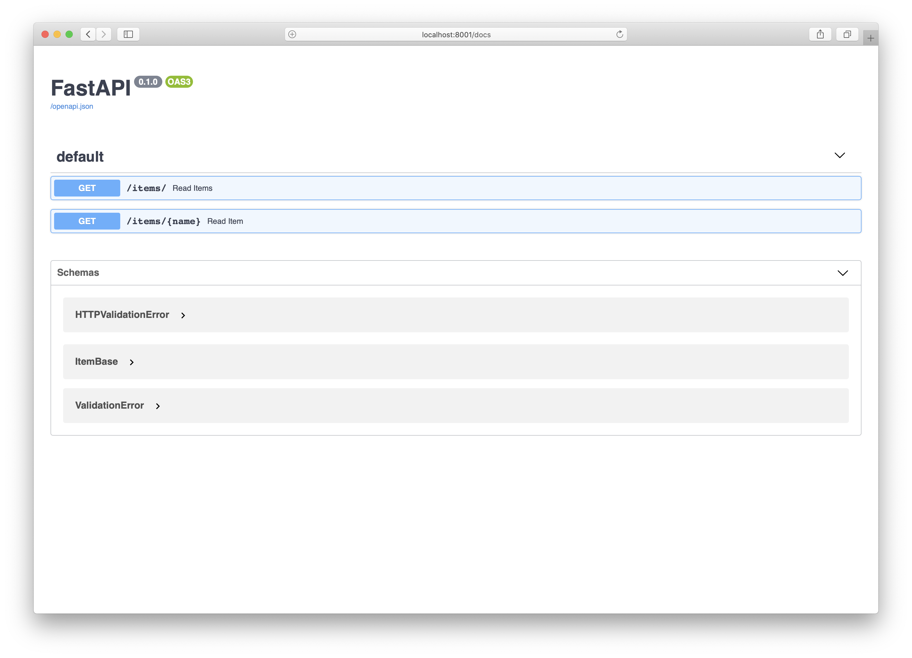
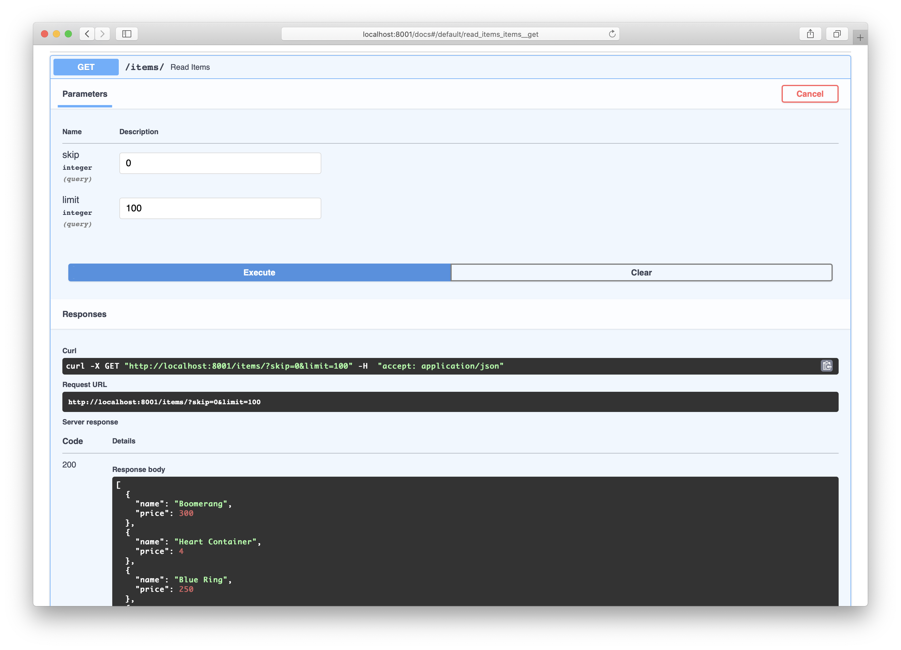

Title: Creating a simple REST API with FastAPI and SQLAlchemy
Date: 2021-02-27 02:27
Modified: 2021-02-27 02:27
Category: posts
Tags: Python, postgres, PostgreSQL, SQLAlchemy, FastAPI, REST, API
Slug: creating-simple-rest-api-with-fastapi-and-sqlalchemy
Authors: Jitse-Jan
Summary: The fourth tutorial in the Postgres related articles is an improvement on the [Flask API](https://www.jitsejan.com/creating-simple-rest-api-with-flask-and-sqlalchemy.html) I made last time. I will be using FastAPI to create the same API, but with the batteries included.

## Introduction

In my previous article I made a quick example explaining how to use [Flask with SQLALchemy as REST API](https://www.jitsejan.com/creating-simple-rest-api-with-flask-and-sqlalchemy.html). Since then I have moved away from Flask and picked up [FastAPI](https://fastapi.tiangolo.com) which makes it, in my opinion, much easier to create a REST API and it is even more performant. Throughout this tutorial I will use the same   data as in the Flask article and assume the data is already stored in Postgres with the same account. The only difference is the code to get the API running.

> *FastAPI framework, high performance, easy to learn, fast to code, ready for production*

## Overview

- **Database** - connects to the Postgres database
- **Models** - describes the data model(s)
- **CRUD** - contains the Create, Read, Update and Delete actions which execute queries on the models against the database
- **Schemas** - defines the schemas of the inputs and outputs of the API
- **Routers** - explains the different routes of the API and what CRUD action to call
- **Main** - instantiates the FastAPI application and adds the routes from the routers

## Database

The important bit is to have your database running and have some data to display. I will simply reuse the same connection that I have used for the Flask REST API which means I store my credentials as environment variables and construct the PostgreSQL connection string to connect to the database through SQLalchemy. The code is similar to the connection code for Flask, however, we can directly use SQLalchemy without an additional package whereas for Flask we had to use `flask_sqlalchemy`. This is one of the important arguments why people use FastAPI over Flask!

**`database.py`**

```python
import os

from sqlalchemy import create_engine  # type: ignore
from sqlalchemy.ext.declarative import declarative_base  # type: ignore
from sqlalchemy.orm import sessionmaker  # type: ignore

host = os.environ["POSTGRES_HOST"]
port = os.environ["POSTGRES_PORT"]
user = os.environ["POSTGRES_USER"]
password = os.environ["POSTGRES_PASS"]
db = os.environ["POSTGRES_DB"]
dbtype = "postgresql"

SQLALCHEMY_DATABASE_URI = f"{dbtype}://{user}:{password }@{host}:{port}/{db}"

engine = create_engine(SQLALCHEMY_DATABASE_URI)
SessionLocal = sessionmaker(autocommit=False, autoflush=False, bind=engine)
Base = declarative_base()

```

The `# type: ignore` comment is to avoid running into errors with the [mypy](https://mypy.readthedocs.io/en/stable/) typechecker.

## Models

Secondly, I create the data model for the application now that I have a database connection. This will be identical to the one that we have used for the Flask app in the other article. The model only contains one table `items` with a name and a price column. Note that because FastAPI is all driven by [typehinting](https://www.python.org/dev/peps/pep-0484/) and [Pydantic](https://pydantic-docs.helpmanual.io) modelling I did add a [`TypedDict`](https://www.python.org/dev/peps/pep-0589/) as return value for the `serialize` method. Using this type I can indicate that I expect a dictionary back that contains the key `name` and the key `price` and their respective types. Obviously this is identical to the database model a few lines below. As mentioned in the previous paragraph, we do not need extra packages like `flask_sqlalchemy` and connect directly to SQLalchemy which makes the models here inherit from `Base` (`declarative_base()`) rather than the `flask_sqlalchemy` SQLalchemy model.

**`models.py`**

```python
from typing import TypedDict

from sqlalchemy import Column, Integer, String  # type: ignore

from .database import Base


class ItemDict(TypedDict):
    name: str
    price: int


class Item(Base):
    """
    Defines the items model
    """

    __tablename__ = "items"

    name = Column(String, primary_key=True)
    price = Column(Integer)

    def __init__(self, name: str, price: int):
        self.name = name
        self.price = price

    def __repr__(self) -> str:
        return f"<Item {self.name}>"

    @property
    def serialize(self) -> ItemDict:
        """
        Return item in serializeable format
        """
        return {"name": self.name, "price": self.price}

```

## CRUD

The [CRUD](https://en.wikipedia.org/wiki/Create,_read,_update_and_delete) element of the API is kept unchanged and still only contains a function to get a single item by name or get all the items. These actions were in one single file in the Flask app where the route that was called directly executed the query against the database but for FastAPI it is common to seperate the routes from the database actions. Again I am using type hinting to indicate that the functions return a single `Item` or a list of `Item`s respectively. 

**`crud.py`**

```python
from typing import List

from sqlalchemy.orm import Session  # type: ignore

from .models import Item


def get_item_by_name(session: Session, name: str) -> Item:
    return session.query(Item).filter(Item.name == name).first()


def get_items(session: Session, skip: int = 0, limit: int = 100) -> List[Item]:
    return session.query(Item).offset(skip).limit(limit).all()

```


## Schemas

As mentioned before, FastAPI heavily relies on `pydantic` for enforcing schemas for all the in- and outputs that are used in the API. There are more complex examples in their documentation where the input model (i.e. *ItemInputModel*) contains only a name and the return model (i.e. *ItemOutputModel*) consists of the name, the attributes and the particular ID. This file would be the place to define that and the schemas will be referred to in the `main.py` where the *routes* are defined. This particular example is kept (too) simple and the `ItemBase` contains a `name` and a `price`. This schema is identical to the return value that I defined before in the `models.py` but instead of `pydantic` I used the lower level `typing` library.

**`schemas.py`**

```python
from pydantic import BaseModel


class ItemBase(BaseModel):
    name: str
    price: int

```

## Routers

The routers file will connect the endpoint the user is calling to the corresponding CRUD action. As explained in the CRUD paragraph there are two actions we want to execute, one for getting an item and one for getting all the items. The route will call the right CRUD method and pass the database session to it. It uses the schemas to define the `response_model` for each route which helps to build the automated docs that FastAPI is also famous for. Note that for both API endpoints I `serialize` the output to make sure that the returned value is a dictionary (or a list of dictionaries) which match the `ItemBase` schema definition.

**```routers.py```**

```python
from typing import List

from fastapi import APIRouter, Depends, HTTPException
from sqlalchemy.orm import Session  # type: ignore

from . import crud, models
from .database import SessionLocal, engine
from .schemas import ItemBase

models.Base.metadata.create_all(bind=engine)
itemrouter = APIRouter()


def get_session():
    session = SessionLocal()
    try:
        yield session
    finally:
        session.close()


@itemrouter.get("/items/", response_model=List[ItemBase])
def read_items(
    skip: int = 0, limit: int = 100, session: Session = Depends(get_session)
):
    items = crud.get_items(session=session, skip=skip, limit=limit)
    return [i.serialize for i in items]


@itemrouter.get("/items/{name}", response_model=ItemBase)
def read_item(name: str, session: Session = Depends(get_session)):
    item = crud.get_item_by_name(session=session, name=name)
    if item is None:
        raise HTTPException(status_code=404, detail="Item not found")
    return item.serialize

```

## Main

The `main` file obviously glues all the above together but since it is all nicely split in small files its content is kept *very* short. It initiates a FastAPI app (equal to the Flask app) and add the `itemrouter` that we defined in `routers.py`. 

**`main.py`**

```python
from fastapi import FastAPI
from .routers import itemrouter

app = FastAPI()
app.include_router(itemrouter)

```

## Execution

At this stage I have the following structure:

```bash
❯ tree fastapiapp
├── __init__.py
├── crud.py
├── database.py
├── main.py
├── models.py
├── routers.py
└── schemas.py
```

Now to run the app I use the following command (make sure to move up from the app folder):

```bash
❯ uvicorn fastapiapp.main:app --reload --workers 1 --host 0.0.0.0 --port 8001
INFO:     Uvicorn running on http://0.0.0.0:8001 (Press CTRL+C to quit)
INFO:     Started reloader process [84872] using statreload
INFO:     Started server process [84874]
INFO:     Waiting for application startup.
INFO:     Application startup complete.
```

This will use the asynchronous web server [uvicorn](https://www.uvicorn.org) to kick off the main app on port 8001 open to the public (0.0.0.0). It will reload automatically here because I was debugging the app but this should of course be avoided. I only use a single worker because that should be enough for me hitting F5 to see the changes.

## Verification

Now that the app is running verify that the docs are working. Navigate to localhost:<port>/docs (8001 in this case) and this will show the documentation for the API. Indeed it shows my two endpoints!

<center>

</center>

The next step is to actually test one of the endpoints which can be done through the docs page by expanding one of the two endpoints and click on "Try it out". Scroll down and hit Execute to see all the items returned in a JSON format.

<center>

</center>

If you don't like user interfaces or documentation you can simply use [HTTPie](https://httpie.io/) to call the `items` endpoint. Default it will use `GET` and I have set the limit to 3 and the skip to 2. 

```bash
❯ http localhost:8001/items/\?limit\=3\&skip\=2
HTTP/1.1 200 OK
content-length: 101
content-type: application/json
date: Sat, 27 Feb 2021 02:22:32 GMT
server: uvicorn

[
    {
        "name": "Blue Ring",
        "price": 250
    },
    {
        "name": "Red Water of Life",
        "price": 68
    },
    {
        "name": "Food",
        "price": 60
    }
]
```

The final code can be found [here](https://github.com/jitsejan/architecture-patterns-with-python/tree/main/restapis/restfastapi).

## Sources

[https://fastapi.tiangolo.com/tutorial/sql-databases/](https://fastapi.tiangolo.com/tutorial/sql-databases/)

