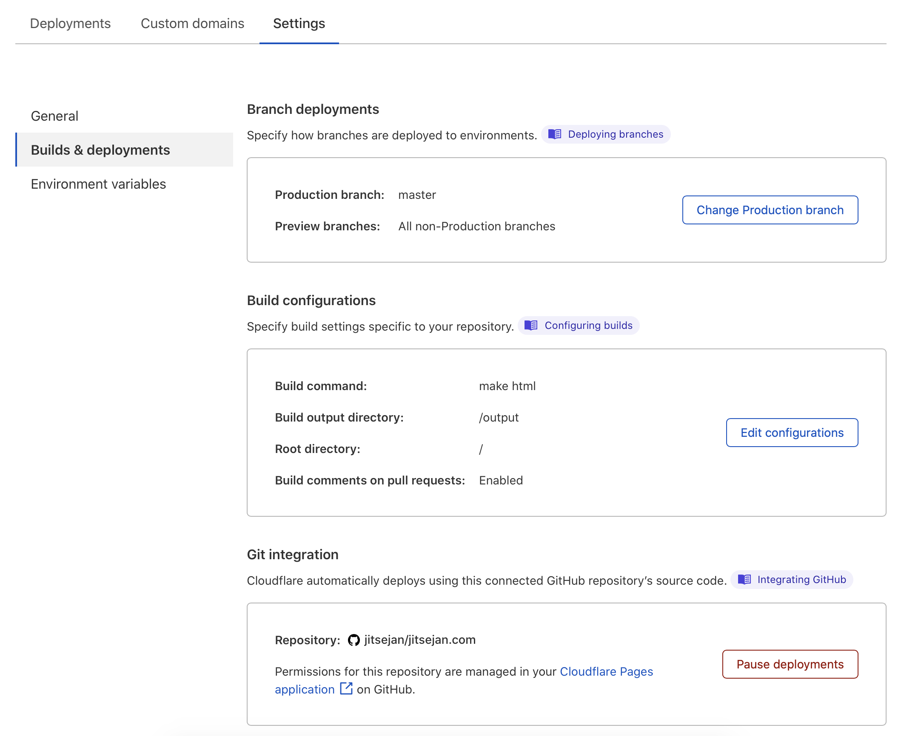
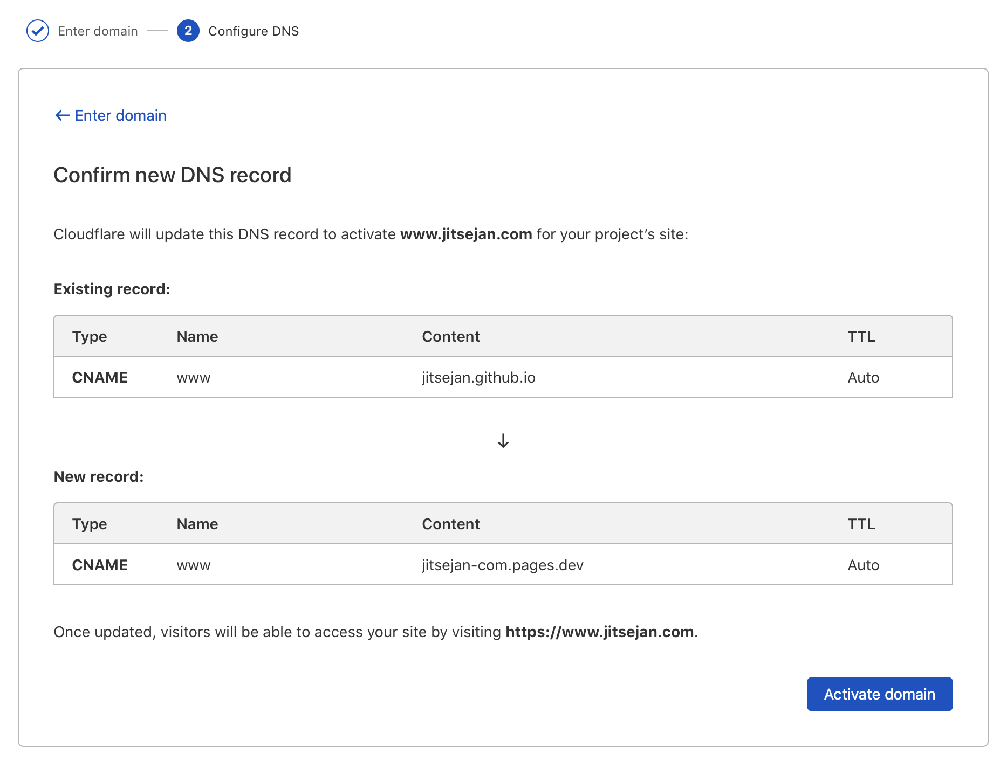

Title: Moving blog to Cloudflare pages
Date: 2021-04-24 01:47
Modified: 2021-04-24 01:47
Category: posts
Tags: Python, pelican, Cloudflare, statis website, hosting
Slug: moving-blog-to-cloudflare-pages
Authors: Jitse-Jan
Summary: With all the new ways of deploying your static websites without hosting your own servers I thought it was a good time for me to move away from Github Pages. For my Github hosted website I was using two repositories of which one is for the [Pelican](https://blog.getpelican.com) source data (Markdown and Jupyter notebooks) and one for the HTML output. Using one of these new services I do not need to worry about the output folder since the build of the HTML files will be done on the server and is not stored in your repository. I did a quick test with the famous [Netlify](https://www.netlify.com) which worked really well but it was slightly more difficult to setup a domain name. Because I am already using Cloudflare for my DNS it made sense to me to try out [Cloudflare Pages](https://pages.cloudflare.com) to easily link my domain name and avoid having two repositories for one website.

With all the new ways of deploying your static websites without hosting your own servers I thought it was a good time for me to move away from Github Pages. For my Github hosted website I was using two repositories of which one is for the [Pelican](https://blog.getpelican.com) source data (Markdown and Jupyter notebooks) and one for the HTML output. Using one of these new services I do not need to worry about the output folder since the build of the HTML files will be done on the server and is not stored in your repository. I did a quick test with the famous [Netlify](https://www.netlify.com) which worked really well but it was slightly more difficult to setup a domain name. Because I am already using Cloudflare for my DNS it made sense to me to try out [Cloudflare Pages](https://pages.cloudflare.com) to easily link my domain name and avoid having two repositories for one website.

Setting up is easy and just requires you to login to your Github account and give access to the repository you want to deploy on Cloudflare Pages. Once you grant the access you set the **Production branch** and **Build configuration**. Default for a Pelican blog the build command is `make html` which will output the HTML files to the `output` folder. The output folder will be the root of the website that is hosted on Cloudflare Pages.

Also the domain name change is very simple. After filling in `www.jitsejan.com` it knows that the DNS is with Cloudflare already and needs to point to the `pages.dev` domain instead of the `github.io` domain.

Lastly, I want to point out a few small issues I faced during the migration. First of all, I had to make sure to add a `runtime.txt` to the root of my website repository to use Python 3.7. Currently Cloudflare Pages only support Python 3.5 and 3.7, running any other version will give errors during the build. Additionally, I had to add the `plugins` folder through a Git module to enable the plugins on the server as well. After running  `git submodule add https://github.com/getpelican/pelican-plugins plugins` this all worked fine. 

Overall it was a very smooth experience to setup the website on Cloudflare Pages. Builds are fast and I have reduced my clutter.