Title: Creating a quick app using Supabase
Date: 2021-04-26 02:20
Modified: 2021-04-26 02:20
Category: posts
Tags: Python, VueJS, Cloudflare, statis website, hosting, Supabase, Pythonista
Slug: creating-quick-app-with-supabase
Authors: Jitse-Jan
Summary: The idea for this project is to finally use Pythonista on my phone. Every time I hit the *Share Menu* I see the option to *Run a Pythonista script* but I never had the opportunity (or imagination) to actually use it. Since I was already building a Dictionary app as part of a VueJS/FastAPI/Postgres project to get familiar with FastAPI I thought it would be interesting to use my phone to add words to the database. In addition to adding words to the database the Pythonista script will also query a dictionary API to add the definition to the table as well.

In this project I am building the following:

- Supabase back-end as database and REST API.
- Pythonista script on iPhone to write to the database through the API.
- VueJS front-end to display the content of the table in the database.

## Idea

The idea for this project is to finally use Pythonista on my phone. Every time I hit the *Share Menu* I see the option to *Run a Pythonista script* but I never had the opportunity (or imagination) to actually use it. Since I was already building a Dictionary app as part of a VueJS/FastAPI/Postgres project to get familiar with FastAPI I thought it would be interesting to use my phone to add words to the database. In addition to adding words to the database the Pythonista script will also query a dictionary API to add the definition to the table as well.

Before I got to the Pythonista script I (luckily) stumbled upon Supabase to replace the FastAPI and Postgres part since it comes with the batteries included and it would avoid me writing any code. Why not learn about Pythonista and Supabase at the same time? 

Finally, I will use VueJS to create a front-end to display the words and definitions stored in the database. Initially the layout can be very plain and styling it or adding pagination will be for a future me.

## Tools

### Supabase

[Supabase](https://supabase.io) is used in this project because of its functionality, the great documentation and it being free (for now?). According to the Pricing page it will be free for personal development projects so it should be more than fine for what I am trying to achieve here. Supabase is using a Postgres database and comes with a built-in API and event stream. All great things that would take some proper effort to setup yourself.

First of all, I create a [new project]([Start your project](https://app.supabase.io/api/login)) where I set the Organization name and add the name for the database.

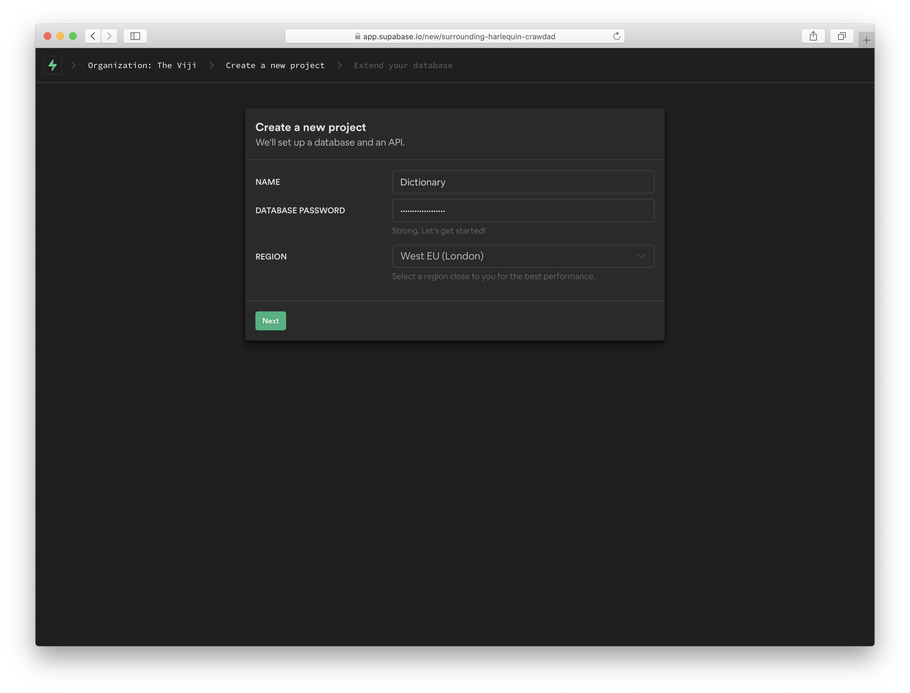

After a quick coffee the project will be ready and the database and API are ready to use.

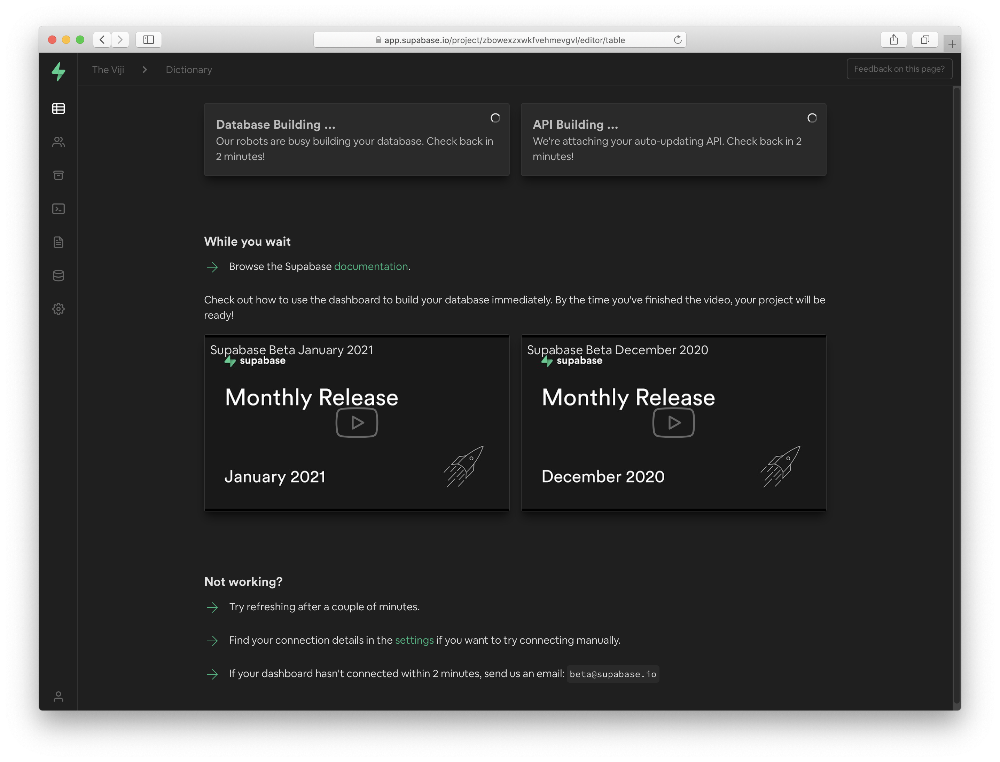

Once the database is ready I create a new table.

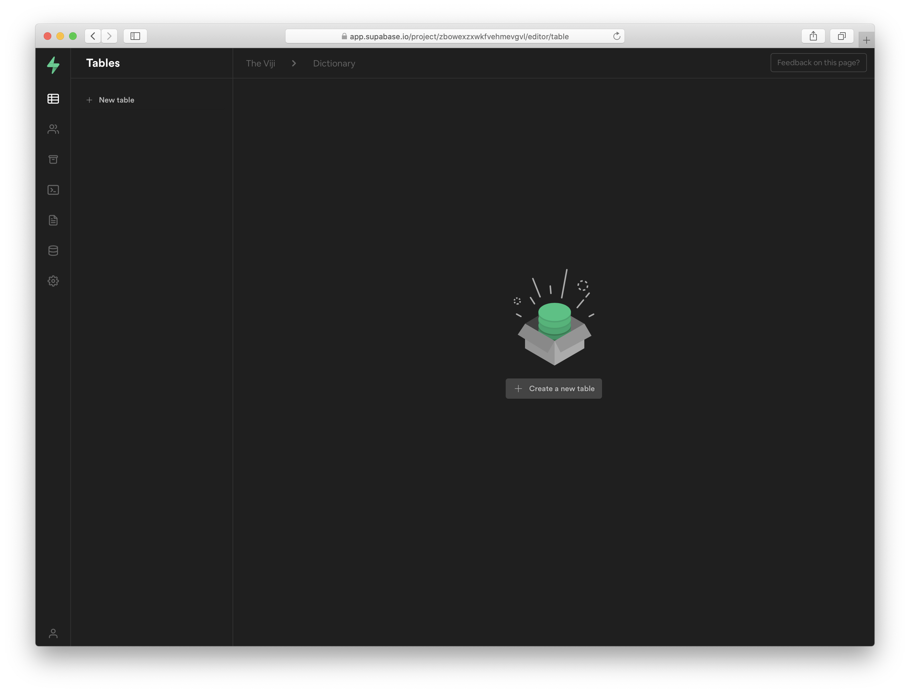

As described in the introduction, I am creating a simple project where I can select words in Safari on my iPhone, run a Pythonista script from the *Share Menu*, get the definition from a dictionary and add the word and the definition to the database. Logically the table in my `Dictionary` database will be named `Words`.

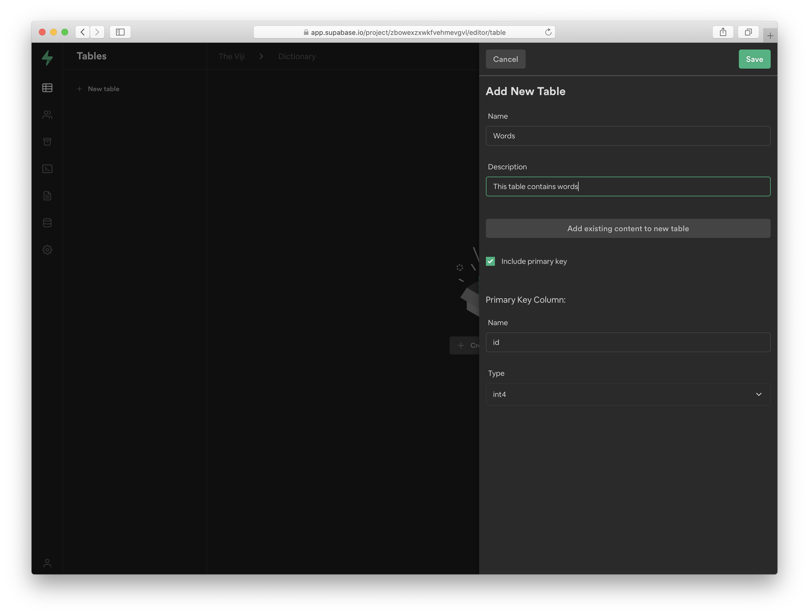

For simplicity I add a `id`, `word` and `definition` column. Very impressive indeed!

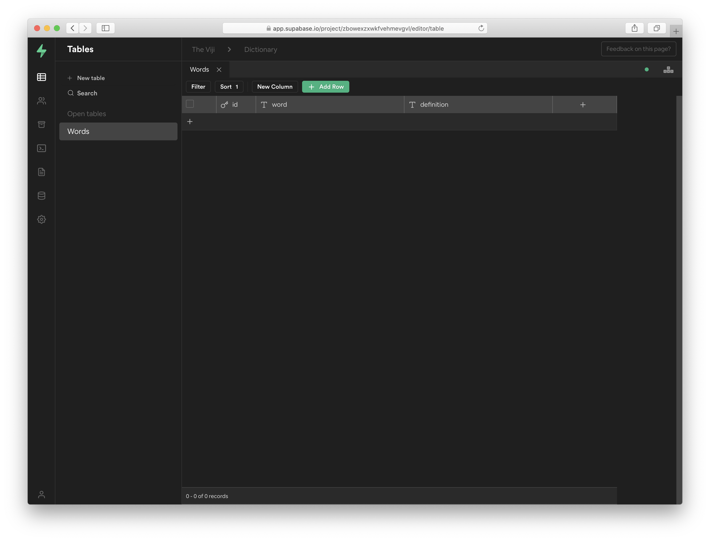

Finally, now that the table is created we need to copy the API key to be able to connect to the database and start inserting some data. Go the *Settings > API* and copy the `url` and `key`.

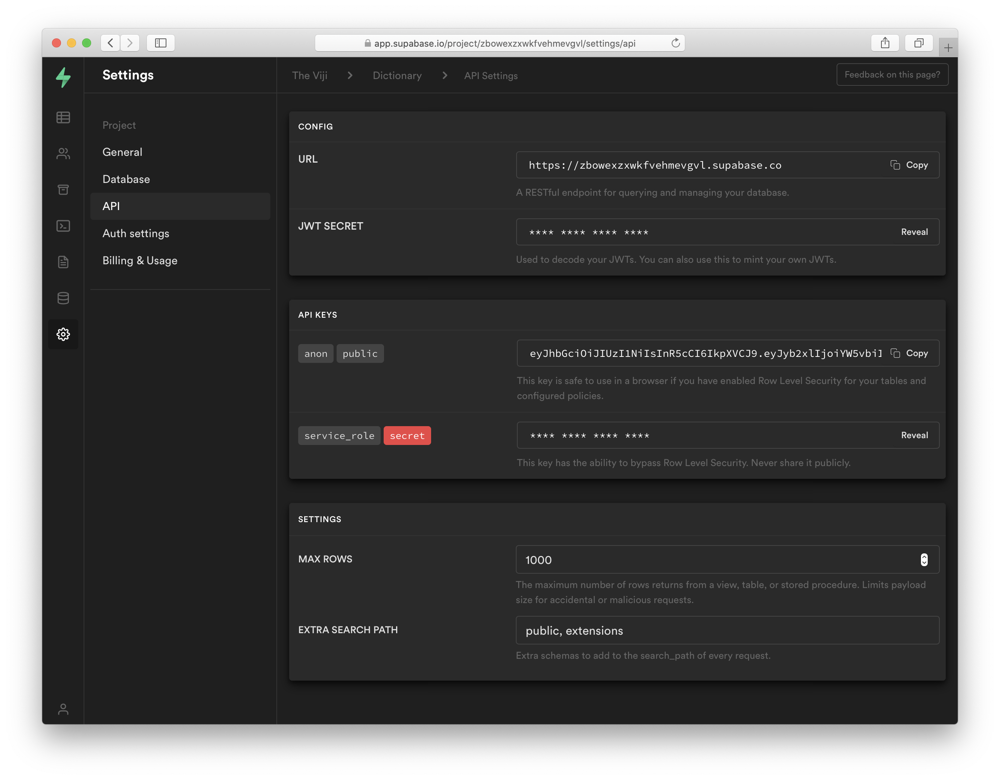

### Pythonista

Perhaps I shouldn't admit this but I have had [Pythonista](http://omz-software.com/pythonista/) installed on my iPhone for ages. When I tried to do a project in the IDE it wasn't working as smooth as I hoped and it was hard to install libraries. With Pythonista 3 it all looks a bit better and I am now aware I should not count on using exotic libraries. The script looks like the following on the phone. It looks clean but of course developing is faster on a computer which is why I am using iCloud to store the script. Once I press save on my Mac it will take a couple of seconds but it will refresh the Pythonista IDE and have the updated script.


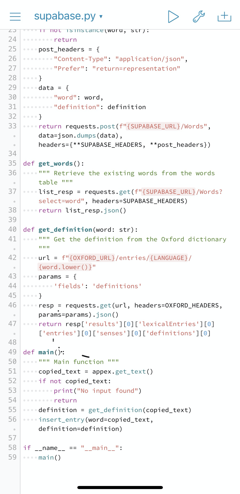


The full script is shown below (and stored as [gist](https://gist.github.com/jitsejan/6d3fdcb560b046c3c88e945562aa63fa) as well).

```python
import appex
import json
import requests

LANGUAGE = "en-gb"
OXFORD_ID = "9acc1234"
OXFORD_KEY = "6baccf388cd6456456326e85054f30aba"
OXFORD_URL = "https://od-api.oxforddictionaries.com/api/v2"
OXFORD_HEADERS = {
    "app_id": OXFORD_ID,
    "app_key": OXFORD_KEY
}
SUPABASE_KEY = "eyJhbGciOiJIUzI1NiIsInR5cCI6IkpXVCJ9.eyJyb2xlIjoiYW5vbiIsImlhdCI6MTYxNzE4NjQ0"
SUPABASE_URL = "https://zbowexzxwkfvehmevgvl.supabase.co/rest/v1"
SUPABASE_HEADERS = {
    "apikey": SUPABASE_KEY,
    "Authorization": f"Bearer {SUPABASE_KEY}"
}


def insert_entry(word: str, definition: str):
    """ Insert entry into Supabase database """
    if not isinstance(word, str):
        return
    post_headers = {
        "Content-Type": "application/json",
        "Prefer": "return=representation"
    }
    data = {
        "word": word,
        "definition": definition
    }
    return requests.post(f"{SUPABASE_URL}/Words", data=json.dumps(data), headers={**SUPABASE_HEADERS, **post_headers})

def get_words():
    """ Retrieve the existing words from the words table """
    list_resp = requests.get(f"{SUPABASE_URL}/Words?select=word", headers=SUPABASE_HEADERS)
    return list_resp.json()

def get_definition(word: str):
    """ Get the definition from the Oxford dictionary """
    url = f"{OXFORD_URL}/entries/{LANGUAGE}/{word.lower()}"
    params = {
        'fields': 'definitions'
    }
    resp = requests.get(url, headers=OXFORD_HEADERS, params=params).json()
    return resp['results'][0]['lexicalEntries'][0]['entries'][0]['senses'][0]['definitions'][0]

def main():
    """ Main function """
    copied_text = appex.get_text()
    if not copied_text:
        print("No input found")
        return
    definition = get_definition(copied_text)
    insert_entry(word=copied_text, definition=definition)

if __name__ == "__main__":
    main()

```

The Pythonista script will perform the following actions:

1. Get the text from the clipboard ussing the `appex` library
2. If there is a word found it will query and return the definition from the [Oxford Dictionary](https://developer.oxforddictionaries.com/documentation/getting_started)
3. It will insert the word and the definition into the Supabase table

When I navigate to a website in Safari and I select a word I can go to the Share option like below:

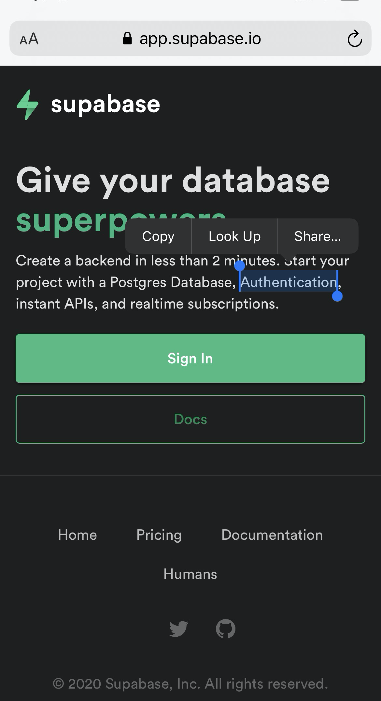


I select *Run Pythonista Script* from the context menu.

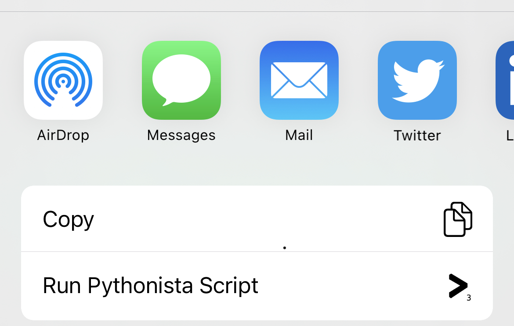

Here I created a [shortcut](http://omz-software.com/pythonista/docs/ios/pythonista_shortcuts.html) to run my script directly from this overview instead of navigating to the script. The blue icon will kick of the script and perform the actions mentioned before. 


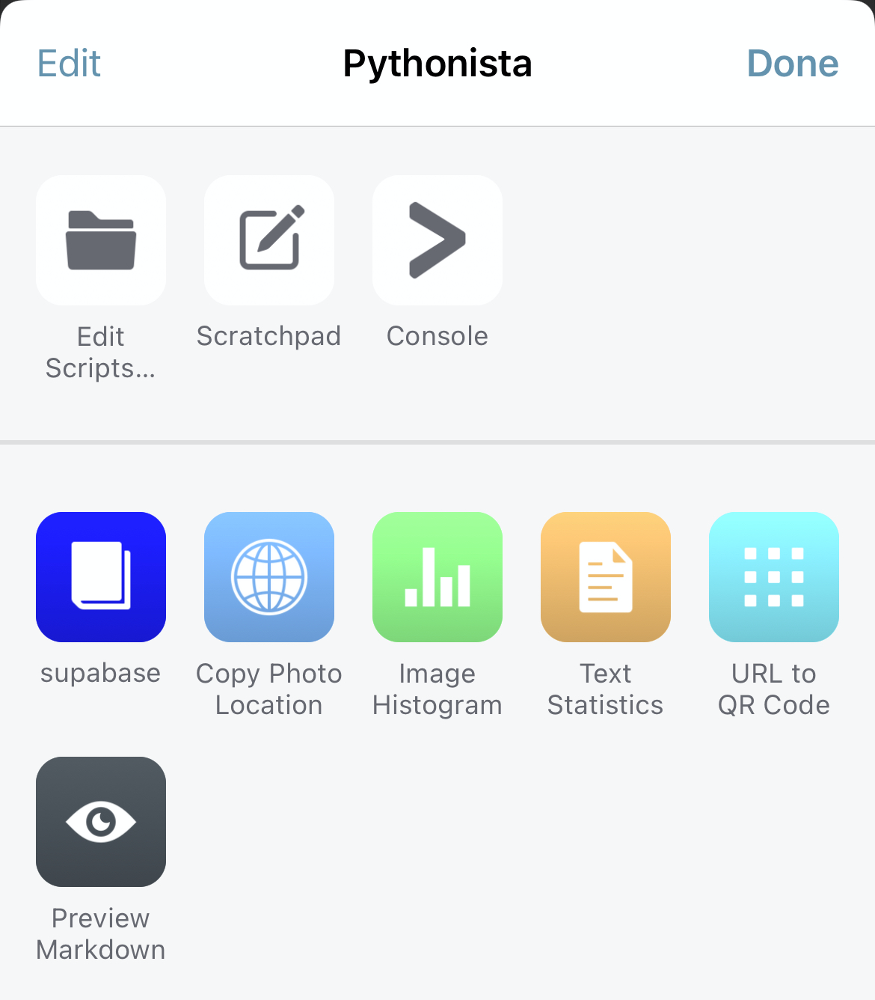

And yes, there is no error handling, so when something goes wrong it will throw a Python error and not be handled properly (yet). Because this is just a pet project I did not spend too much time in making it super robust. The only check right now is to verify that when the script is called there is actually text selected.


## Front-end application

To create a quick way to visualize the content of my dictionary table I have made a small [VueJS](https://vuejs.org) app that connect to Supabase and displays the words and their definitions. I followed the [installation guide](https://cli.vuejs.org/guide/installation.html) to make sure I had the latest Vue CLI installed since that will easily create the scaffold for the front-end app. Additionally, I check the versions of `npm` and `nodejs` since I don't use them every day and often get outdated. 

```bash
❯ vue -V
@vue/cli 4.5.12
```

```bash
❯ npm --version
6.14.10
```

```bash
❯ node --version
v14.15.4
```

After running `vue create` I have the following structure:

```bash
 ~/code/vuejs-supabase @ master
❯ tree src
src
├── App.vue
├── assets
│   └── logo.png
├── components
│   └── WordOverview.vue
├── config.js
├── main.js
└── services
    └── WordDataService.js
```

### `App.vue`

The main application contains the template with the `WordOverview` component, a link to the `WordDataService.js` and calls the service to retrieve the words.

```vue
<template>
  <WordOverview v-bind:words="words" />
</template>

<script>
import WordDataService from "./services/WordDataService";
import WordOverview from './components/WordOverview.vue'

export default {
  name: 'App',
  data: () => ({
    words: []
  }),
  methods: {
    getWords() {
      WordDataService.getAll()
      .then((res) => {
        console.log(res);
        this.words = res.body;
      })
      .catch((error) => {
        console.error(error);
      });
    },
  },
  async created() {
    this.getWords();
  },
  components: {
    WordOverview
  }
}
</script>

<style>
#app {
  font-family: Avenir, Helvetica, Arial, sans-serif;
  -webkit-font-smoothing: antialiased;
  -moz-osx-font-smoothing: grayscale;
  text-align: center;
  color: #2c3e50;
  margin-top: 60px;
}
</style>

```

### `components/WordOverview.vue` 

The WordOverview component contains a very basic markup to display the words from the database in an unordered list. 

```vue
<template>
  <div>
    <h1>Word overview</h1>
    <ul class="word-ul">
      <li class="word-li-entry" v-for="elem in words" :key="elem.id">
        <h2 class="word-title">{{elem.word}}</h2>
        <q class="word-definition">
          {{elem.definition}}
        </q>
      </li>
    </ul>
  </div>
</template>

<script>
export default {
  name: 'WordOverview',
  props: {
    words: Array,
  }
}
</script>

<style scoped>
h2.word-title {
  margin: 40px 0 0;
}
ul.word-ul {
  list-style-type: none;
  padding: 10;
}
li.word-li-entry {
  margin: 10px;
}
q.word-definition {
  font-style: italic;
}
</style>

```


### `services/WordDataService.js`

The data service for this Word app will import the `SUPABASE_CLIENT`, call the `words` database and return the `id`, `word` and `definition` showing the lasted word on top. This is the place you should add more functionality if you also want to insert and update data from within the App but that is not the scope of this project.

```javascript
import SUPABASE_CLIENT from "../config"

class WordDataService {
    getAll() {
        return SUPABASE_CLIENT
        .from("Words")
        .select("id,word,definition")
        .order('created_at', { ascending: false })
    }
}

export default new WordDataService();
```

### `config.js`

The configuration file uses the [supabase](https://www.npmjs.com/package/@supabase/supabase-js) package to create the `SUPABASE_CLIENT` based on the two environment variables. Make sure to prepend the variables with `VUE_APP_` to make them available inside the Vue application. I use the a `.env` file in the root of the Vue app to define these environment variables to keep things clean.

```javascript
import { createClient} from "@supabase/supabase-js"

const SUPABASE_KEY = process.env.VUE_APP_SUPABASE_KEY;
const SUPABASE_URL = process.env.VUE_APP_SUPABASE_URL;

let SUPABASE_CLIENT = null;
try {
    SUPABASE_CLIENT = createClient(SUPABASE_URL, SUPABASE_KEY);
} catch (e) {
    alert(e.message + " See config.js");
}
export default SUPABASE_CLIENT;

```

### `main.js`

This file hasn't been modified and has the standard code.

```javascript
import { createApp } from 'vue'
import App from './App.vue'

createApp(App).mount('#app')

```

Check the [repository](https://github.com/jitsejan/vuejs-supabase) for my final code for this project.

## Auto deployment

In my [previous article](https://www.jitsejan.com/moving-blog-to-cloudflare-pages) I mentioned I moved my personal Pelican blog from Github Pages to [Cloudflare pages](https://developers.cloudflare.com/pages/getting-started). As you can expect, Cloudflare Pages has support for [VueJS](https://developers.cloudflare.com/pages/how-to/deploy-a-vue-application) as well. Following the same steps to grant access to my repository and setting up the build was all I need to do to get this app live. Since this is a `VueJS` application the default build command is `npm run build` and the output is written to the `/dist` folder. 

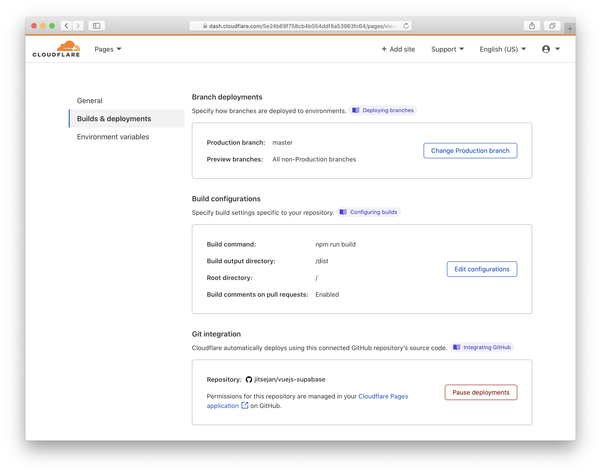

Apart from setting up the build (with the defaults) I had to add the two environment variables for the Supabase client. Without setting these the app will start but won't load any content since it cannot connect to the Supabase database.

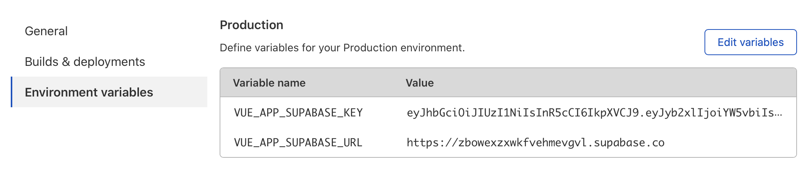

Of course I had to add a custom domain to make it easier to remember this app. 

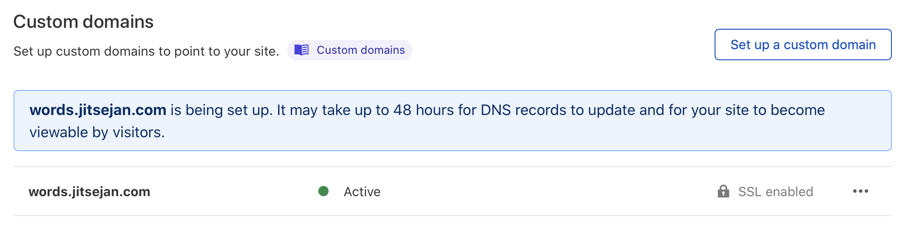


## Final result

And this is the final result, a simple page with the random words I have used for testing words from a summary of Metamorphosis and the Supabase homepage. 

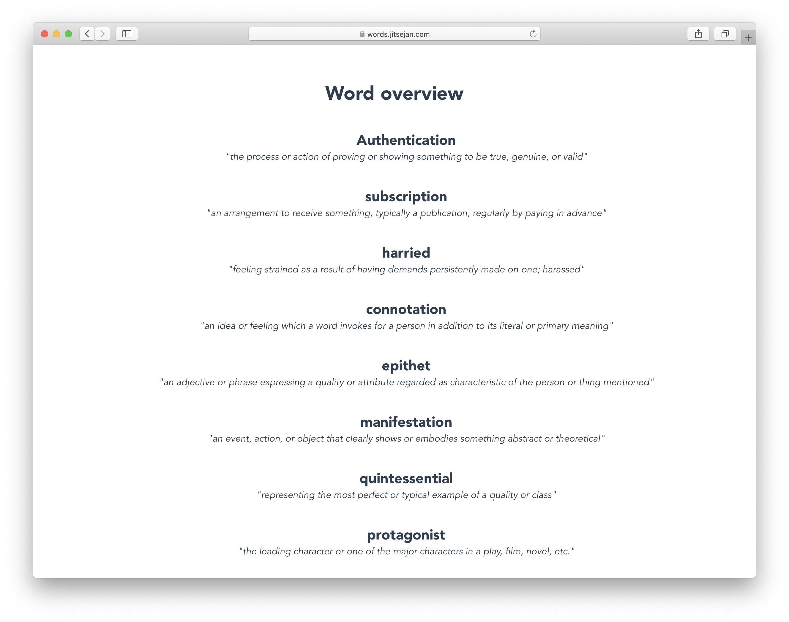